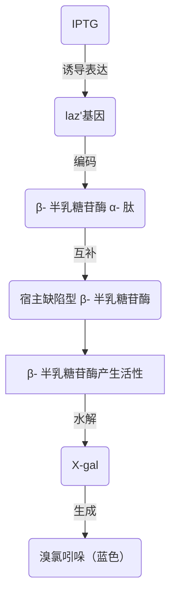
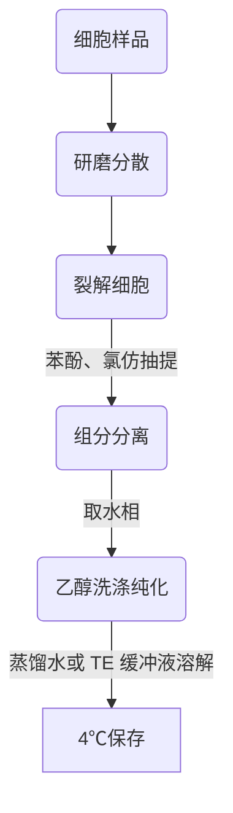

# 分子生物学 第 5 章 第 1 节：DNA 基本操作技术
#分子生物学 #生物 

> [!Tip] **Created by. Min Ni**

> [!summary] **Backer. 陕西师范大学食品工程与营养科学学院**

> 这是本章的第一节~
> 前往上一章🚀 [[MMB 04-3 蛋白质的转运、修饰与降解]]
> 下一节链接🔗

---
- 分子生物学三大成就

| 时间        | 事件                                       |
| --------- | ---------------------------------------- |
| 20 C 40 S | 解决遗传的物质基础问题 *（DNA）*                      |
| 20 C 50 S | 解决基因的自我复制和世代交替问题 *（DNA 双螺旋结构模型及半保留复制机制）* |
| 20 C 60 S | 阐明了遗传信息流动与表达机制 *（中心法则和操纵子学说）*            |

## 5.1 DNA 基本操作技术
### 5.1.1 重组 DNA 技术讲略
- 重组 DNA 的核心：用限制性内切核酸酶 *（restriction endonuclease，RE）* 和 DNA 连接酶对 DNA 分子进行体外切割和连接
- **工具酶的发现和应用**是现代生物工程技术史上最重要的事件
- **载体***vector*：具备自主复制能力的 DNA 分子
	- 如病毒、噬菌体、质粒
- pSC101 
	- 第一代质粒载体
	- **带有四环素抗性基因** $tet^r$

>pSC101质粒是一种严紧型复制控制的低拷贝质粒，平均每个宿主细胞仅有 1-2 个拷贝，因此，从带有质粒的宿主细胞中很难大量提取质粒 DNA，不利于后续实验进行

- 大肠杆菌细胞经适量氯化钙 $CaCl_2$ 处理后，能有效摄取质粒、吸收 λ 噬菌体 DNA *（处于感受态）*
- 把非洲爪蟾核糖体蛋白基因片段与 pSC101 质粒 DNA 片段重组后导入大肠杆菌，证明动物基因也能进入大肠杆菌细胞并转录出相应的 mRNA 分子

### 5.1.2 蓝白斑实验

- 实验结果分析
	- 蓝色：说明菌落未被转化
	- 白色：说明菌落被转化， *laz'* 基因**被破坏**，β- 半乳糖苷酶**无法产生活性**，因此无法水解 X-gal 产生蓝色的溴氯吲哚

### 5.1.3 基因组 DNA 的提取

> 基因组*genome*的定义
> - 广义：指一个**单倍体**细胞内细胞核、线粒体和叶绿体中所包含的全部 DNA 分子
> - 狭义：细胞核内染色体上的包括编码区和非编码区在内的全部 DNA 分子

- DNA 提取实验大致流程

- 对植物组织样品
	- 用液氮速冻帮助研磨
	- 加入 CTAB *（阳离子去垢剂）* 裂解
- 对动物组织样品或细胞样品
	- 加入 SDS *（阴离子去垢剂）* 裂解
- 苯酚的作用：蛋白质变性剂
- 裂解细胞后，也可选择用硅胶膜纯化柱吸附，最后在低盐浓度下洗脱
- TE 缓冲液 = Tris-HCl + EDTA *（保护 DNA）*

> **DNA 浓度和纯度的测定**
> - 通过 $OD_{260}$ 和 $OD_{280}$ 来判断
> -  $OD_{260}$ = 1 时相当于浓度为 50 μg/mL
> -  $OD_{260}$ / $OD_{280}$ 的比值在 1.8-2.0 之间，代表所提取的 DNA 纯度较好 

---
> [!tip] ٩(๑˃̵ᴗ˂̵๑)۶ 学累了记得好好歇歇捏~
