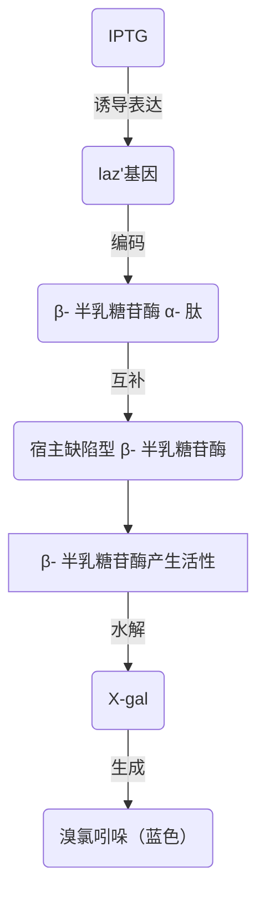
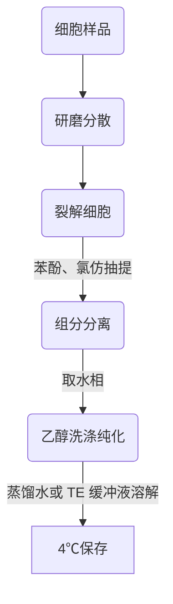
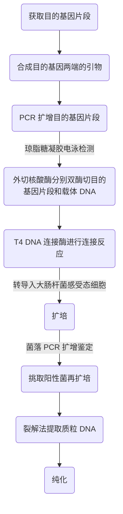

# 分子生物学 第 5 章 第 1 节：DNA 基本操作技术
#分子生物学 #生物 

> [!Tip] **Created by. Min Ni**

> [!summary] **Backer. 陕西师范大学食品工程与营养科学学院**

> 这是本章的第一节~
> 前往上一章🚀 [[MMB 04-3 蛋白质的转运、修饰与降解]]
> 下一节链接🔗[[MMB 05-2 RNA 基本操作技术]]

---

> [!note] 笔者按：第五章卷帙浩繁，全盘记忆所耗不赀。不妨提纲挈领地学，正所谓纲举而目张。笔者谨列出本章的几处肯綮供读者引以为本章学习的主线与关节，方便读者们在此基础上归纳理解
> - 技术的原理
> - 技术所需的条件：如酶、反应条件
> - 技术所需的原料
> - 技术的大致步骤
> - 技术的应用

- 分子生物学三大成就

| 时间        | 事件                                       |
| --------- | ---------------------------------------- |
| 20 C 40 S | 解决遗传的物质基础问题 *（DNA）*                      |
| 20 C 50 S | 解决基因的自我复制和世代交替问题 *（DNA 双螺旋结构模型及半保留复制机制）* |
| 20 C 60 S | 阐明了遗传信息流动与表达机制 *（中心法则和操纵子学说）*            |

### 5.1.1 重组 DNA 技术讲略
- 重组 DNA 的核心：用限制性内切核酸酶 *（restriction endonuclease，RE）* 和 DNA 连接酶对 DNA 分子进行体外切割和连接
- **工具酶的发现和应用**是现代生物工程技术史上最重要的事件
- **载体** *vector*：具备自主复制能力的 DNA 分子
	- 如病毒、噬菌体、质粒
- pSC101 
	- 第一代质粒载体
	- **带有四环素抗性基因** $tet^r$

>pSC101质粒是一种严紧型复制控制的低拷贝质粒，平均每个宿主细胞仅有 1-2 个拷贝，因此，从带有质粒的宿主细胞中很难大量提取质粒 DNA，不利于后续实验进行

- 大肠杆菌细胞经适量氯化钙 $CaCl_2$ 处理后，能有效摄取质粒、吸收 λ 噬菌体 DNA *（处于感受态）*
- 把非洲爪蟾核糖体蛋白基因片段与 pSC101 质粒 DNA 片段重组后导入大肠杆菌，证明动物基因也能进入大肠杆菌细胞并转录出相应的 mRNA 分子

### 5.1.2 蓝白斑实验

- 实验结果分析
	- 蓝色：说明菌落未被转化
	- 白色：说明菌落被转化， *laz'* 基因**被破坏**，β- 半乳糖苷酶**无法产生活性**，因此无法水解 X-gal 产生蓝色的溴氯吲哚

### 5.1.3 基因组 DNA 的提取

> 基因组*genome*的定义
> - 广义：指一个**单倍体**细胞内细胞核、线粒体和叶绿体中所包含的全部 DNA 分子
> - 狭义：细胞核内染色体上的包括编码区和非编码区在内的全部 DNA 分子

- DNA 提取实验大致流程

- 对植物组织样品
	- 用液氮速冻帮助研磨
	- 加入 CTAB *（阳离子去垢剂）* 裂解
- 对动物组织样品或细胞样品
	- 加入 SDS *（阴离子去垢剂）* 裂解
- 苯酚的作用：蛋白质变性剂
- 裂解细胞后，也可选择用硅胶膜纯化柱吸附，最后在低盐浓度下洗脱
- TE 缓冲液 = Tris-HCl + EDTA *（保护 DNA）*

> **DNA 浓度和纯度的测定**
> - 通过 $OD_{260}$ 和 $OD_{280}$ 来判断
> -  $OD_{260}$ = 1 时相当于浓度为 50 μg/mL
> -  $OD_{260}$ / $OD_{280}$ 的比值在 1.8-2.0 之间，代表所提取的 DNA 纯度较好 

### 5.1.4 核酸凝胶电泳
- 按相对分子质量分离 DNA，相对分子量越大，电泳跑得越慢
- 电泳的介质：
	- 琼脂糖*agarose*
	- 聚丙烯酰胺凝胶*polyacrylamide*
- 原理：在生理条件下，核酸分子中的磷酸基团呈离子化状态，把这些核酸分子放置在电场当中，它们会向正电极移动。在一定电场强度下，DNA 分子的迁移速度完全取决于核酸分子本身的大小
- 凝胶的分辨能力与**凝胶的类型和浓度**有关
	- 凝胶浓度**越高**，凝胶介质孔隙越小，分辨能力**越强**

> 溴化乙啶 *（ethidium bromide， EB）*：能插入到核酸分子的相邻碱基之间，并在紫外光（300 nm 波长为检测最宜）照射下发出荧光

- 脉冲电场凝胶电泳*pulsed-field gel electrophoresis*：用于分离超大相对分子质量的 DNA

### 5.1.5 聚合酶链式反应技术
- 原理：将模板 DNA 加热至**临近沸点**，变性解链成单链 DNA 分子，然后以之为模板在 DNA 聚合酶 *（Taq 酶）* 的催化下利用反应混合物中的 4 种脱氧核苷酸（dNTP）**合成 DNA 互补链**
- PCR 所用 DNA 聚合酶 *（Taq 酶）* 的特点：耐高温
- 原料：
	- 模板 DNA
	- **引物**
	- dNTP
	- 缓冲液
- 由于在 PCR 反应种所选用的一对引物是按照与扩增区段两端序列彼此**互补**的原则设计的，因此，每一条新生链的合成都是从引物的**退火结合位点**开始并朝**相反方向**延伸的，每一条新合成的 DNA 链上都具有新的引物结合位点
- PCR 的过程（一般进行 30 轮左右）：
	1. 变性：DNA 解链
	2. 退火：引物与模板 DNA 相结合
	3. 延伸：DNA 互补链合成

### 5.1.6 重组载体的构建
- 对引物的要求：
	- 长度一般为 18-27 bp
	- GC 含量控制在 40%-60%
	- $T_m$ 值在 60℃左右
- 对核酸外切酶的要求：与载体上的多克隆位点相匹配
- 重组载体构建的流程

> 感受态细胞：细胞膜通透性发生改变，易于吸附外源 DNA 的细胞

### 5.1.7 实时定量 PCR
- PCR 技术具有极高的敏感性，扩增产物总量的变异系数常常达到 **10%-30%**
- 实时定量 PCR *（real time quantitative PRC，qPCR）*：利用荧光检测的 PCR 仪对整个 PCR 过程扩增 DNA 的积累速率绘制动态变化图，从而消除了在测定终端产物丰度时有较大变异系数的问题
#### TaqMan 探针
- **特异性**
- 将荧光染料（不同波长）固定在引物上，PCR 扩增，引物在这一过程中被降解，解除了荧光淬灭的束缚，荧光基团因此得以在激发光下发出荧光。所产生的荧光强度直接反映了被扩增的靶 DNA 总量
#### STBR Green Ⅰ 探针
- **非特异性**
- 荧光染料 STBR Green Ⅰ激发光波长为 **520 nm**，这种荧光染料只能与双链 DNA 结合
- PCR 扩增出的 DNA 双链被 STBR Green Ⅰ结合而发出荧光

### 5.1.8 基因组 DNA 文库的构建

> **基因组文库相关概念**
> - 基因组的 DNA 文库：基因组中所有 DNA 序列克隆的总汇
> - 基因组 DNA 文库的构建：把某种生物的基因组 DNA 切成适当大小，分别与载体组合，导入微生物细胞，形成克隆
> - 作用：常被用于分离特定的基因片段、分析特定基因结构、研究基因表达调控，还可以用于全基因组物理图谱的构建和全基因组序列测定等

- 基因组 DNA 文库构建的第一步：制备合适大小的随机 DNA 片段，在体外将这些 DNA 片段与适合的载体 *（最常用的载体：λ 噬菌体）* 相连成**重组子**，转化到大肠杆菌或其他受体细胞中，从转化子克隆群中筛选出含有靶基因的克隆
- 提高文库代表性的方法
		1. 用**机械切割法**或**限制性核酸内切酶切割法**随机断裂 DNA，以保证克隆的随机性
		2. **增加文库重组克隆的数目**，以提高覆盖基因组的倍数
- 构建基因组文库常用：
	- λ 噬菌体载体
	- 限制性核酸内切酶部分消化法
- λ 噬菌体文库构建方法简单高效，所获得的文库易于用分子杂交法进行筛选，因此被广泛应用于细菌、真菌等**基因组较小物种**的研究
- 高容量克隆载体
	- 举例：科斯质粒、细菌人工染色体*BAC*、P1 源人工染色体*PAC*、酵母人工染色体*YAC*
	- 优点：可以插入大片段 DNA
	- 应用：基因组作图、测序和克隆序列的比对

---
> [!tip] ٩(๑˃̵ᴗ˂̵๑)۶ 学累了记得好好歇歇捏~
