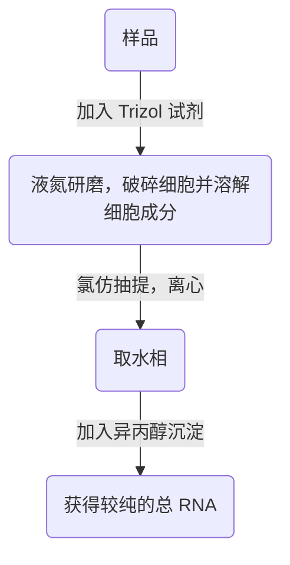

# 分子生物学 第 5 章 第 2 节：RNA 基本操作技术
#分子生物学 #实验技术 #RNA #mRNA #提取 #cDNA #基因组 #基因工程 #非编码RNA

> [!Tip] **Created by. Min Ni**

> [!summary] **Backer. 陕西师范大学食品工程与营养科学学院**

> 上一节链接🔗 [[MMB 05-1 DNA 基本操作技术]]
> 下一节链接🔗 [[MMB 05-3 蛋白质与蛋白质组学技术]]

---

> [!summary] 摘要（AI）
> 
> #### 主要内容
> 
> 本文为第五章第二节“RNA基本操作技术”，重点解析总RNA提取（Trizol法）、mRNA纯化（寡聚dT柱层析）、cDNA合成（反转录酶/甲基化dCTP防降解）、基因文库筛选（核酸杂交/PCR/免疫法）及非编码RNA分类（miRNA/siRNA/circRNA等）的研究方法。
> 
> #### 知识点
> 
> - **RNA提取**：Trizol试剂（异硫氰酸胍/苯酚）裂解细胞；OD260/280比值评估纯度（1.8-2.0）。
>     
> - **cDNA合成**：第一链（mRNA模板+寡聚dT引物）；第二链（DNA聚合酶）；甲基化修饰防宿主酶切。
>     
> - **文库筛选**：核酸杂交法（放射性探针）、免疫法（抗原抗体结合需表达文库）。
>     
> - **ncRNA研究**：miRNA（基因调控）、circRNA（环状结构稳定性）、聚丙烯酰胺凝胶分离小RNA。
>     
> 
> #### 评级
> 
> - **难度**：🌿🌿🌿🌿
>     
> - **重要性**：🌟🌟🌟🌟🌟
>     

---

> cDNA *（complementary DNA）* ：mRNA 反转录得到的 DNA，不含冗余序列，代表了生物体某一器官或组织 mRNA 中所含的全部或绝大部分遗传信息。通过特异性探针筛选 cDNA 文库，可以较快地分离到相关基因

- 由于单链 RNA 分子不稳定且易发生降解，在自然状态下难以被扩增，因此，为了研究 mRNA 所包含的功能基因信息，**一般将其反转录成稳定的 DNA 双螺旋**，再插入到可以自我复制的载体中

### 5.2.1 总 RNA 的提取：异硫氰酸胍-苯酚抽提法
- 细胞中总 RNA 包括：
	- 编码蛋白质的 mRNA
	- 不编码蛋白质的 ncRNA *（包括：rRNA、tRNA 以及其他 RNA）*

> **Trizol 试剂**
> - 主要由异硫氰酸胍和苯酚组成
> - 可以迅速破坏细胞结构，使存在于细胞质及核内的 RNA 释放出来，并使核糖体蛋白于 RNA 分子分离，还能保证 RNA 的完整

- 提取过程：

>[!tip] 要根据不同植物组织的特点，预先去除酚类、多糖或其他次生代谢产物对 RNA 的干扰

> **RNA 浓度和纯度的判断**
> - 通过 $OD_{260}$ 和 $OD_{280}$ 来判断
> -  $OD_{260}$ = 1 时相当于浓度为 50 μg/mL
> -  $OD_{260}$ / $OD_{280}$ 的比值在 1.8-2.0 之间，代表所提取的 DNA 纯度较好 

>[!note] 笔者按：其实此处 RNA 浓度和纯度的判断与上文 DNA 浓度的判断大致相同，区别在于 OD 260/280 比值较大 

### 5.2.2 mRNA 的纯化
- 真核细胞 mRNA 的 poly（A）尾真核生物 mRNA 的提取提供了极为方便的选择性标志
- 实验中常用**寡聚（dT）-纤维素柱层析法**获得高纯度的 mRNA
	- 利用 mRNA 3' 端含有 poly（A）的特点，当 RNA 流经寡聚（dT）纤维素柱时，在高盐缓冲液的作用下，mRNA 被特异性地结合在柱上，再用低盐溶液或蒸馏水洗脱 mRNA
	- 原理：**碱基互补配对**
- **poly（AT）Tract mRNA 分离系统**：将生物素标记的寡聚（dT）引物与细胞总 RNA 温育，加入微磁球相连的抗生物素蛋白以结合 poly（A）mRNA，通过**磁场吸附作用**将之分离出来

### 5.2.3 cDNA 的合成
- 从 DNA 的合成包括第一链和第二链 cDNA 的合成
	- 第一链的合成是以 mRNA 为模板，反转录时加入寡聚（dT）做引物，在反转录酶的催化下形成 cDNA
	- 第二链 cDNA 的合成是以第一链为模板，由 DNA 聚合酶催化
- 在 cDNA 合成过程中应选用活性较高的反转录酶及**甲基化 dCTP**，cDNA 两端应加上不同内切酶所识别的接头序列，保证所获得双链 cDNA 的方向性

>[!question] 为什么要加入甲基化的 dCTP？
>- 保证新合成的 cDNA 链被甲基化修饰，以防止构建克隆时被限制性内切酶切割

- 绝大多数大肠杆菌都会切除带有 5'-甲基胞嘧啶的外源 DNA，所以实验中常选用 $mcrA^-$ 和 $mcrB^-$ 菌株以防止 cDNA 被降解

### 5.2.4 cDNA 文库的构建
- 应用：筛选目的基因、大规模测序、基因芯片杂交等功能基因组学研究

### 5.2.5 基因文库的筛选
1. 核酸杂交法
	- 广泛的适用性和快速性，最常用
	- 常用放射性标记的特异性 DNA 探针进行高密度的菌落杂交筛选
2. PCR 筛选法
	- 通用性，操作简单
	- **使用前提：已知足够的序列信息并获得基因特异性引物**
3. 免疫筛选法
	- 原理：**抗原抗体特异性结合**
	- 适用于对**表达文库**的筛选，也即如果该 DNA 或 cDNA 文库是用表达载体构建的，每个克隆都可以在宿主细胞中表达，产生所编码的蛋白质，就可以用免疫筛选法进行筛选

### 5.2.6 非编码 RNA 的研究
- ncRNA 的功能：在转录和翻译水平调控基因表达，维持基因组的稳定，或在细胞功能与命运的决定中发挥至关重要的作用
- ncRNA 的分类

| ncRNA 的分类 | 举例                                            |
| --------- | --------------------------------------------- |
| 组成型 ncRNA | rRNA、tRNA                                     |
| 调控型 ncRNA | miRNA、siRNA、piRNA、snRNA、snoRNA、lcnRNA、circRNA |

> [!tip] 调控型 ncRNA 概述
> - **miRNA** *（microRNA）*：是一类内生的、长度约为20-24个核苷酸的小 RNA，其在细胞内具有多种重要的调节作用
> - **siRNA** *（small interfering RNA）*：siRNA 是 siRISC 的主要成员，激发与之互补的目标mRNA的沉默。**详见：RNAi 技术**
> - **piRNA** *（piwi-interacting RNA）*：piRNA是指 piwi 相互作用 RNA，是一类内源性小干扰 RNA，能特异性地与动物细胞中 Argonaute 蛋白的类似物 PIWI 结合
> - **snRNA** *（small nuclear RNA）*：核小 RNA，剪接体中的 5 种 RNA（U1、U2、U4、U5、U6）统称为 snRNA，参与 hnRNA 的剪接加工
> - **snoRNA** *（small nucleolar RNA）*：核仁小 RNA，参与核糖核酸酶对特定立体结构的识别，从而确定切割位点
> - **lncRNA** *（long non-coding RNA）*：指长度大于200 核苷酸的非编码RNA。lncRNA具有非常重要的调控功能，且几乎参与到了各种生物学过程和通路，与各种疾病的发生发展紧密关联
> - **circRNA** *（circular RNA）*：环状 RNA，虽然 circRNA 通常表达水平较低，但它们的表达存在细胞和组织特异性。circRNA 可以通过不同途径影响基因表达，有效扩展真核细胞转录组的多样性和复杂性，在细胞中扮演着重要角色

- 目前只能依据 ncRNA 的大小和形态进行分离
- 小于 50 nt 的 ncRNA 的分离：提取总 RNA 后，用聚丙烯酰胺凝胶电泳分离后，再用乙醇沉淀出来

> [! success] 符号约定：有关核酸的内容中，“nt”代表核苷酸（nucleotide）

- 也可以从总 RNA 样品中去除 rRNA 和 tRNA，再分离其他 ncRNA
- circRNA 的分离可利用其特殊的环状结构

---
> [!tip] ٩(๑˃̵ᴗ˂̵๑)۶ 学累了记得好好歇歇捏~
