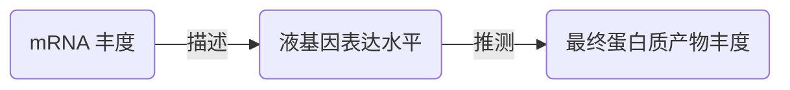

# 分子生物学 第 5 章 第 6 节：基因表达技术
#分子生物学 #表达 #转录 #测序 #RNA #实验技术 #杂交 #基因工程 

> 上一节链接🔗 [[MMB 05-5 基因克隆技术]]
> 下一节链接🔗 [[MMB 05-7 基因敲除技术]]

---

> [!IMPORTANT] 
> 
> #### 主要内容
> 
> 本文为第五章第六节“基因表达技术”，涵盖转录组测序（RNA-Seq高通量分析）、原位杂交（mRNA定位/染色体标记）、基因定点突变（氨基酸残基功能研究）及EST/SAGE传统测序方法，全面解析基因表达水平的定性与定量研究策略。
> 
> #### 知识点
> 
> - **RNA-Seq**：高通量测序→Reads组装→差异表达基因筛选；可研究选择性剪接。
>     
> - **原位杂交**：探针标记（放射性/荧光）→组织切片杂交→定位mRNA或染色体序列。
>     
> - **定点突变**：PCR引物设计引入突变位点→研究蛋白质功能或修饰载体酶切位点。
>     
> - **EST/SAGE**：Sanger测序为基础，标签串联分析基因表达谱。
>     
> 
> #### 评级
> 
> - **难度**：🌿🌿🌿🌿
>     
> - **重要性**：🌟🌟🌟
>
>> **DeepSeek** · provides the SUMMARY service.

---
### 5.6.1 转录组测序分析和 RNA-Seq
- 转录组*transcription*
	- 广义上：指某一特定生理条件或环境下，一个细胞、组织或生物体中所有 RNA 的总和
	- 狭义上：特指细胞中转录出的所有 mRNA 的总和
	- 转录组使中心法则在组学框架下的主要表现形式
- 通过特定生理条件下细胞内的 mRNA 丰度来描述基因表达水平，并外推到最终蛋白质产物的丰度是目前基因表达研究的**基本思路**

- 基于传统的 **Sanger 测序法**对转录组进行研究的方法主要包括：
	- 表达序列标签测序技术 *（expressed sequence tag，EST）*
	- 基因表达系列分析技术 *（serial analysis of expression，SAGE）*

 > **高通量测序技术** *high-throughput sequencing*
 > - 又叫：深度测序*deep sequencing*
 > - 包括：二代测序、三代测序
 > - 可以一次性测序几十万甚至几百万条序列，是传统测序技术的一次革命
 > - **RNA-Seq**：利用高通量测序技术对转录组进行测序分析，对测序得到的大量原始读长*reads*进行过滤、组装及生物信息学分析

### 5.6.2 RNA 的选择性剪接研究
- **RNA-Seq** 还可以用于研究全基因组水平的 RNA 选择性剪接

### 5.6.3 原位杂交技术
- *in situ hybridization，ISH*
- 是用标记的核酸探针，经放射自显影或非放射检测体系，在组织、细胞、间期核及染色体上对核酸进行**定位**和**相对定量**研究的一种手段
- 分类：
	- RNA 原位杂交
	- 染色体原位杂交
- RNA 原位杂交
	- **定性定量**
	- 用放射性或非放射性标记的特异性探针与被固定的组织切片反应，若细胞中存在与探针互补的 mRNA 分子，**两者杂交产生双链 RNA**，就可以通过**检测放射性标记**或**经酶促免疫显色**，对该基因的表达产物在细胞水平上作出定性定量分析
- 染色体原位杂交
	- **定位**
	- 对**寡核苷酸探针**做特殊的修饰和标记，然后用原位杂交法与**靶染色体或 DNA** 上特定序列结合，再通过荧光素分子相偶联的单克隆抗体来**确定该 DNA 序列在染色体上的位置**

### 5.6.4 基因定点突变技术
- **定点突变*site-directed mutagenesis* 是重组 DNA 进化的基础**
- 该方法通过改变基因特定位点核苷酸序列来改变所编码的氨基酸序列
- 应用：研究某个或某些氨基酸残基对蛋白质的结构、催化活性以及结合配体能力的影响，也可用于改造 DNA 调控元件特征序列，修饰表达载体，引入新的酶切位点等

---
> [!TIP]
> ٩(๑˃̵ᴗ˂̵๑)۶ 学累了记得好好歇歇捏~
