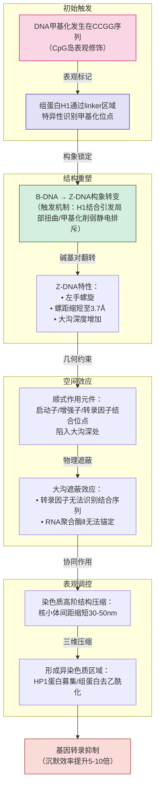

# 分子生物学第 7 章第 3 节：真核基因表达的表观遗传调控
#分子生物学 

> 上一节链接🔗 [[MMB 07-2 真核基因表达的转录调控]]
> 下一节链接🔗

---

> **基因的表达调控**：发生在转录之前的、染色质水平上的结构调整，主要包括 DNA 修饰和组蛋白修饰两个方面

**真核生物表观遗传调控的种类**
1. DNA 水平调控
2. DNA 甲基化   *DNA 修饰*
3. 组蛋白乙酰化   *组蛋白修饰*
4. 组蛋白甲基化   *组蛋白修饰*
5. RNA 水平修饰   $m^6A$

### 7.3.1 DNA 水平调控

> [!IMPORTANT]
> 在个体发育过程中，用来合成 RNA 的 DNA 模版（外显子）也会发生规律性变化，从而调控基因表达和生物体的发育

> [!CAUTION]
> ⚠️ 注意：在这一过程中，基因组发生了改变（而在转录及翻译水平的调控中，基因组未改变）

- 高度重复基因的形成通常与个体分化阶段 DNA 的某些变化有关

#### a）“开放”型活性染色质 *active chromatin* 结构对转录的影响

- 真核基因的活跃转录是在常染色质上进行的

> [!NOTE]
> 辨析｜常染色质与异染色质
> - **常染色质**：压缩程度低，处于伸展状态，碱性染料着色浅
> - 异染色质：碱性染料着色深

- **活跃表达基因**所在的染色质上一般含有一个或数个 DNA 酶 I 超敏感位点 *hypersensitive site*，大多位于 5' 端启动区（**非活性态基因**则无）
- **灯刷染色体**上的环形结构可能与基因的活性转录有关

> [!TIP]
> **灯刷染色体**
> - 是染色体充分伸展时的一种形态
> - 只有在两栖类动物卵细胞发生减数分裂时才能被观察到。此时，两对姐妹染色体常常通过“交叉点” *chiasmata* 连成一体
> - 详细参看：🔍 《五年本科 三年细胞》相关条目

#### b）基因扩增

- **基因扩增**：是指某些基因的拷贝数专一性大量增加的现象，是基因活性调控的一种方式
- **生物学意义**：使细胞在短期内产生大量的基因产物以满足生长发育的需要

#### c）基因重排

- **基因重排**：将一个基因从远离启动子的地方移到距它很近的位点，从而启动转录

>[!TIP]
>举例｜基因重排
>**免疫球蛋白结构基因和 T 细胞受体基因的表达**
>- 编码产生免疫球蛋白的细胞发育分化时，通过染色体内 DNA 重组把 4 个相隔较远的基因片段连接在一起，从而产生了具有表达活性的免疫球蛋白基因
>- 详细参看：🔍 《极简免疫学》相关条目

---
### 7.3.2 DNA 甲基化

>  DNA 甲基化能关闭某些基因的活性，去甲基化则诱导了基因的重新活化和表达

- CpG 二核苷酸胞嘧啶的甲基化导致了人体 1/3 以上由于碱基转换而引起的遗传病

> [!NOTE]
> **CpG 岛**
> - C：胞嘧啶
> - p：磷酸
> - G：鸟嘌呤
> 
> CpG 岛主要位于基因的启动子和外显子区域，富含 CpG 二核苷酸，常出现在真核生物编码基因的调控区
> CpG 二核苷酸序列中，C 通常是甲基化的，极易自发脱氨，生成 T，故 CpG 出现的频率远低于计算值

 **DNA 甲基化修饰现象广泛存在**
- **染色体水平上**：DNA 甲基化在着丝粒附近水平最高
- **基因水平上**：DNA 甲基化高水平区域涵盖了多数的转座子、假基因和 miRNA

> [!TIP]
> 甲基化对长度较短的基因有更强的转录调控能力

- DNA 甲基化导致某些区域 DNA 构象变化，从而影响了蛋白质与 DNA 的相互作用，抑制了转录因子与启动区 DNA 的结合效率

复习 DNA 构象👉 🔗 [[MMB 02-2 DNA 的结构#2.2.2 DNA 的二级结构]]

---
### 7.3.3 组蛋白乙酰化

复习组蛋白 👉 🔗 [[MMB 02-1 染色体#组蛋白]] 

---
### 7.3.4 组蛋白甲基化

---
### 7.3.5 RNA 水平修饰

---
> [!TIP]
> ٩(๑˃̵ᴗ˂̵๑)۶ 学累了记得好好歇歇捏~
