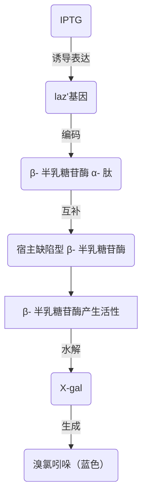
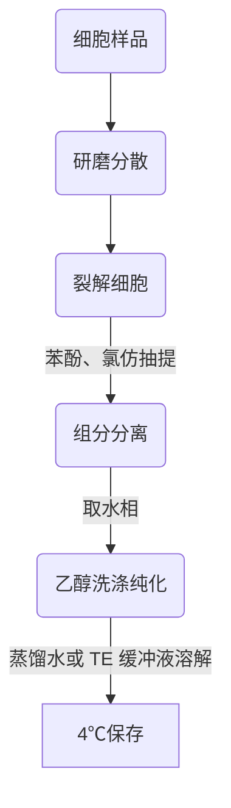
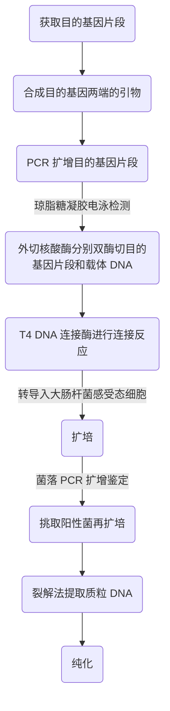
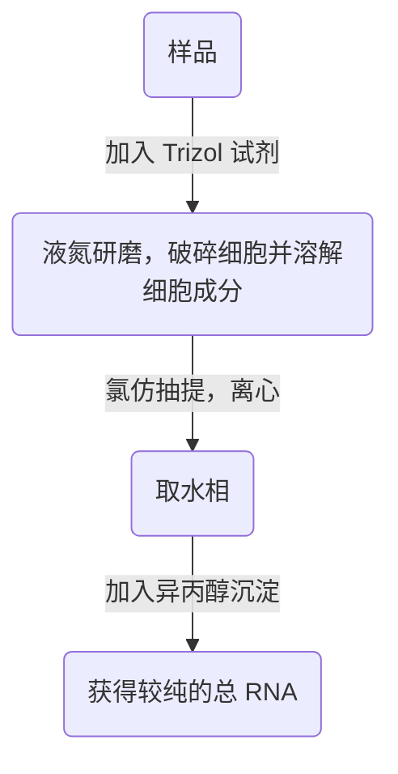
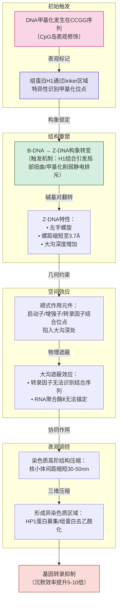

# 
第 1 章：绪论

---
- **现代分子生物学研究的终极目标是要在分子水平上阐明各种生物活动的规律，揭示生命的本质**
- 生命的起源
	- 创世说：上帝创造一切
	- 进化论：物竞天择，适者生存
- 细胞学说：动植物的基本单位是是细胞
## 1.1 DNA 的发现
### 1.1.1 肺炎链球菌转化实验

| 注射的肺炎链球菌种类及状态   | 被注射后小鼠状态 |
| --------------- | -------- |
| 活 S 型菌          | 死了       |
| 死 S 型菌          | 活着       |
| 活 R 型菌          | 活着       |
| 死 S 型菌 + 活 R 型菌 | 死了       |
- 解剖第四组死去的小鼠，发现有大量活着的 S 型菌
- 用已杀死的 S 型菌的不同细胞组分反复试验发现，死细菌 DNA 指导了这一可遗传的转化，从而导致了小鼠的死亡
- 实验证明：DNA 是遗传信息的载体
### 1.1.2 T2 噬菌体侵染细菌实验
- 用 $^{35}S$ 标记噬菌体外壳，用其侵染大肠杆菌，发现噬菌体子代几乎不含 $^{35}S$
- 用 $^{32}P$ 标记噬菌体 DNA ，用其侵染大肠杆菌，发现噬菌体子代含有 30%以上的 $^{32}P$
- 实验证明：在噬菌体侵染细菌的过程中，只有 DNA 进入到细菌细胞体内，而这些 DNA 足以完成噬菌体的全部生命过程

---
## 1.2 分子生物学主要研究内容
- 分子生物学三条基本原理
	1. 构成生物体各类有机大分子的单体在不同生物中都是相同的
	2. 生物体内一切有机大分子的构成都遵循共同的规则
	3. 某一特定生物体所拥有的核酸及蛋白质分子决定了它的属性
### 1.2.1 重组 DNA 技术（基因工程）
- 目的：将不同 DNA 片段按照人们的设计定向连接起来，在特定的受体细胞中与载体同时复制并得到表达，产生影响受体细胞的新的遗传性状
- 基因工程的应用前景
	- 重组 DNA 技术可被用于大量生产某些在真核细胞代谢中产量很低的多肽
	- 重组 DNA 技术可用于定向改造某些生物的基因组结构，使它们所具备的特殊经济价值或功能得以成百上千倍地提高
	- 重组 DNA 技术可被用来进行基础研究
### 1.2.2 基因表达调控研究
- 基因表达的实质：遗传信息的转录和翻译
- 在个体生长发育过程中，生物遗传信息的表达按一定的时序发生变化，并随着内外环境的变化而不断加以修正
	- 即：基因表达受到时序调节和环境调节
- 基因表达的调控主要发生在转录水平或翻译水平上
- 基因表达调控主要表现在以下三个方面
	- 信号转导研究
	- 转录因子研究
	- RNA 剪辑
### 1.2.3 生物大分子的结构功能研究（结构分子生物学）
- 结构分子生物学：研究生物大分子特定的空间结构及结构的运动变化与其生物学功能关系的科学
- 研究常用仪器：冷冻电子显微镜*cryo-electron microscopy， cryo-EM*

---
# 
第 2 章：染色体与DNA

---
- 核苷酸的组成：
	- 核苷
		- 核糖
		- 碱基
	- 磷酸

## 2.1 染色体
- 亲代能够将自己的遗传物质 DNA 以染色体的形式传给子代，保持了物种的稳定性和连续性
- 原核细胞 DNA：
	- 细菌 DNA：共价，闭合，双链（通常也称为染色体）
	- 一般只有一条染色体，只有少数基因 *（如 rRNA 基因）* 以**多拷贝**形式存在
	- 整个染色体 DNA 几乎全部由**功能基因**与**调控序列**所组成
	- 几乎每个基因序列都与它所编码的蛋白质序列呈**线性对应关系**
### 2.1.1 染色体的特点
1. 分子结构相对稳定
2. 能够自我复制，使亲、子代之间保持连续性
3. 能够指导蛋白质的合成，从而控制整个生命过程
4. 能够产生**可遗传**的变异
### 2.1.2 真核细胞染色体的组成
- DNA
- 组蛋白
- 非组蛋白
- 少量 RNA

>辨析染色体与染色质：同一物质在不同细胞周期的不同形态
#### 组蛋白

| 组蛋白类型  | 富含的 AA |  保守性  | 是否为核心组蛋白 |
| :----: | :----: | :---: | :------: |
| $H_1$  |  Lys   |  不保守  |  **否**   |
| $H_2A$ |        |  较保守  |    是     |
| $H_2B$ |        |  较保守  |    是     |
| $H_3$  |  Arg   | 极端保守性 |    是     |
| $H_4$  |  Arg   | 极端保守性 |    是     |
- 组蛋白富含的氨基酸都为**碱性氨基酸**，带正电，可以与带负电的 DNA 紧密结合，组成核小体
- 组蛋白的特性：
	1. 进化上的极端保守性：$H_3$ 及 $H_4$ 在氨基酸表明，它们可能对稳定真核细胞的染色体结构起着重要作用
	2. 无组织特异性
		- 例外 1：鸟类、鱼类、两栖类红细胞的染色体不含 $H_1$ 而含有 $H_5$
		- 例外 2：精细胞染色体的组蛋白是鱼精蛋白
	3. 肽链上氨基酸分布的不对称性：碱性氨基酸集中分布在 N 段（氨基端）的半条链上，碱性的半条链易与 DNA 的负电荷区结合，而另外半条链与其他组蛋白、非组蛋白结合
	4. 组蛋白的修饰作用（发挥基因调控作用）
	5. 富含 Lys 的组蛋白 $H_5$
		- 在成熟鱼类和鸟类红细胞中，$H_1$ 被特殊的组蛋白 $H_5$ 取代
		- 有核的红细胞完全失去复制和转录能力，其核很小，染色体高度浓缩，所以人们认为红细胞染色质的失活与 $H_5$ 的积累有关
		- $H_5$ 的磷酸化很可能在染色质失活过程中起重要作用

| 化学修饰 | 作用与特点                                      |
| ---- | ------------------------------------------ |
| 甲基化  | 主要发生在组蛋白 Lys 和 Arg 残基上。**比较稳定**，宜表观遗传      |
| 乙酰化  | $H_3$、$H_4$ 乙酰化水平高于 $H_2A$、$H_2B$。激活转录作用   |
| 泛素化  | 修饰位点为高度保守的 Lys 残基。招募核小体；参与 X 染色体的失活；影响基因转录 |

| 组蛋白           | 易发生的化学修饰    |
| ------------- | ----------- |
| $H_1$         | 泛素化、磷酸化     |
| $H_2A$、$H_2B$ | 泛素化、乙酰化     |
| $H_3$、$H_4$   | **甲基化、乙酰化** |
#### 非组蛋白
- HMG 蛋白（*high speed group protein*，高速泳动蛋白）
	- 因其相对分子质量小、在凝胶电泳中迁移速率快而得名
	- 是真核细胞内除组蛋白外含量最为丰富的一组染色质蛋白质
	- 与 DNA 结合并不紧密，可能与 DNA 的超螺旋结构有关，是真核细胞基因表达调控的动力体现者
- DNA 结合蛋白
	- 与 DNA 紧密结合，只有用 2 mol/L NaCl 和 5 mol/L 尿素才能把这些蛋白质解离
	- 可能是一些与 DNA 复制或转录有关的酶或调节物质
- A24 非组蛋白
	- 可能具有 rDNA 抑制子的作用

> rDNA：核糖体 DNA

### 2.1.3 真核生物基因组 DNA
- 真核细胞基因组最大特点是它**含有大量的重复序列**（多拷贝），而且功能 DNA 序列（外显子）大多被不编码蛋白质的非功能 DNA （内含子）所隔开

> 基因密度 *gene density* ：每 Mb 基因组 DNA 上所含有的平均基因数目
> 一般来说，基因密度越高，生物的复杂性越低

- 在真核生物中，基因组的大小一般随着生物进化而增加，然而许多复杂性相近的物种却有着显著不同的基因组大小、
- 与原核生物比，真核生物不但基因密度低，而且各种变异相对较多
	- 原因：真核细胞中大量基因间隔区序列 *intergenic sequence* 造成的
- 对于复杂度高的生物，调控转录的序列长度显著增长，内含子数目也大大增加
- 间隔 DNA 根据其重复性分为：
	1. 唯一性
	2. 重复性（几乎占一半以上）
#### 真核细胞的 DNA 序列分类
1. 不重复序列：一般只有一个**或几个**拷贝
	- 结构基因基本上属于不重复序列
2. 中度重复序列
	- 各种 rRNA、tRNA 及某些结构基因 *如组蛋白* 等都属此类
3. 高度重复序列（卫星 DNA）
	- 只存在于真核生物中
	- 原位杂交法证明，许多卫星 DNA 位于染色体的着丝粒部分，也有一些在染色体臂上
	- 这类 DNA 高度浓缩，是异染色质的组成部分
	- 卫星 DNA 不转录，其功能不明，可能与染色体的稳定性有关

> 常染色质：大部分转录
> 异染色质：一般不转录

### 2.1.4 染色质与核小体

> 由 DNA 和组蛋白组成的染色质纤维细丝是许多核小体连成的念珠状结构

#### 念珠状结构模型的证据
1. 染色质 DNA 的 $T_m$ 值比自由 DNA 高，说明在染色质中 DNA 极可能与蛋白质分子相互作用
2. 在染色质状态下，由 DNA 聚合酶和 RNA 聚合酶催化的 DNA 复制和转录活性大大低于在自由 DNA 中的反应
3. DNA 酶 I *DNaseI* 对染色质 DNA 的消化远远慢于对纯 DNA 的作用
4. 染色质的电子显微镜图显示出由核小体组成的念珠状结构，可以看到由一条细丝连接着的一连串直径为 10 nm 的球状体

> DNaseI 或小球菌核酸酶可以切断游离 DNA 上的任何磷酸二酯键，而除了少数几个位点以外，染色质中的 DNA 是被保护不被消化的。用小球菌核酸酶处理染色质以后电泳，分离的 DNA 片段均为 200 bp 基本单位的复数

#### 核小体的结构
- $H_2A$、$H_2B$、$H_3$、$H_4$ 各两个分子生成的八聚体
- 大约 200 bp DNA
- 一个 $H_1$
- 八聚体在中间，DNA 分子盘绕在外，$H_1$ 则在核小体外面
- 每个核心组蛋白有一个 N 段延伸的“尾巴”，上面有许多高度修饰的位点
- 核酸酶水解核小体后产生只含 146 bp 核心颗粒，包括组蛋白八聚体及与其结合的 146 bp 核心 DNA，该序列在核心外形成 1.65 圈，每圈约 80 bp
- 核小体之间的连接 DNA 长度是**可变的**，一般为 20-60 bp

| 蛋白结合           | 特点    |
| -------------- | ----- |
| 组蛋白结合          | 非特异性的 |
| 非组蛋白结合 *如转录因子* | 特异性的  |
### 2.1.5 染色体的组装

|    形态     | 同上一级相比浓缩倍数 |
| :-------: | :--------: |
| DNA.plain |     -      |
|  核小体.zip  |    7 倍     |
|  螺线管.zip  |    6 倍     |
| 超螺线管.zip  |    40 倍    |
| 染色单体.zip  |    5 倍     |
- 浓缩总倍数：8400
### 2.1.6 真核生物基因组的结构特点
1. 真核基因组庞大，远远大于原核基因组
2. 真核基因组存在大量重复序列
3. 真核基因组的大部分为非编码序列 **（真核生物与细菌和病毒间最主要的区别）**
4. 真核基因组的转录产物为单顺反子（一种 mRNA）
5. 真核基因是断裂基因，有内含子结构
6. 真核基因组存在大量顺式作用原件
7. 真核基因组中存在大量的 DNA 多态性（主要包括单核苷酸多态性 *SNP* 和串联重复序列多态性）
8. 真核基因组具有端粒结构

> [!Notes] 
> 1. mRNA 分为单顺反子（真核）和多顺反子（原核），单顺反子一条 mRNA 翻译一个蛋白质，而多顺反子一条 mRNA 翻译多个蛋白质
> 2. 断裂基因：去除非编码区域（内含子）再连接后可翻译完整蛋白质
> 3. 端粒具有保护线性 DNA 的完整复制、保护染色体末端和决定细胞寿命等功能。端粒在复制过程中会缩短

### 2.1.7 原核生物基因组的结构特点
1. 结构简练：只有非常小一部分不转录
2. 存在转录单元
	- 原核生物 DNA 序列中功能相关的 RNA 和蛋白质基因，往往丛集在基因组的一个或几个特定部位，形成功能单元或转录单元，它们可被一起转录为含多个 mRNA 的分子，叫**多顺反子 mRNA**
3. 有重叠基因
	- 一个基因完全在另一个基因里面
	- 部分重叠
	- 两个基因只有一个碱基对的重叠

---
## 2.2 DNA 的结构
### 2.2.1 DNA 的一级结构
- 四种核苷酸的连接及其排列顺序 *即 DNA 的化学构成*

| 核苷酸种类 | 简写  | DNA 中是否含有 | RNA 中是否含有 |
| :---: | :-: | :-------: | :-------: |
|  腺嘌呤  |  A  |     ✅     |     ✅     |
| 胸腺嘧啶  |  T  |     ✅     |     ❌     |
|  胞嘧啶  |  C  |     ✅     |     ✅     |
|  鸟嘌呤  |  G  |     ✅     |     ✅     |
|  胞嘧啶  |  U  |     ❌     |     ✅     |
### 2.2.2 DNA 的二级结构
- 是指两条多核苷酸链**反向平行**盘绕所生成的双螺旋结构
- 特点
	1. DNA 分子是由两条相互平行的脱氧核苷酸长链盘绕而成
	2. DNA 分子中的脱氧核糖和磷酸交替连接，排在外侧，**构成基本骨架**，碱基排列在内侧
- 碱基互补配对原则：碱基之间的一一对应关系
	- A - T
	- A - U
	- C - G
- DNA 二级结构的分类

| DNA 二级结构的类型 | 螺旋方向 |
| :---------: | :--: |
|    B-DNA    | 右手螺旋 |
|    A-DNA    | 右手螺旋 |
|    Z-DNA    | 左手螺旋 |
#### B-DNA
- 沃森和克里克提出 DNA 双螺旋模型的证据
	1. X 射线衍射实验数据表明 DNA 是一种规则螺旋结构
	2. DNA 分子密度测量表面这种螺旋结构由两条多核苷酸链组成
	3. 不论碱基数目的多少，G 的含量总是与 C 一样，而 A 与 T 也是一样的
- B-DNA 的特点
	- B-DNA 钠盐结构含水量高 *(而 A-DNA 含水量低)*
	- 多核苷酸方向由核苷酸间的磷酸二酯键的走向决定，一条从 5' 到 3'，另一条从 3' 到 5'
	- 链间有螺旋型的凹槽，一小一大，小沟 **1.2 nm** 交叉，大沟 **2.2 nm** 交叉
- 碱基平面与纵轴垂直，脱氧核糖环平面与纵轴平行
- 相邻碱基对平面间的距离：**0.34 nm**
- 结构重复周期：**3.4 nm**
- 螺旋上升一圈有 **10 bp**
- 双螺旋直径：**2 nm**
#### A-DNA
- 在相对湿度 **75%** 以下时，该构象的 DNA 称为 A-DNA
- A-DNA 与 B-DNA 的重要区别在于：A-DNA具有一个**深窄的大沟**和**宽浅的小沟**，而 B-DNA 大沟宽，小沟窄
- B-DNA 若双链中的一条链被相应的 RNA 链所替换，则变构成 A-DNA *(DNA-RNA 杂化双链)*
- **A-DNA 构象对基因表达有重要作用**
#### Z-DNA
- Z-DNA 螺旋细长，每圈螺旋含 12 bp，大沟平坦，小沟深而窄，核苷酸构象顺反相间，螺旋骨架呈 Z 字形
#### DNA 双链的变性和复性
- (可逆)变性*denaturation*：DNA 溶液温度接近沸点或者 pH 较高时，互补的两条链分开
- 复性： 变性 DNA 溶液缓慢降温时，DNA 的互补链又可重新形成规则的双螺旋
- DNA 变性与复性能力的应用
	- Southern 印记杂交
	- DNA 芯片分析

> **DNA 芯片分析** 
> 又叫基因芯片,测序原理是杂交测序方法，即通过与一组已知序列的核酸探针杂交进行核酸序列测定的方法，在一块基片表面固定了序列已知的靶核苷酸的探针。当溶液中带有荧光标记的核酸序列TATGCAATCTAG，与基因芯片上对应位置的核酸探针产生互补匹配时，通过确定荧光强度最强的探针位置，获得一组序列完全互补的探针序列。据此可重组出靶核酸的序列。

| DNA 性质 | 现象                     |
| ------ | ---------------------- |
| DNA 变性 | 增色效应 *hyperchromicity* |
| DNA 复性 | 减色效应 *hypochromicity*  |
> 增色效应：当 DNA 溶液温度升高到接近水的沸点时，260nm 处的吸光度 $A_{260nm}$ 明显增加
> 人们常通过检测 DNA 溶液的紫外吸光度 $A_{260nm}$ 的变化来监控 DNA 的变性过程

#### 影响熔解温度 Tm 的因素
- DNA 中 C + G 的含量
- 溶液中的离子强度
- DNA 的均一性

> [!Notes] 
> - 在高离子强度下，负电荷可以被阳离子中和，双螺旋结构被稳定保持。故 DNA 样品一般在**含盐缓冲溶液**中比较稳定，而较难保存在稀电解质溶液中
> - $T_m$ 值可以作为衡量样品均一性的标准

### 2.2.3 DNA 的高级结构
- 分为**正超螺旋**和**负超螺旋**两大类
- 天然状态下，DNA 以负超螺旋为主

---
## 2.3 DNA 的复制
- dNTP：脱氧核苷三磷酸
- ddNTP：双脱氧核苷三磷酸 *（不能形成 3'-5'磷酸二酯键而掺入 DNA 链）*
### 2.3.1 DNA 复制概念辨析
#### 复制子与复制叉
- 复制子*replicon*：能独立进行复制的单位。从复制起始点*origin*到终止点的区域为一个复制子。一个复制子只包含一个复制起始点
- 复制叉*replication fork*：复制时，双链 DNA 要解开成两股链分别进行，这个复制起始点呈现叉子的形式，故被称为复制叉
#### 复制起始点与终止点
- 起始点可以启动单向复制或双向复制。双向复制中，复制叉从起始点开始沿着相反方向**等速**前进
- 复制起始点的共同特点：含有丰富的 AT 序列，可能有利于 DNA 复制启动时双链的解开 *（A - T 配对只形成两条氢键，易解开）*

| 生物 / 细胞器      | 复制形式 |
| ------------- | ---- |
| 细菌、病毒、线粒体 DNA | 单复制子 |
| 真核生物          | 多复制子 |
- 真核生物复制子并非同时起作用，一般只有不超过 15% 的复制子进行复制
- 细胞内复制子数目与复制子移动速度成反比
- 复制终止点*terminus*：复制子中控制复制终止的位点
	- 大肠杆菌 cDNA 中，复制终止点在起始点的相对位置（旋转 180°），复制从起始点双向进行，复制叉向两个相反方向延 cDNA 前进，最后两个复制叉相遇在一个位点而停止，该位点即为终止点
#### DNA 复制方向
- 单向复制
- 双向复制 *（最普遍）*
- 相向复制 *（如：腺病毒等某些线性DNA病毒）*

> **放射自显影实验判断 DNA 复制的方向性**
> 1. 复制开始时用低放射性 $^3H$ 脱氧胸苷标记 *E.coli* ，数分钟后转移到高放射性培养基中继续标记。复制起始区放射性标记密度低，感光还原的银颗粒密度也比较低
> 2. 单向复制：银颗粒密度分布一端低，一端高
> 3. 双向复制：银颗粒密度分布中间低，两端高

#### DNA 复制速度
- 细菌DNA 只有一个复制起始点，所以其复制叉移动速度比真核生物快 20-50 倍
- 对一个生物体基因组来说，复制起始点是**固定的**，复制叉移动方向与速度以**双向等速方式**为主
### 2.3.2 DNA 的半保留复制
- 定义：每个子代分子的一条链来自亲代 DNA，另一条链则是新合成的，这种复制方式被称为 DNA 的半保留复制*semiconservative replication*
- DNA 在复制过程中碱基间的氢键首先断裂，双螺旋解旋并被分开，每条链分别作为模板合成新链，产生互补的两条链

>**DNA 半保留复制的验证实验**
>1. $^{15}N$ 培养基培养大肠杆菌
>2. 移入 $^{14}N$ 继续培养一代，CsCl 密度梯度离心，DNA 密度在 $^{15}N-DNA$ 和 $^{14}N-DNA$ 之间，说明形成了一半 $^{15}N$ 一半 $^{14}N$ 的杂合 DNA 分子
>3. 继续在 $^{14}N$ 培养基中培养，CsCl 密度梯度离心，发现 $^{14}N-DNA$ 增多

- DNA 半保留复制的意义：保证了 DNA 在代谢上的稳定性。经过许多代复制，DNA 多核苷酸链仍可完整地存在于后代而不被分解掉。这种稳定性与DNA 的遗传功能相符
### 2.3.3 冈崎片段与半不连续复制*semidiscontinuous replication*

| DNA 半不连续复制中的子代链 |        英文        |
| :-------------: | :--------------: |
|       前导链       | *leading strand* |
|       后随链       | *lagging strand* |

- 冈崎片段：沿着后随链的模板链合成的新 DNA 片段
- DNA 复制过程中至少有一条链首先合成较短的冈崎片段，然后再由连接酶连接成大分子 DNA
- DNA 复制方向：从 5' 到 3'
	- 因为 DNA 聚合酶只能在 3'-OH 上添加核苷酸
### 2.3.4 DNA 聚合酶
- 具有**催化选择性**
- DNA 聚合酶*DNA polymerase*用一个活性位点催化 4 种脱氧核苷三磷酸（dNTP）的添加
- DNA 聚合酶的结构域
	- 手掌域：含有**催化位点**的基本原件，由一个 β 折叠构成，还负责**检查**最新加入的核苷酸碱基配对的准确性
	- 手指域：包围住 dNTP，使引入的核苷酸和金属离子密切接触，**促进催化**反应
	- 拇指域：维持引物以及活性部位的**正确位置**，促进 DNA 聚合酶与其底物之间的**紧密连接**，有助于添加更多 dNTP
- DNA 聚合酶的延伸能力*processivity*：指每次聚合酶与模板-引物结合时所能添加的核苷酸的平均数
- 校正外切核酸酶*proofreading exonuclease*具有校正新合成 DNA 的能力，可把错误核苷酸从引物链的 3' 端除去
	- 校正外切核酸酶将不正确配对碱基发生概率降低至每添加 $10^7$ 个核苷酸出现一次
	- 复制后错配修复将不正确配对碱基发生概率降低至每添加 $10^{10}$ 个核苷酸出现一次
### 2.3.5 滑动 DNA 夹
- 滑动 DNA 夹*sliding DNA clamp*：一种蛋白质，是一个闭合的环，由 5 个亚基组成的滑动夹装载器*sliding clamp loader*通过**结合和水解ATP**催化滑动夹的打开，并将其安放在 DNA 的引物-模板接头上
- 滑动 DNA 夹的作用：与 DNA 聚合酶结合，组成“油炸圈饼”结构，保持聚合酶与 DNA 的紧密接触，从而大大增加了 DNA 的延伸能力（需要 ATP）
- 滑动 DNA 夹是生物 DNA 复制体系种必不可少的**保守**部件

---
## 2.4 原核生物和真核生物 DNA 复制的特点
### 2.4.1 原核生物 DNA 复制过程
- 复制起始点（oriC）含有 3 个 13bp 的串联重复保守序列*GATCTNTTNTTTT*以及 4 个由 9bp 的保守序列*TTATACANA*组成的能结合 DnaA 的起始结合位点
- 原核生物 DNA 复制过程：
	1. DNA 双螺旋的解旋
	2. DNA 复制的引发
	3. DNA 复制的延伸
	4. DNA 复制的终止
#### ① DNA 双螺旋的解旋

| 参与酶                                                  | 作用                                                     |
| ---------------------------------------------------- | ------------------------------------------------------ |
| DNA 解旋酶*DNA helicase*                                | 利用 ATP 的能量解开双链                                         |
| 单链 DNA 结合蛋白*single-stranded DNA binding protein，SSB* | 保证被解开的单链在复制完成前能保持单链结构，以四聚体形式存在于复制叉处，待单链复制完成后才离开，重新进入循环 |
| DNA 拓扑异构酶*DNA topoisomerase*                         | 消除解链造成的**正**超螺旋的堆积，消除阻碍解链继续进行的这种压力，使复制得以延伸             |
- 在拓扑异构酶 I 的作用下解开负超螺旋，并与 DNA 解链酶共同作用，在复制起点处解开双链
- 参与解链的除了解链酶外，还有 Dna 蛋白等，一旦局部解开双链，就必须有 SSB 蛋白来稳定解开的单链，以确保该局部结构不会恢复成双链
- 接着，由引发酶等组成的引发体迅速作用于两条单链DNA 上
- 前导链和后随链均需要一段 RNA 引物以起始子链 DNA 的合成
#### ② DNA 复制的引发
- **DNA 聚合酶只能延长已存在的DNA 链，不能从头合成 DNA 链**，因此，DNA 新链的起始需要一条 RNA 引物

> **引物** *primer*
> - 提供 3'-OH
> - 引物的合成需要引发酶（一种特殊的 RNA 聚合酶），且最后需切除
> - 在体内，引物为RNA；在体外，引物为 DNA/RNA 均可

- 前导链只需要一个引物，而后随链每个冈崎片段都需要一个引物
- 后随链的引发过程往往由引发体*primosome*来完成
- 引发体前体*preprimosome*（包含六种蛋白） + 引发酶*primase* = 引发体
- 引发酶是*dnaG*基因的产物
- 引发体向后随链分叉方向前进，沿途断断续续地引发生成后随链的引物
- 引物产生后，**DNA 聚合酶 III** 在引物后合成 DNA，再由 **RNase H** 降解 RNA 引物并由 **DNA 聚合酶 I** 将缺口补齐，最后， **DNA 连接酶**将两个冈崎片段连在一起形成子代 DNA 链

> [!bug] 注意
> - DNA 聚合酶可以利用 dNTP 高能磷酸键的能量，**无需额外提供 ATP**
> - DNA 连接酶**需要额外提供 ATP** 才能完成功能

#### ③ DNA 复制的延伸
1. 引物酶合成约 10 个核苷酸大小的新引物
2. DNA 聚合酶 III 以 5' -> 3' 方向延伸引物，直到遇见邻接引物的 5' 端
3. 在*E.coli*中，DNA 聚合酶 I 具有 5' -> 3' 外切酶的活性，被用来去除引物
4. DNA 连接酶连接相邻的冈崎片段，使之成为一条完整的子代链

| 参与酶         | 作用                             |
| ----------- | ------------------------------ |
| DNA 聚合酶 III | 在引物后延长子链                       |
| RNase H     | 切除引物                           |
| DNA 聚合酶 I   | 补全切除引物后的子链空缺（在大肠杆菌中还具有切除引物的作用） |
| DNA 连接酶     | 连接冈崎片段                         |
#### ④ DNA 复制的终止
- 需要 Tus 蛋白
- 重复性终止子序列（*Ter*）：22 b

> [! success] 符号约定：有关核酸的内容中，“bp”代表碱基对，“b”代表碱基

### 2.4.2 原核生物的 DNA 聚合酶

|   原核生物 DNA 聚合酶    |            Ⅰ             |   Ⅱ    |  Ⅲ  |
| :---------------: | :----------------------: | :----: | :-: |
| 3' -> 5' 外切（校正作用） |            +             |   +    |  +  |
|    5' -> 3' 外切    | **+（大肠杆菌中有切除 5'端引物的作用）** |   -    |  -  |
|  5' -> 3' 聚合酶活性   |          有，但不发挥          | 有，但不发挥 |  +  |
- DNA 聚合酶 I
	- 可被蛋白酶切成两个区域：C 端区和 N 端区
	- C 端区大，又被称为 Klenow 片段，同时具有 DNA 聚合酶活性和 3' -> 5' 外切酶活性
	- N 端区小，具有 5' -> 3' 外切酶活性
- DNA 聚合酶Ⅱ
- DNA 聚合酶Ⅲ
	- 是大肠杆菌 DNA 复制中链延长反应的**主导聚合酶**
- DNA 聚合酶Ⅳ 和 DNA 聚合酶Ⅴ
	- 主要在 DNA 修复和跨损伤合成 *（translesion synthesis，TLS）* 过程中发挥作用
### 2.4.3 真核生物 DNA 复制的特点
1. 真核生物 DNA 每个细胞周期只精确复制一次
2. 真核细胞复制的起始需要在前复制复合体 pre-RC 的指导下进行
3. 细胞周期蛋白依赖性激酶（CDK）调控前复制复合体的形成和激活

> **真核生物冈崎片段的切除**
> 1. RNase HⅠ切开引物
> 2. FENⅠ蛋白（具备5' -> 3'外切核酸酶活性）降解RNA引物片段
> 3. DNA连接酶Ⅰ连接冈崎片段

### 2.4.4 真核生物 DNA 聚合酶
- 已发现的有 15 种以上
- 哺乳动物细胞主要有五种：α、β、γ、δ、ε
- 真核细胞 DNA 聚合酶和细菌 DNA 聚合酶基本性质相同，均以 dNTP 为底物，需 $Mg^{2+}$ 激活，聚合时必须有模板链和具有 3'-OH 末端的引物链，链的延伸方向为 5' -> 3' 
### 2.4.5 端粒酶与 DNA 末端复制
- 末端复制问题*end replication problem*：由于所有新 DNA 合成启动都需要一条引物，这使得线性染色体（后随链）末端的复制成为难题
- **以前导链为模板的复制不存在末端复制问题**
- 解决末端复制问题
	1. 用蛋白质代替 RNA 作为每个染色体末端最后一个冈崎片段的引物
	2. （多数真核细胞）利用端粒酶来延伸染色体 3' 端
- 端粒酶*telomerase*：一种特殊的酶，由蛋白质和 RNA 组成。与 DNA 聚合酶不同的是，**它不需要外源 DNA 模板来指导新 dNTP 的添加**。可利用自身含有的 RNA 成分作为模板将端粒序列添加到染色体 3' 端
- 生殖细胞、干细胞、肿瘤细胞端粒酶活性高
### 2.4.6 DNA 复制的调控

| 细胞        | 原核细胞          | 真核细胞                                    |
| --------- | ------------- | --------------------------------------- |
| DNA 复制的调控 | 主要发生在**起始阶段** | 1. 细胞周期水平调控 2. 染色体水平调控 3. 复制子水平调控 |
- 真核细胞复制子水平调控决定复制的起始与否，**高度保守**

---
## 2.5 DNA 损伤的修复
### 2.5.1 错配修复*mismatch repair*
- 系统识别新合成链种的错配并加以校正，DNA 子链中的错配几乎完全能被修正，充分反映了母链序列的重要性
- 原则：保存母链，修正子链
- 标记母链的方法：母链在复制时会被打上甲基化的标签，方便识别
### 2.5.2 切除修复
#### ① 碱基切除修复*base-excision repair*
- 糖苷水解酶能特异性切除受损核苷酸上的 N-β 糖苷键，在 DNA 链上形成去嘌呤或去嘧啶位点，统称为 **AP 位点**
- AP 位点：DNA 链上去除碱基的位点
- DNA 分子中一旦产生了 AP 位点，**AP 内切核酸酶**就会把受损核苷酸的糖苷-磷酸键切开，并移去包括 AP 位点核苷酸在内的小片段 DNA，由 DNA 聚合酶Ⅰ合成新的片段，最终由 DNA 把两者连接成新的被修复的 DNA 链
#### ② 核苷酸切除修复*nucleotide-excision repair*
- 当 DNA 链上相应位置的核苷酸发生损伤，导致两链之间无法形成氢键，则由核苷酸切除修复系统负责修复
### 2.5.3 同源重组修复和非同源末端连接
- 当 DNA 发生双链断裂时，可通过同源重组修复 *（homologous recombination repair，HR）* 和非同源末端连接 *（non-homologous endjoining，NHEJ）* 来进行修复
- 同源重组修复*HR*
	- 又被称为：复制后修复
	- 是一种高保真*error-free*修复方式
	- 机体在对复制起始时尚未修复的 DNA 损伤部位可以先跳过，在子链中留下一个对应损伤序列的缺口。复制完成后，从同源 DNA 母链上将相应未损伤核苷酸序列片段移至子链缺口处，然后再用新合成的序列补上母链空缺
- 非同源末端连接*NHEJ*
	- 一种易错修复方式

> [!note] 笔者按：个人的理解，NHEJ 是直接把断裂 DNA 双链中错误的、无法配对的核苷酸切除到只剩平末端，再连接在一起。只能算是勉强把 DNA 的断裂连上了，而没有修复错误的核苷酸信息，不能算真正的修复

### 2.5.4 DNA 的直接修复
- 直接修复是把损伤的碱基回复到原来状态的一种修复
- 如：DNA 光解酶*photolyase*
- 又如：甲基转移酶：防止形成 G-T 配对
### 2.5.5 跨损伤合成*translesion synthesis，TLS*
- 是一种易错修复
- 也被称为“跨缺刻复制”或“备份复制*backup synthesis*”
- 在 DNA 链复制过程中，当 DNA 聚合酶遇到未被修复的损伤而停顿时，复制机器必须越过损伤防止复制叉崩塌，机体必须启动 TLS 系统并忽略已存在的损伤
- TLS 在掺入核苷酸时不依赖于碱基配对

> [!note] 笔者按：TLS 即在遇到损伤时随便加一个核苷酸上去草草了事，不保证准确性，只保证复制能进行下去。课本评：“好死不如赖活着”

### 2.5.6 SOS 修复系统
- 是一种易错修复
- SOS 修复*SOS repair*系统是细胞 DNA 受到损伤或复制系统受到抑制的紧急情况下，细胞为求生存而产生的一种应急措施，允许新生的 DNA 链越过胸腺嘧啶二聚体继续复制，其代价是保真度的极大降低
- 意义
	- DNA 修复
	- 产生变异

---
## 2.6 DNA 的转座
- DNA 转座*transposition*：又称“移位”，是由可移位因子*transposable element*介导的遗传物质重排现象
- 在转座过程中，可移位因子常常留在原来位置上，在新位点上出现的是它的拷贝
### 2.6.1 转座子*transposon，Tn*
- 定义：存在于染色体 DNA 上可自主复制和位移的基本单位（一段 DNA 序列）
- 分类
	- 插入序列*insertional sequence，IS*
	- 复合型转座子*composite transposon*
#### ① 插入序列
- IS 是最简单的转座子，不含有任何宿主基因，是细菌染色体或质粒 DNA 的正常组成部分
- 常见的 IS 都是小 DNA 片段，约 1 kb，末端具有**反向**重复区，转座时往往复制宿主靶位点一小段（4-15 bp）DNA，形成位于 IS 两端的**正向**重复区
#### ② 复合型转座子
- 复合型转座子是一类带有某些抗药性基因（或其他宿主基因）的转座子
- 复合型转座子两翼往往是两个相同或高度同源的 IS，表明 IS 插入到某个功能基因两端时就可能产生复合型转座子
- 一旦形成复合型转座子，IS 就不能再单独移动，因为它们的功能被修饰了，只能作为复合体移动
- **大部分情况下，这些转座子的转座能力是由 IS 决定和调节的**
- TnA 家族
	- 没有 IS，体积庞大（5000 bp 以上）
	- 带有三个基因：一个编码 β-内酰胺酶的基因，另两个是转座作用所必须的
	- 所有 TnA 类转座子两翼都带有 38 bp 的**反向重复序列**
#### 真核生物中的转座子
- 玉米细胞内的转座子（控制因子）
	- 自主性因子*autonomous element*
		- 具有自主剪切和转座功能
	- 非自主性因子*nonautonomous element*
		- 单独存在时稳定，不能转座，当基因组中存在与非自主性因子同家族的自主性因子时，才具备转座功能，成为与自主性因子相同的转座子
### 2.6.2 转座作用的遗传学效应
1. 转座引入插入突变
2. 转座产生新的基因
3. 转座产生染色体畸变
4. 转座引起生物进化

---
## 2.7 SNP 的理论与应用
- SNP：*single nucleotide polymorphism*，单核苷酸多态性，指基因组 DNA 序列中由于单个核苷酸的突变（对换或颠换）而引起的多态性
- SNP 的优点：是基因组中最简单、最常见的多态性形式，具有很高的遗传稳定性
- 遗传标记技术的迭代：
	1. 一代：限制性片段长度多态性*RFLP*
	2. 二代：微卫星标记*SSR*
	3. 三代：SNP 检测和分析技术
- 等位位点：染色体 DNA 同一位置的每个碱基类型
	- 相邻 SNP 的等位位点倾向于以一个整体遗传给后代
- 单倍型*haplotype*：位于染色体上某一区域的一组相关联的 SNP 等位位点、
- SNP 的检测技术
	- 最常见：DNA 测序法
	- 基因型分型*genotyping*：利用数据库中已有的 SNP 进行特定人群的序列和发生频率的研究，主要包括基因芯片技术、Taqman 技术、分子导标技术*molecular beacon*和焦磷酸测序法*pyrosequencing*等
- SNP 的应用
	- 人类单倍型图的绘制
	- SNP 与疾病易感基因的相关性分析
	- 指导用药与药物设计

---
# 
第 3 章：转录

---
## 3.1 RNA 概述

> [!note] Notes
>- 转录和翻译的速度基本相等
>- 除少数 RNA 病毒外，所有 RNA 分子都来自于 DNA 
>- mRNA 在细菌细胞内的半衰期很短
>- 许多基因的 mRNA 在体内相当稳定
>- DNA 转录时的两条 DNA 链
>	- 编码链*codinig strand*（有义链*sense strand*）：DNA 转录时与 mRNA 序列相同的 DNA 链
>	- 模板链*template strand*（反义链*antisense strand*）：DNA 转录时根据碱基互补配对原则指导 mRNA 合成的链

- mRNA 的功能：通过三联体密码翻译生成蛋白质
- **真核**细胞 mRNA 的最大特点：往往以一个较大相对分子质量的前体 mRNA 出现在核内，需要经过转录后加工。只有成熟的、相对分子质量明显变小并经化学修饰的 mRNA 才能进入细胞质，参与蛋白质的合成

| 真核生物起始密码子 |      原核生物起始密码子      |
| :-------: | :-----------------: |
|    AUG    | 主：AUG 有时：GUG、UUG |
### 3.1.1 RNA 的结构特点
1. RNA 含有核糖和嘧啶，**通常是**单链线性分子
2. RNA 链自身折叠形成局部双螺旋（茎-环结构*stem-loop structure*）
	- 具有大量双螺旋结构特征
	- 茎-环结构举例：发夹结构*hairpin*、凸起、环状结构、四通道内环
	- 除了沃森-克里克配对（即：碱基互补配对）外，RNA 还具有额外的非沃森-克里克配对的碱基，如 G-U 碱基对
3. RNA 可折叠形成复杂的三级结构
	- 如：假结*pseudoknot*
4. 存在环状 RNA（circRNA）
	- 没有 5'、3'端，无法被 RNA 外切酶酶切，比线性 RNA 稳定
	- 真核细胞 circRNA 来自于 RNA 前体（pre-RNA）的反向剪切
	- 虽然 circRNA 通常表达水平较低，但它们的表达存在细胞和组织特异性。circRNA 可以通过不同途径影响基因表达，**有效扩展真核细胞转录组的多样性和复杂性**，在细胞中扮演着重要角色
### 3.1.2 RNA 的种类

| RNA                  | 功能                                 |
| -------------------- | ---------------------------------- |
| mRNA，*messenger RNA* | 编码特定蛋白质序列                          |
| tRNA，*transfer RNA*  | 特异性解读 mRNA 中的遗传信息、将其转化成相应氨基酸后加入多肽链 |
| rRNA，*ribosomal RNA* | 直接参与核糖体中蛋白质合成                      |
- 按是否编码蛋白质分
	- 编码 RNA *coding RNA*
		- 只有 mRNA 和 hnRNA 属于编码 RNA
	- 非编码 RNA *non-coding RNA，ncRNA*
### 3.1.3 RNA 的功能
1. 作为细胞内蛋白质生物合成的主要参与者
2. 部分 RNA 可以作为核酶，在细胞中催化一些重要反应，主要作用域初始转录产物的剪接加工
3. 参与基因表达的调控，与生物的生长发育密切相关
4. 在某些病毒中，RNA 是遗传物质
### 3.1.4 核酶*ribosome*
- 定义：一类具有催化功能的 RNA 分子
- 按催化功能分类
	1. 剪切型核酶
	2. 剪接型核酶
- 核酶发现的意义（简单了解即可）
	1. 使我们对 RNA 的重要功能又有了新的认识
	2. 核酶是继反转录现象后，对中心法则的又一个重要修正
	3. 核酶的发现为生命起源的研究提供了新的思路
### 3.1.5 核糖体的沉降系数

|          | 原核细胞核糖体              | 真核细胞核糖体                           |
| -------- | -------------------- | --------------------------------- |
| 总        | 70 S                 | 80 S                              |
| 小亚基      | 30 S                 | 40 S                              |
| 大亚基      | 50 S                 | 60 S                              |
| 小亚基 rRNA | 16 S rRNA            | 18 S rRNA                         |
| 大亚基 rRNA | 23 S rRNA + 5 S rRNA | 28 S rRNA + 5.8 S rRNA + 5 S rRNA |

---
## 3.2 RNA 转录的基本过程
### 3.2.1 RNA 转录与 DNA 复制的比较

| 比较方面    | DNA 复制                             | RNA 转录                                                        |
| ------- | ---------------------------------- | ------------------------------------------------------------- |
| 是否需要引物  | DNA 聚合酶不可催化两个游离核苷酸的连接，因此需要一段引物     | RNA 聚合酶具有从头起始转录的能力，故其催化 RNA 合成时无需引物                           |
| 碱基互补状态  | DNA 子链需与母链一直保持碱基互补状态               | RNA 产物不与模板 DNA 保持碱基互补状态，仅形成局部的双链杂交结构。因此，多个 RNA 聚合分子可以同时转录一个基因 |
| 是否具有选择性 | DNA 复制必须将整个基因组全部拷贝，并且在每个细胞周期内只复制一次 | RNA 转录可选择性地复制基因组的特定部分                                         |
| 精确度     | 很精确                                | 转录过程缺乏严谨的校正机制                                                 |
| 模板      | 单双链都可以作为模板                         | 主要以双链 DNA 为模板，RNA 或 RNA-DNA 双链杂合体不能作为模板                       |
- 以 DNA 序列为模板的 RNA 聚合酶主要以双链 DNA 为模板，以 4 种核苷三磷酸（NTPs）作为活性前体，并以 $Mg^{2+}$ 或 $Mn^{2+}$ 为**辅助因子**，催化 RNA 链的起始、延伸和终止，它**不需要任何引物**，催化生成的产物是与 DNA 模板链相互补的 RNA
### 3.2.2 启动子*promoter*
- 定义：一段位于结构基因 5' 上游区的 DNA 序列，能活化 RNA 聚合酶，使之与模板 DNA 准确地相结合，并具有转录起始的特异性，是基因表达调控的上游顺式作用原件之一
- **转录起始时基因表达的关键阶段**，这一阶段的重要问题是：RNA 聚合酶与启动子的相互作用
- 启动子的结构影响了它与 RNA 聚合酶的亲和力，从而影响了基因表达的水平
- 转录单元*transcription unit*：一段从启动子开始至终止子*terminator*结束的 DNA 序列
	- RNA 结合酶从转录起点开始沿着模板前进，直到终止子为止，转录出一条 RNA 链
- 转录起点：与新生 RNA 链第一个核苷酸相对应的 DNA 链上的碱基
	- 通常为一个**嘌呤**
- 上游序列与下游序列
	- 上游序列*upstream*：转录起点前面，即 5' 端的序列
	- 下游序列*downstream*：转录起点后面，即 3' 端的序列
	- 转录起点表示为：+1
	- 上游方向依次为：-1 -2 -3……
	- 下游方向依次为：+2 +3 +4……
### 3.2.3 mRNA 转录的基本过程
- mRNA 转录的特点
	- 方向：5' -> 3'
	- 模板：DNA 模板链（反义链）
	- 酶：RNA 聚合酶
	- 原料：四种核苷三磷酸（NTPs）
	- 配对原则：碱基互补配对
	- 形成的化学键：磷酸二酯键
	- 不需要引物参与
	- 合成的 RNA 带有与 DNA 编码链（有义链）相同的序列
- mRNA 转录的基本过程
	1. 模板识别
	2. 转录起始
	3. 转录延伸
	4. 转录终止
#### ① 模板识别*template recognition*
- 定义：RNA 聚合酶识别启动子序列并与启动子 DNA 双链特异性结合的过程
#### ② 转录起始*initiation*
- 定义：RNA 链上第一个核苷酸键（磷酸二酯键）的形成
- 转录起始不需要引物
- RNA 聚合酶与启动子结合后，使其附近的 DNA 双链解旋并解链，形成**转录泡**以促进底物核糖核苷酸与模板 DNA 的碱基配对
#### ③ 转录延伸*elongation*
- 定义：底物 NTP 被不断添加到新生 RNA 链的 3'-OH 端
- 随着转录泡复合体与 RNA 聚合酶沿着 DNA 模板向前移动，DNA 双螺旋持续解开，暴露出新的单链 DNA 模板，新生 RNA 链的 3' 端不断延伸，在解链区形成 RNA-DNA 杂合物
- 在解链区后面，DNA 模板链与其原先配对的非模板链（编码链）结合重新成为双螺旋，RNA 链被逐步释放
#### ④ 转录终止*termination*
- 当 RNA 链延伸到转录终止位点时：
	- RNA 聚合酶不再形成新的磷酸二酯键
	- RNA-DNA 杂合物分离
	- 转录泡瓦解
	- DNA 恢复成双链状态
	- RNA 聚合酶和 RNA 链都被从模板上释放下来

---
## 3.3 原核生物与真核生物的转录及产物特征比较
### 3.3.1 原核生物与真核生物转录过程比较

| 比较方面       | 原核生物                                                                   | 真核生物                                    |
| ---------- | ---------------------------------------------------------------------- | --------------------------------------- |
| RNA 聚合酶数量  | 1 种                                                                    | 3 种                                     |
| 转录产物       | 初始转录产物大多数是编码序列，与蛋白质的氨基酸序列呈线性关系                                         | 初始转录产物很大，含有内含子序列，成熟的 mRNA 只占初始转录产物的一小部分 |
| 转录产物是否需要加工 | 初始转录几乎不需要剪接加工就可以直接作为成熟的 mRNA 进一步行使翻译模板的功能                              | 转录产物需要经过剪接、修饰等转录后加工成熟过程才能成为成熟的 mRNA     |
| 转录与翻译的关系   | *边转录边翻译：* 转录和翻译不仅发生在同一个细胞空间中，而且这两个过程几乎是同步进行的，蛋白质合成往往在 mRNA 刚开始转录时就被引发了 | mRNA 的合成（转录）和蛋白质的合成（翻译）发生在不同的空间和时间中     |
### 3.3.2 原核生物 mRNA 的特征
1. 原核生物 mRNA 的半衰期短
2. 许多原核生物的 mRNA 可能以多顺反子的形式存在
	- 几乎所有 mRNA 都可以被分成三部分：编码区、位于 AUG 之前的 5' 端上游非编码区、位于终止密码子之后不翻译的 3' 端下游

>- 单顺反子 mRNA *（monocistronic mRNA）* ：只编码一个蛋白质的 mRNA
>- 多顺反子 mRNA *（polycistronic mRNA）* ：编码多个蛋白质的 mRNA
>	- 多顺反子 mRNA 时一组相邻或相互重叠基因的转录产物，这样的一组基因可被称为一个操纵子*operon*，是生物体内重要的遗传单位
>	- 如大肠杆菌乳糖操纵子转录成编码 3 条多肽的多顺反子 mRNA，经过翻译生成 β-半乳糖苷酶、透过酶及乙酰基转移酶

3. 原核生物 mRNA 的 5' 端无帽子结构，3' 端没有或只有较短的多（A）结构

>**SD 序列（Shine-Dalgarno sequence）**
>- 位于原核生物起始密码子 AUG 上游 7-12 核苷酸处
>- 保守
>- 该序列与 16S rRNA 3' 端反向互补，帮助核糖体识别起始密码子

### 3.3.3 真核生物 mRNA 的特征
1. 真核生物 mRNA 的 5' 端存在“帽子”结构
	- 5' 帽的功能
		- 使 mRNA 免遭核酸酶的破坏
		- 有帽子结构的 mRNA 更容易被蛋白质合成的起始因子所识别，从而促进蛋白质的合成
		- 甲基化的帽子结构可能是蛋白质合成起始信号的一部分
2. 绝大多数真核生物有 poly（A）尾
	- poly（A）尾的作用
		- poly（A）是 mRNA 由细胞核进入细胞质所必须的形式，它大大提高了 mRNA 在细胞质中的稳定性
		- poly（A）能增强 mRNA 的可翻译能力

>[!bug] 注意：真核生物 mRNA 有一个以上的 3'-OH，除了 3' 端有一个，5' 帽还多了一个

---
## 3.4 RNA 聚合酶、RNA 转录及其抑制剂
### 3.4.1 RNA 聚合酶

#### 原核生物 RNA 聚合酶
- 原核生物 RNA 聚合酶全酶*holoenzyme*
	- σ 因子：辨认起始点，**只与转录起始有关**
	- 核心酶：转录延伸
		- 2 个 α 亚基
		- 1 个 β 亚基
		- 1 个 β' 亚基
		- 1 个 ω 亚基
- β 亚基和 β' 亚基是**催化中心**
- 2 个 α 亚基负责**组装**
- ω 亚基功能不明
- 原核生物转录的起始需要全酶参加，由 σ 因子辨认起始点，延长过程仅需要核心酶的催化
#### 真核生物 RNA 聚合酶
- 真核生物中共有 3 类结构相对更复杂的 RNA 聚合酶，它们在细胞核中的位置不同，负责转录的基因不同

>[!quote] REVIEW：核糖体沉降系数
>|          | 原核细胞核糖体              | 真核细胞核糖体                           |
| -------- | -------------------- | --------------------------------- |
| 总        | 70 S                 | 80 S                              |
| 小亚基      | 30 S                 | 40 S                              |
| 大亚基      | 50 S                 | 60 S                              |
| 小亚基 rRNA | 16 S rRNA            | 18 S rRNA                         |
| 大亚基 rRNA | 23 S rRNA + 5 S rRNA | 28 S rRNA + 5.8 S rRNA + 5 S rRNA |

| RNA 聚合酶种类 | RNA 聚合酶 I    | RNA 聚合酶Ⅱ                     | RNA 聚合酶Ⅲ                       |
| --------- | ------------ | ---------------------------- | ------------------------------ |
| 定位        | 核仁           | 细胞核质                         | 细胞核质                           |
| 转录产物      | 45 S rRNA 前体 | 核内不均一 RNA *（hnRNA）*          | tRNA、5 S rRNA、snRNA            |
| 活性        | 在低离子强度时活性最高  | 在较高离子强度（特别是高 $Mn^{2+}$ ）时活性高 | 在很宽的离子强度范围内均有活性，离子优选 $Mn^{2+}$ |
- 真核细胞三种 RNA 聚合酶中，**聚合酶Ⅱ对α-鹅膏蕈碱最敏感**
- 45 S rRNA 前体经剪接修饰后，生成除了 5 S rRNA 以外的各种 rRNA
- hnRNA 经剪接加工后生成 mRNA
- 核内小 RNA（snRNA）参与 hnRNA 的剪接加工
- 除了细胞核中的 RNA 聚合酶之外，真核生物线粒体和叶绿体中还存在不同的 RNA 聚合酶。**线粒体和叶绿体 RNA 聚合酶活性不受 α-鹅膏蕈碱所抑制**
- 由 RNA 聚合酶Ⅱ 所转录的编码蛋白质的基因数目最多
### 3.4.2 启动子*promoter*
#### 原核生物的启动子
- Pribnow 区 *(Pribnow box)* : 又称为 -10 区，中央大约位于起点上游 10 bp 处

> **Pribnow 实验**
> 1. 使 RNA 聚合酶全酶与模板 DNA 结合
> 2. 用 DNaseⅠ 水解 DNA，然后用酚抽提
> 3. 沉淀纯化 DNA 后，得到一个被 RNA 聚合酶保护的 DNA 片段，有 41-44 bp
> 4. 保护区内有一个 5 bp 组成的共同序列，是 RNA 聚合酶的紧密结合点，即 Pribnow 区
> 5. 提纯被保护的片段后发现，RNA 聚合酶仍不能重新结合或选择正确的起始点，表明保护区外还存在与 RNA 聚合酶识别有关的序列，即 -35 区

- 原核生物 RNA 聚合酶与启动子结合的位点：

| 所在区   | 碱基序列   |
| ----- | ------ |
| -10 区 | TATAA  |
| -35 区 | TTGACA |
- 这两个结合位点**能与 σ 因子相互识别**而具有很高的亲和力
- 启动子对两区间距有要求
	- -35 区与 -10 区之间的举例通常为 16-19 bp
	- 小于 15 bp 或大于 20 bp 都会降低启动子活性
- 大肠杆菌 RNA 聚合酶与启动子的相互作用主要包括：启动子区的识别、酶与启动子的结合、σ 因子的结合与解离
#### 真核生物的启动子
- 真核生物基因由三类不同的 RNA 聚合酶负责转录，这些基因的启动子结构也各有特点
- 真核生物中由 RNA 聚合酶Ⅱ 催化转录的 DNA 序列 5' 上游区有一段与原核生物 Pribnow 区相似，富含 TA 的保守序列，称为 **TATA 区** *TATA box*
- 真核生物启动子
	- TATA 区：-25 bp ~ -35 bp，核心启动子的组成部分
	- 转录调控区（控制转录起始频率）：
		- CAAT 区：-70 bp ~ -80 bp
		- GC 区：-80 bp ~ -100 bp
	- 上游启动子元件*upstream promoter element，UPE*（上游激活序列*upstream activating sequence，UAS*）：TATA 区上游的保守序列
- CAAT 区对转录起始频率的影响最大
- 并非每个基因的启动子区都包含这三种序列
- 真核细胞中存在着大量特异性或组成型表达的、能够与不同基因启动子区 UPE 结合的转录调控因子
- 基因转录实际上是 RNA 聚合酶、转录调控因子和启动子区各种调控元件相互作用的结果

> **辨析特异性表达和组成型表达**
> - 特异性表达：受调控
> - 组成型表达：总是表达

>[!Notes] 笔者按：特异性表达与组成型表达的区别类似于**组成酶**和**诱导酶**之间的关系

### 3.4.3 原核生物 RNA 转录周期
#### ① 转录起始
- RNA 聚合酶全酶对启动子的识别，聚合酶与启动子可逆性结合形成封闭复合物*closed complex*，此时，DNA 链仍处于双链状态
- 伴随 DNA 构象上的重大变化，封闭复合物转变为开放复合物*open complex*，聚合酶全酶所结合的 DNA 序列中有一小段双链被解开
- 开放复合物与最初的两个 NTP 相结合，并在这两个核苷酸之间形成磷酸二酯键后，转变成包括 RNA 聚合酶、DNA 和新生 RNA 的三元复合物*ternary complex*

> **三元复合物的两条去向**
> ##### 之一、流产式起始
> - 合成并释放 2-9 个核苷酸的短 RNA 转录物
> - 原因：RNA 聚合酶合成长度若小于 10 个，这些产物若不进一步延长，新生的 RNA 链与 DNA 模板结合就不够牢固，很容易从 DNA 链上脱落并导致转录重新开始
> ##### 之二、转录进入正常的延伸阶段
> - 若 RNA 聚合酶成功合成 10 个及以上核苷酸，就形成了一个稳定的三元复合物并离开启动子区，进入延伸阶段

#### ② 新生 RNA 链延伸
- 新生 RNA 链长度达到 9-10 个核苷酸时，σ 亚基从转录复合物的 RNA 聚合酶全酶上脱落下来，RNA 聚合酶离开启动子，核心酶沿模板 DNA 链移动并使新生 RNA 链不断延长
- 延伸 RNA 聚合酶同时具有**合成**和**校对**两种功能

> **RNA 聚合酶的校对机制**
> ##### 之一、焦磷酸编辑*pyrophosphorolytic editing*
> - 聚合酶利用其活性位点，在一个简单的逆向反应中，通过重新加入焦磷酸来去除错误插入的核糖核苷酸
> - 这种修复方法既可以去除错误碱基，也可以去除正确碱基。去除错误碱基的效率更高
> ##### 之二、水解编辑*hydrolytic editing*
> - 由一些 Gre 因子激发
> - Gre 因子可帮助聚合酶快速延伸，同时去除含有错误配对的序列

>[!note] 笔者按：焦磷酸编辑去除错误核苷酸的原理其实就是**勒夏特列原理**
> ##### NTP + 核苷酸链 $\Leftrightarrow$ 核苷酸-AMP + PPT
>- 在一个可逆反应中，如果增加产物浓度，则平衡向负方向移动
>- 通过增加焦磷酸 PPT，增加了产物浓度，反应向负方向移动，即达到了去除错误插入核苷酸的效果

#### ③ 转录终止

> [!note] 笔者按：埋个伏笔，后文 Trp 操纵子还会再见

- RNA 聚合酶碰上终止信号时停止加入新的核苷酸，新生 RNA 链与模板 DNA 相脱离而被释放
- 终止子*intrinsic terminator*：又称为内在或固有终止子，指**模板 DNA 链上**存在的终止转录的特殊信号
	- 每个基因或操纵子都有一个启动子和一个终止子
	- 终止子的结构特点
		1. 终止位点上游一般存在一个富含 **GC** 碱基的反向重复序列，由这段 DNA 转录产生的 RNA 容易形成发夹结构
		2. 在终止位点前面有一段由 4-8 个 **A-T** 碱基对序列，其转录产物的 3' 端为寡聚 U
	- 终止子的这些元件要在它们被转录后才会影响聚合酶，即它们是**以 RNA 形式发挥作用**的，这种结构特征的存在决定了转录的终止
- 大肠杆菌中的终止子分类（按**是否需要辅助因子参与才能终止转录**分）
	- 不依赖于 ρ 因子
		- 转录终止没有任何其他因子参与，核心酶就能终止基因转录
	- 依赖于 ρ 因子
- ρ 因子是 RNA 聚合酶终止转录的重要辅助因子
	- 作用机制：穷追*hot pursuit*模型
### 3.4.4 真核细胞转录起始复合物的组装
- 真核生物 RNA 聚合酶不能直接识别基因的启动子区，需要至少七种**转录调控因子** *（transcription factor，TF）* 按**特定顺序**结合于启动子上，帮助 RNA 聚合酶特异性地结合到靶基因的启动子上并解开 DNA 双链
- 转录调控因子：属于蛋白质，功能类似于原核生物中的 σ 因子，起识别启动子的作用
- 许多转录调控因子本身包含多个亚基，它们与 RNA 聚合酶形成转录前起始复合物 *（preinitiation transcription complex，PIC）*，保证转录有效起始
- PIC 装配过程有严格的**顺序性**，如果缺少一种或集中成分，则不能起始转录，或者只有很低的转录速率
### 3.4.5 增强子*enhancer*
- 定义：能强化转录起始的序列
- 增强子的特点 **【重要】**
	1. 远距离效应：可增强远处启动子的转录
	2. 无方向性：无论位于靶基因的上游、下游或内部都可发挥增强转录的作用
	3. 顺式调节：**只**调节位于同一染色体上的靶基因
	4. 具有组织特异性
	5. 无物种和基因的特异性：可连接到异源基因上发挥作用
	6. 有相位性：其作用和 DNA 的构象有关
	7. 某些增强子可应答外部信号：如热休克基因在高温下才表达；金属硫蛋白基因在镉和锌的存在下才表达；一些增强子可被固醇类激素所激活

> [!example] 记忆口诀：远方吮特种翔鹰
> - 远：远距离
> - 方：方向性
> - 吮：顺式
> - 特：组织特异性
> - 种：无物种和基因的特异性
> - 翔：相位性
> - 鹰：应答外部信号

### 3.4.5 RNA 转录的抑制
- 三类转录抑制剂

| 抑制剂类型 | 作用机理                              | 举例                                                         |
| ----- | --------------------------------- | ---------------------------------------------------------- |
| 抑制底物  | 嘌呤和嘧啶类似物，可作为核苷酸代谢拮抗剂而抑制前体 RNA 的合成 | 5-氟尿嘧啶、6-氮尿嘧啶                                              |
| 抑制模板  | 与 DNA 结合，使其失去模板功能                 | 放线菌素 D *actinomycin D* 烷化剂：氮芥、磺酸酯、氮丙啶 嵌入染料：溴化乙锭 *EB* |
| 抑制酶   | 抑制 RNA 聚合酶                        | 利福霉素、利迪链霉素、α-鹅膏蕈碱                                          |

>[!note] Notes
>- 碱基类似物可作为代谢拮抗物直接抑制核苷酸合成有关的酶类，或者通过掺入核酸分子形成异常的核酸结构，从而影响核酸的进一步延伸
>- 碱基类似物进入体内后一般**先转变成相应的核苷酸**后才能发挥抑制作用
>- 放线菌素 D 具有**抗菌**和**抗癌**作用，是 DNA 模板功能的抑制剂，可与 DNA 形成非共价复合物，抑制其作为模板的功能
>- 嵌入染料可插入双链 DNA 相邻的碱基对之间
>- 溴化乙锭*ethidium bromide，EB*：一种高敏感度的荧光试剂，与核酸结合后抑制其复制和转录。实验中常用 EB 来检测样品中的 DNA 和 RNA 浓度

---
## 3.5 RNA 转录后加工、编辑、再编码与化学修饰
- 真核生物基因表达往往伴随着 RNA 剪接*splicing*过程
- 从 mRNA 前体分子中切除内含子*intron*，并使外显子*exon*拼接成成熟 mRNA

> 内含子：在 mRNA 前体剪接过程中被保留的编码区
> 外显子：从 mRNA 前体中被切除的非编码区

### 3.5.1 真核细胞 RNA 前体的转录后加工
- 真核细胞 tRNA 基因中有内含子，其前体必须经过剪接
- 真核细胞 tRNA 加工过程
	1. 内含子的剪接：tRNA 内切核酸酶切割前体分子中的内含子，RNA 连接酶将外显子部分连接在一起
	2. 3' 端添加 CCA：真核生物所有 tRNA 前体的 3' 端缺乏 **-CCAOH** 结构（该结构可携带氨基酸），在蛋白质翻译过程没有活性，因而需要在 tRNA 核苷酸转移酶的催化下，在其 3' 端添加 CCA
	3. 核苷酸修饰：tRNA 分子中西游核苷酸较多，其修饰很频繁。*eg. tRNA 甲基化酶可催化 tRNA 分子特定位置的甲基化*
- tRNA-CCA-OH + 氨基酸 $\Rightarrow$ 氨酰 tRNA
- rRNA 前体在核仁中被剪接成成熟的 rRNA 分子。核仁小 RNA *（snoRNA）* 参与核糖核酸酶对特定立体结构的识别，从而确定切割位点

>[!note] 笔者按：此处可举例上文所提及的 RNA 聚合酶Ⅰ转录产物 45 S rRNA 前体。在核仁中，这一前体被剪接成成熟的 18 S rRNA、28 S rRNA 和 5.8 S rRNA

### 3.5.2 真核生物 mRNA 的剪接
- mRNA 剪接分类：
	1. pre-mRNA 剪接
	2. Ⅰ类自剪接内含子
	3. Ⅱ类自剪接内含子
- 由 DNA 转录生成的原始转录产物—— hnRNA（核内不均一 RNA，mRNA 的前体），经过 5' 加帽和 3' 加 poly（A）尾，再经过 RNA 剪接，编码蛋白质的外显子部分就连接成为一个连续的可读框 *（open reading frame，ORF）*，通过核孔进入细胞质，就能作为蛋白质合成的模板了
- RNA 序列决定了剪接发生的位点
	- GU-AG 法则（Chambon 法则）：一种**保守序列**模式，是产生 mRNA 前体剪接的信号，GU 表示供体衔接点的 **5' 端**，AG 表示接纳体衔接点 **3' 端**
- RNA 剪接经历了两步转酯反应（亲核进攻）
	- 在这一反应中，**没有增加新的化学键**，只是断开了两个磷酸二酯键，同时形成了两个新的磷酸二酯键
	- 这一反应释放出的内含子形状像一个套索*lariat form*
	- 这一转酯反应在 pre-mRNA 中是由**剪接体**介导的，而Ⅰ类和Ⅱ类自剪接内含子则**不需要**剪接体介导

> **剪接体** *spliceosome*
> - mRNA 前体在剪接过程中组装形成的多组分复合物，是一种具有催化剪接反应功能的核糖核蛋白复合体
> - 核小 RNA *（snRNA）*：剪接体中的 5 种 RNA（U1、U2、U4、U5、U6）统称为 snRNA
> - 细胞核小核糖体蛋白 *（small nuclear ribonuclear protein，snRNP）*：snRNA 与几种蛋白质形成的 RNA-蛋白质复合物

- 内含子的可变剪接或选择性：在个体发育或细胞分化时可以**选择性地越过**某些外显子或某个剪接点进行变位剪接，产生出**组织或发育阶段特异性** mRNA
- Ⅰ类和Ⅱ类自剪接内含子
	- **不需要剪接体**
	- 这些内含子的 RNA **本身具有催化活性**，能通过自身折叠成一种特殊的构象来进行内含子的自我剪接，而不需要形成剪接体
	- 最初发现：在原生动物**四膜虫**中发现了Ⅰ类内含子
	- Ⅰ类和Ⅱ类自剪接内含子的对比
		- Ⅰ类：第一个转酯反应由一个游离的**鸟苷或鸟苷酸**（GMP、GDP 或 GTP）介导
		- Ⅱ类：主要存在于真核细胞的**线粒体和叶绿体 rRNA 基因**中。转酯反应无需游离的鸟苷或鸟苷酸，而是内含子本身介导

> [!note] 笔者按：从课本的文字表述中，可以推测自剪接内含子也是一种**核酶**

### 3.5.3 RNA 的编辑 *RNA editing*
- 定义：是 mRNA 前体的加工方式之一，通过插入、删除或取代一些核苷酸残基，**使 DNA 所编码的遗传信息发生变化**，是生物细胞内改变 mRNA 序列和蛋白质编码信息的重要途径
- 根据**中心法则**，DNA、RNA 和蛋白质之间存在着直接的线性关系，即连续的序列 DNA 被真实地转录成 mRNA 序列，然后翻译成蛋白质分子
- 断裂基因的发现和 RNA 的剪接虽然使基因表达过程增加了一个步骤，但 **DNA 的实际编码序列没有发生变化**
- 介导 RNA 编辑的两种机制
	1. 位点特异性脱氨基作用
	2. 指导 RNA 引导的尿嘧啶插入或删除
- *RNA 编辑虽然不是很普遍，但在真核生物中时有发生，表明这一途径可能是细胞充分发挥生理功能所必须的*
- RNA 编辑的生物学意义
	1. 校正作用：有些基因在突变过程中丢失的遗传信息可能通过 RNA 的编辑得以恢复
	2. 调控翻译：通过编辑可以构建或去除起始密码子和终止密码子，是基因表达调控的一种方式
	3. 扩充遗传信息：能使基因产物获得新的结构和功能，有利于生物的进化

### 3.5.4 RNA 的再编码*RNA recoding*
- 定义：RNA 编码和读码方式的改变
	- 展开来说：mRNA 在某些情况下不是以固定的方式被翻译，而可以改变原来的编码信息，以不同的方式进行翻译
- 举例：
	- +1/-1 移码
	- 核糖体跳跃
	- 终止子通读

### 3.5.5 RNA 的化学修饰
*六种最常见的化学修饰途径列举如下*
1. 甲基化
2. 去氨基化
3. 硫代
4. 碱基的同分异构化 *eg. 尿嘧啶糖苷键改变，异构化为假尿嘧啶*
5. 二价键的饱和化
6. 核苷酸的取代

---
# 
第 4 章：翻译

---
- 蛋白质生物合成的过程
	1. 翻译的起始：核糖体与 mRNA 结合并与氨酰 tRNA 生成起始复合物
	2. 肽链的延伸：核糖体沿着 mRNA 5' 端向 3' 端移动，开始了从 N 端向 C 端的多肽合成
	3. 肽链的终止及释放：核糖体从 mRNA 上解离
- 蛋白质生物合成的条件
	- 场所：核糖体
	- 模板：mRNA
	- 模板与氨基酸之间的接合体：tRNA
- 蛋白质合成重要性的体现
	- 细胞用来进行合成代谢总能量的 **90%** 消耗在蛋白质合成过程中
	- 参与蛋白质合成的各种组分约占细胞干重的 **35%**
- **翻译的定义：** 将 DNA 链上的核苷酸从一个特定的起始位点开始，按每 3 个核苷酸代表一个氨基酸的原则，一次合成一条多肽链的过程

## 4.1 tRNA 与遗传密码
### 4.1.1 三联子
- 密码子*codon*的定义：mRNA 上每 3 个核苷酸翻译成蛋白质多肽链上的一个氨基酸，这三个核苷酸就称为密码子（三联子密码）
- 起始密码子*initiation codon*：**AUG**
- 若细胞体系中 $Mg^{2+}$ 浓度很高，则**人工合成的**多聚核苷酸不需要起始密码子就能指导多肽的生物的合成，**读码随机**
- 在生理 $Mg^{2+}$ 条件下，没有起始密码子的多聚核苷酸不能被用作多肽合成的模板

### 4.1.2 遗传密码的性质
1. 密码的连续性
	- 翻译由 mRNA 的 5' 端的起始密码子开始，一个密码子接一个密码子连续阅读指导 3' 终止密码，密码间无间断，也没有重叠
2. 密码的简并性
	- 共有 64 个密码子
	- **61 个**是编码氨基酸的密码子
	- 剩下 3 个密码子是终止密码子*termination codon*：UAA、UGA、UAG
	- 终止密码子不代表任何氨基酸，不能与 tRNA 的反密码子配对，但能被终止因子或释放因子识别，以终止肽链的合成
	- 细菌中 3 种终止密码子的使用频率不同，**UAA 是最常用的**
	- **Met（AUG）、Trp（UGG）只有一个密码子**，其余氨基酸均有多个密码子与之对应
	- **AUG、GUG 既是 Met、Val 的密码子，又是起始密码子**
	- 简并*degeneracy*：由一种以上密码子编码同一氨基酸的现象
	- 同义密码子*synonymous codon*：对应于同一氨基酸的密码子

> [!quote] REVIEW：同义突变与无义突变
> - **同义突变：** 由于遗传密码的简并性，DNA 片段中某个碱基对的突变有时并不改变所编码的氨基酸
> - **无义突变：** DNA 片段中某个碱基对的突变使该密码子转变为终止密码子，导致翻译提前终止

3. 遗传密码的通用性与特殊性
	- 通用性：遗传密码无论在体内还是体外，也无论对什么生物而言都是通用的
	- 特殊性
		- 支原体：终止密码子 UGA 被用来编码色氨酸 Trp
		- 嗜热四膜虫：终止密码子 UAA 被用来编码谷氨酰胺 Gln
		- 线粒体：终止密码子 UGA 编码色氨酸 Trp *（和支原体一样）*，甲硫氨酸 Met 可由 AUA 编码

### 4.1.3 密码子与反密码子的相互作用
- 在蛋白质生物合成过程中，tRNA 的反密码子在核糖体内是通过碱基**反向配对**与 mRNA 上的反密码子相互作用的

> [!note] 笔者按：反向互补，简单理解就是密码子的首位（第 1 位）与反密码子的最后一位（第 3 位）配对；密码子的最后一位（第 3 位）与反密码子的首位（第 1 位）配对

- 摆动假说*wobble hypothesis*：解释了反密码子中某些稀有成分的配对，以及许多氨基酸有两个以上密码子的问题

>**摆动假说** *wobble hypothesis*
>- 密码子的第 1、2 位与反密码子的第 3、2 位遵循 A-U、C-G 的碱基互补配对原则
>- 密码子的第 3 位与反密码子的第 1 位则不严格遵循碱基互补配对原则

| 反密码子的第 1 位 | 密码子的第 3 位 |
| :--------: | :-------: |
|     I      | A 或 U 或 C |
|     G      |   C 或 U   |
|     U      |   G 或 A   |
|     A      |     U     |
|     C      |     G     |
### 4.1.4 tRNA 的结构与功能
- tRNA 的共性：存在经过特殊修饰的碱基 *（如：次黄嘌呤 I）* ，tRNA 的 3' 端都以 CCA-OH 结束，该为带你是 tRNA 与相应氨基酸结合的位点
#### tRNA 的三叶草二级结构
- 受体臂*acceptor arm*
	- 又叫**氨基酸臂**
	- 是 tRNA 结合氨基酸的位点
	- 其 3' 端的最后三个碱基序列永远是 -CCA 序列
	- 最后一个碱基的 3' 或 2' 自由羟基（-OH）可以被氨酰化
- TψC 臂
	- 根据三个核苷酸命名的，其中 ψ 表示假尿嘧啶
- 反密码子臂
	- 根据位于套索中央的三联反密码子命名的
- D 臂
	- 根据其含有二氢尿嘧啶*dihydrouracil*命名
#### tRNA 的 L-形三级结构
#### tRNA 的功能
- 携带氨基酸，识别密码子
### 4.1.5 tRNA 的种类
1. 起始 tRNA 和延伸 tRNA
	- 起始 tRNA：能特异性地识别 mRNA 模板上起始密码子的 tRNA
	- 真核生物起始 tRNA：携带 Met
	- 原核生物起始 tRNA：携带 **fMet** *（甲酰甲硫氨酸）*
	- 原核生物中 Met-tRNA $^{fMet}$ 必须首先甲酰化生成 fMet-tRNA $^{fMet}$ 才能参与蛋白质的生物合成
2. 同工 tRNA *cognate tRNA*
	- 定义：几个代表相同氨基酸的 tRNA
	- 在一个同工 tRNA 组内，所有 tRNA **均专一于相同氨酰 tRNA 合成酶**
3. 校正 tRNA
	- 无义突变*nonsense mutation*：在蛋白质的结构基因中，一个氨基酸的改变可能使代表某个氨基酸的密码子变成终止密码子 *（UAG、UGA、UAA）*，使蛋白质合成提前终止，合成无功能或无意义的多肽
	- 错义突变*missense mutation*：由于结构基因中某个核苷酸的变化使一种氨基酸的密码变成另一种氨基酸的密码
	- 无义突变的校正 tRNA 可通过**改变反密码子区**校正无义突变
	- 错义突变的校正 tRNA 通过**反密码子区的改变**把正确的氨基酸加到肽链上，合成正常的蛋白质

> **校正 tRNA 的作用机理**
> - 无义突变的校正 tRNA 与释放因子竞争识别密码子
> - 错义突变的校正 tRNA 与该密码的正常 tRNA 竞争

### 4.1.6 氨酰 tRNA 合成酶
- 氨酰 tRNA 合成酶是一类催化氨基酸连接于 tRNA 的 3' 端特异性酶（令氨基酸活化），包含以下两步反应：
	1. 氨基酸活化，生成酶-氨基酰腺苷酸复合物
	2. 氨酰基转移到 tRNA 3' 端腺苷残基的 2' 或 3'-羟基上
- 翻译的**保真性**：AA-tRNA 合成酶既要**识别 tRNA**，又能**识别氨基酸**，它对两者都具有高度的专一性

---
## 4.2 蛋白质合成
- 蛋白质的生物合成包括：
	- 氨基酸活化
	- 肽链的起始、延伸、终止
	- 新合成多肽链的折叠和加工

### 4.2.1 核糖体
- 定义：由几十种蛋白质和几种核糖体 RNA *（ribosomal RNA，rRNA）* 组成的亚细胞颗粒
- 核糖体包含两个亚基，大亚基约为小亚基相对分子质量的两倍
- 核糖体的小亚基负责对模板 mRNA 进行序列特异性识别 *如寻找 SD 序列*

> **沉降系数**
> - 单位：Svedberg，S
> - 沉降系数是由**形状**和**大小**共同决定的，因而不是质量的衡量标准

- 核糖体上有多个活性中心，每个中心都有一组特殊的核糖体蛋白 *（ribosomal protein，r-protein）* 构成
- 核糖体有 3 个 tRNA 结合位点
	- A 位点：入口，是新到来的氨酰 tRNA 的结合位点
	- P 位点：**肽酰 tRNA** 结合位点
	- E 位点：是延伸过程中的多肽链转移到氨酰 tRNA 上释放 tRNA 的位点
	- 方向性：tRNA 的移动顺序是从 A 位点到 P 位点再到 E 位点，通过密码子与反密码子之间的相互作用保证反应正向进行而不会倒转

> 氨酰 tRNA：AA-tRNA
> 肽酰 tRNA：AA-AA-tRNA

### 4.2.2 氨基酸的活化

>[!warning] 此步骤消耗 1 **ATP**

- 氨基酸必须在氨酰 tRNA 合成酶的作用下生成活化氨基酸： AA-tRNA
- 至少存在 20 种以上**具有氨基酸专一性**的氨酰 tRNA 合成酶，能够识别并通过氨基酸的羧基与 tRNA 3' 端腺苷酸核糖基上 3'-OH 缩水形成二酯键

>[!quote] REVIEW
>- tRNA 3' 端末端碱基为-CCA
>- 细菌中，起始氨基酸为 fMet

### 4.2.3 翻译的起始

>[!warning] 此步骤消耗 **GTP**

| 对比      | 真核生物                                                              | 原核生物                                                                |
| ------- | ----------------------------------------------------------------- | ------------------------------------------------------------------- |
| 起始 tRNA | Met-tRNA $^{Met}$                                                 | fMet-tRNA $^{fMet}$                                                 |
| 起始结合顺序  | 40 S 小亚基先与 Met-tRNA $^{Met}$ 结合 再与 mRNA 模板结合 最后与 60 S 大亚基结合 | 30 S 小亚基先与 mRNA 模板结合 再与 fMet-tRNA $^{fMet}$ 结合 最后与 50 S 大亚基结合 |
- 起始复合物的生成的条件
	- **GTP 提供能量**
	- $Mg^{2+}$
	- $NH_4^+$
	- 3 个翻译起始因子：IF-1、IF-2、IF-3（可重复利用）
#### ① 原核生物翻译的起始
- 细菌中翻译起始需要的成分（按结合顺序）：
	1. 30 S 小亚基
	2. mRNA 模板
	3. fMet-tRNA $^{fMet}$
	4. 3 个翻译起始因子：IF-1、IF-2、IF-3
	5. GTP
	6. 60 S 大亚基
	7. $Mg^{2+}$
- 翻译起始的三步：
	1. 30 S 小亚基与翻译起始因子 IF-1、IF-3 结合，通过 SD 序列与 mRNA 模板相结合
	2. 在 IF-2 和 GTP 的帮助下，fMet-tRNA $^{fMet}$ 进入小亚基的 P 位点，tRNA 上的反密码子与 mRNA 上的起始密码子配对
	3. 带有 tRNA、mRNA、3 个翻译起始因子的小亚基复合物与 50 S 大亚基结合，GTP 水解，释放翻译起始因子
#### ② 真核生物翻译的起始
- 扫描模型：解释 40 S 小亚基对 mRNA 起始密码子的识别作用
- 40 S 小亚基识别 mRNA 5' 端的甲基化帽子 *（作用类似于原核生物中的 SD 序列）*

### 4.2.4 肽链的延伸

>[!warning] 此步骤消耗 **GTP**
>每形成一个肽键消耗 2 GTP

1. 后续 AA-tRNA 与核糖体结合(AA -tRNA 进入 A 位点) *此步消耗 1 GTP*
2. 肽键的生成
3. 移位：核糖体向 mRNA 3' 端方向移动一个密码子 *此步消耗 1 GTP*

### 4.2.5 肽链的终止

>[!warning] 此步骤消耗 **GTP**

- 肽链延伸过程中，当终止密码子 *（UGA、UAG、UAA）* 出现在核糖体的 **A 位**时，**没有**相应的 AA-tRNA 能与之结合，而释放因子 *（release factor，RF）* 能识别这些密码子并与之相结合，水解 **P 位**上的多肽链与 tRNA 上的二酯键。接着，新生的肽链和 tRNA 从核糖体上释放，核糖体大、小亚基解体，蛋白质合成结束

> **释放因子 RF**
> - **具有 GTP 酶活性**，催化 GTP 水解，使肽链与核糖体解离
> - 释放因子分类
> 	- Ⅰ类 RF：识别终止密码子，催化新合成的多肽链从 P 位点的 tRNA 中水解释放出来
> 	- Ⅱ类 RF：在多肽链释放后，刺激Ⅰ类 RF 从核糖体中解离出来
> - 细菌细胞内存在 3 种不同的释放因子（RF 1、RF 2、RF 3）
> - 真核细胞的Ⅰ类和Ⅱ类释放因子分别只有一种：eRF 1、eRF 3
> - Ⅰ类 RF（eRF 1）能识别 3 个终止密码子

- 多核糖体 *（polyribosome 或 polysome）*：结合多个核糖体的 mRNA
	- 多核糖体的作用：提高 mRNA 翻译效率

### 4.2.6 蛋白质前体的加工（4 种）
1. N 端 fMet 或 Met 的切除
2. 二硫键的形成
3. 特定氨基酸的修饰
	- 磷酸化*phosphorylation*
	- 糖基化*glycosylation*
	- 甲基化*methylation*
	- 乙酰化*acetylation*
	- 泛素化*ubiquitination*和类泛素化修饰*ubiquitin-like modifications*
4. 切除新生肽链中的非功能片段

### 4.2.7 蛋白质的折叠
- 分子伴侣*molecular  chaperone*：一类序列上没有相关性，但有共同功能的保守性蛋白质，它们在细胞内能帮助其他多肽进行正确的折叠、组装、转运和降解
- 两类分子伴侣
	1. 热休克蛋白
	2. 伴侣素

---
## 4.3 蛋白质的转运、修饰与降解

### 4.3.1 蛋白质转运机制
- 蛋白质转运分类
	1. 共翻译转运（翻译转运同步机制）：某个蛋白质的合成和转运是同时发生的 *适用于在 rER上合成的蛋白质*
	2. 翻译后转运机制：蛋白质从核糖体上释放后才发生转运 *适用于在胞质中合成的蛋白质*

> **信号肽假说**
> - 蛋白质定位的信息存在于该蛋白质自身结构中，并通过与膜上特殊受体的相互作用得以表达
> - 蛋白质跨膜转运信号也是由 mRNA 编码的
> - **信号序列**：在起始密码子后的一段编码**疏水性**氨基酸序列的 RNA 区域
> - 信号序列在结合核糖体 *（附着于 rER 上）* 上合成后便与膜上特定受体相互作用，产生通道，允许这段多肽**在延长的同时穿过膜结构** *（共翻译转运）*

> [!success] 细胞生物学相关部分将会进一步论述信号肽假说

- 绝大部分被转运入内质网内腔的蛋白质都带有一个信号肽，该序列长城长位于蛋白质的氨基端 *（N 端）* ，长度一般为 13-36 个残基
- 信号肽特点如下：
	1. 一般带有 10-15 个**疏水性**氨基酸
	2. 在靠近该序列 N 端常常有 1 个或数个**带正电荷**的氨基酸 *（酸性氨基酸，如 Glu、Asp）*
	3. 在靠近蛋白酶切割位点常带有数个**极性**氨基酸，离切割位点最近的那个氨基酸往往带有**很短的侧链** *（Ala 或 Gly）*

### 4.3.2 蛋白质的降解
- 泛素化：泛素分子在泛素激活酶*E1*、结合酶*E2*、连接酶*E3*等的作用下，对靶蛋白进行**特异性**修饰的过程 *（三个酶的级联反应）*
- 在**泛素化修饰介导的蛋白质降解**过程中，泛素 C 端 Gly 残基通过酰胺键 *（肽键）* 与底物蛋白 Lys 残基的 ε 氨基共价结合
- 蛋白质分子的一个位点上可结合单个或多个泛素分子
- 蛋白质降解场所：蛋白酶体*proteasome*
	- 蛋白酶体沉降系数：**26 S**

### 4.3.3 蛋白质的修饰
- 蛋白质的 SUMO 化修饰 *（小泛素化修饰，SUMOylation）*
	- 定义：把小泛素相关修饰物 *（small ubiquitin-related modifier，SUMO）* 转移到底物的 Lys 残基上，稳定靶蛋白，**使其免受降解**的过程
	- SUMO 化修饰影响蛋白质亚细胞定位和蛋白质构象，广泛参与细胞内蛋白质相互作用、DNA 结合、信号转导、核质转运、转录因子激活等重要过程
- 蛋白质的 NEDD 化修饰 *（NEDDylation）*
	- 定义：NEDD 8 在体内固有酶簇作用下被共价结合到底物蛋白上，参与蛋白质翻译后修饰的过程
	- NEDD 化修饰不会引起蛋白质的降解，主要通过该种修饰来**调节蛋白质的功能**
	- NEDD 化可能参与细胞增值分化、细胞发育、细胞周期、信号转导等重要生命过程的调控，NEDD 化异常会导致人类的神经退行性疾病和癌症

---
# 
第 5 章：分子生物学研究法

---

> [!note] 笔者按：第五章卷帙浩繁，全盘记忆所耗不赀。不妨提纲挈领地学，正所谓纲举而目张。笔者谨列出本章的几处肯綮供读者引以为本章学习的主线与关节，方便读者们在此基础上归纳理解
> - 技术的原理
> - 技术所需的条件：如酶、反应条件
> - 技术所需的原料
> - 技术的大致步骤
> - 技术的应用

- 分子生物学三大成就

| 时间        | 事件                                       |
| --------- | ---------------------------------------- |
| 20 C 40 S | 解决遗传的物质基础问题 *（DNA）*                      |
| 20 C 50 S | 解决基因的自我复制和世代交替问题 *（DNA 双螺旋结构模型及半保留复制机制）* |
| 20 C 60 S | 阐明了遗传信息流动与表达机制 *（中心法则和操纵子学说）*            |

## 5.1 DNA 基本操作技术
### 5.1.1 重组 DNA 技术讲略
- 重组 DNA 的核心：用限制性内切核酸酶 *（restriction endonuclease，RE）* 和 DNA 连接酶对 DNA 分子进行体外切割和连接
- **工具酶的发现和应用**是现代生物工程技术史上最重要的事件
- **载体** *vector*：具备自主复制能力的 DNA 分子
	- 如病毒、噬菌体、质粒
- pSC101 
	- 第一代质粒载体
	- **带有四环素抗性基因** $tet^r$

>pSC101质粒是一种严紧型复制控制的低拷贝质粒，平均每个宿主细胞仅有 1-2 个拷贝，因此，从带有质粒的宿主细胞中很难大量提取质粒 DNA，不利于后续实验进行

- 大肠杆菌细胞经适量氯化钙 $CaCl_2$ 处理后，能有效摄取质粒、吸收 λ 噬菌体 DNA *（处于感受态）*
- 把非洲爪蟾核糖体蛋白基因片段与 pSC101 质粒 DNA 片段重组后导入大肠杆菌，证明动物基因也能进入大肠杆菌细胞并转录出相应的 mRNA 分子

### 5.1.2 蓝白斑实验

- 实验结果分析
	- 蓝色：说明菌落未被转化
	- 白色：说明菌落被转化， *laz'* 基因**被破坏**，β- 半乳糖苷酶**无法产生活性**，因此无法水解 X-gal 产生蓝色的溴氯吲哚

### 5.1.3 基因组 DNA 的提取

> 基因组*genome*的定义
> - 广义：指一个**单倍体**细胞内细胞核、线粒体和叶绿体中所包含的全部 DNA 分子
> - 狭义：细胞核内染色体上的包括编码区和非编码区在内的全部 DNA 分子

- DNA 提取实验大致流程

- 对植物组织样品
	- 用液氮速冻帮助研磨
	- 加入 CTAB *（阳离子去垢剂）* 裂解
- 对动物组织样品或细胞样品
	- 加入 SDS *（阴离子去垢剂）* 裂解
- 苯酚的作用：蛋白质变性剂
- 裂解细胞后，也可选择用硅胶膜纯化柱吸附，最后在低盐浓度下洗脱
- TE 缓冲液 = Tris-HCl + EDTA *（保护 DNA）*

> **DNA 浓度和纯度的测定**
> - 通过 $OD_{260}$ 和 $OD_{280}$ 来判断
> -  $OD_{260}$ = 1 时相当于浓度为 50 μg/mL
> -  $OD_{260}$ / $OD_{280}$ 的比值在 2.0 左右，代表所提取的 DNA 纯度较好 

> [!example] 记忆口诀：王八蛋，喝六个核桃
> - 八、蛋： $OD_{280}$ 反映蛋白质浓度
> - 六、核： $OD_{260}$ 反映核酸浓度

### 5.1.4 核酸凝胶电泳
- 按相对分子质量分离 DNA，相对分子量越大，电泳跑得越慢
- 电泳的介质：
	- 琼脂糖*agarose*
	- 聚丙烯酰胺凝胶*polyacrylamide*
- 原理：在生理条件下，核酸分子中的磷酸基团呈离子化状态，把这些核酸分子放置在电场当中，它们会向正电极移动。在一定电场强度下，DNA 分子的迁移速度完全取决于核酸分子本身的大小
- 凝胶的分辨能力与**凝胶的类型和浓度**有关
	- 凝胶浓度**越高**，凝胶介质孔隙越小，分辨能力**越强**

> 溴化乙锭 *（ethidium bromide， EB）*：能插入到核酸分子的相邻碱基之间，并在紫外光（300 nm 波长为检测最宜）照射下发出荧光

- 脉冲电场凝胶电泳*pulsed-field gel electrophoresis*：用于分离超大相对分子质量的 DNA

### 5.1.5 聚合酶链式反应技术
- 原理：将模板 DNA 加热至**临近沸点**，变性解链成单链 DNA 分子，然后以之为模板在 DNA 聚合酶 *（Taq 酶）* 的催化下利用反应混合物中的 4 种脱氧核苷酸（dNTP）**合成 DNA 互补链**
- PCR 所用 DNA 聚合酶 *（Taq 酶）* 的特点：耐高温
- 原料：
	- 模板 DNA
	- **引物**
	- dNTP
	- 缓冲液
- 由于在 PCR 反应种所选用的一对引物是按照与扩增区段两端序列彼此**互补**的原则设计的，因此，每一条新生链的合成都是从引物的**退火结合位点**开始并朝**相反方向**延伸的，每一条新合成的 DNA 链上都具有新的引物结合位点
- PCR 的过程（一般进行 30 轮左右）：
	1. 变性：DNA 解链
	2. 退火：引物与模板 DNA 相结合
	3. 延伸：DNA 互补链合成

### 5.1.6 重组载体的构建
- 对引物的要求：
	- 长度一般为 18-27 bp
	- GC 含量控制在 40%-60%
	- $T_m$ 值在 60℃左右
- 对核酸外切酶的要求：与载体上的多克隆位点相匹配
- 重组载体构建的流程：

> 感受态细胞：细胞膜通透性发生改变，易于吸附外源 DNA 的细胞

### 5.1.7 实时定量 PCR
- PCR 技术具有极高的敏感性，扩增产物总量的变异系数常常达到 **10%-30%**
- 实时定量 PCR *（real time quantitative PRC，qPCR）*：利用荧光检测的 PCR 仪对整个 PCR 过程扩增 DNA 的积累速率绘制动态变化图，从而消除了在测定终端产物丰度时有较大变异系数的问题
#### TaqMan 探针
- **特异性**
- 将荧光染料（不同波长）固定在探针上，PCR 扩增，探针在这一过程中被 DNA 聚合酶降解，接触了荧光淬灭的束缚，荧光基团因此得以在激发光下发出荧光。所产生的荧光强度直接反映了被扩增的靶 DNA 总量
#### STBR Green Ⅰ 染料
- **非特异性**
- 荧光染料 STBR Green Ⅰ激发光波长为 **520 nm**，这种荧光染料只能与双链 DNA 结合
- PCR 扩增出的 DNA 双链被 STBR Green Ⅰ结合而发出荧光

### 5.1.8 基因组 DNA 文库的构建

> **基因组文库相关概念**
> - 基因组的 DNA 文库：基因组中所有 DNA 序列克隆的总汇
> - 基因组 DNA 文库的构建：把某种生物的基因组 DNA 切成适当大小，分别与载体组合，导入微生物细胞，形成克隆
> - 作用：常被用于分离特定的基因片段、分析特定基因结构、研究基因表达调控，还可以用于全基因组物理图谱的构建和全基因组序列测定等

- 基因组 DNA 文库构建的第一步：制备合适大小的随机 DNA 片段，在体外将这些 DNA 片段与适合的载体 *（最常用的载体：λ 噬菌体）* 相连成**重组子**，转化到大肠杆菌或其他受体细胞中，从转化子克隆群中筛选出含有靶基因的克隆
- 提高文库代表性的方法
		1. 用**机械切割法**或**限制性核酸内切酶切割法**随机断裂 DNA，以保证克隆的随机性
		2. **增加文库重组克隆的数目**，以提高覆盖基因组的倍数
- 构建基因组文库常用：
	- λ 噬菌体载体
	- 限制性核酸内切酶部分消化法
- λ 噬菌体文库构建方法简单高效，所获得的文库易于用分子杂交法进行筛选，因此被广泛应用于细菌、真菌等**基因组较小物种**的研究
- 高容量克隆载体
	- 举例：科斯质粒、细菌人工染色体*BAC*、P1 源人工染色体*PAC*、酵母人工染色体*YAC*
	- 优点：可以插入大片段 DNA
	- 应用：基因组作图、测序和克隆序列的比对

---
## 5.2 RNA 基本操作技术

> cDNA *（complementary DNA）* ：mRNA 反转录得到的 DNA，不含冗余序列，代表了生物体某一器官或组织 mRNA 中所含的全部或绝大部分遗传信息。通过特异性探针筛选 cDNA 文库，可以较快地分离到相关基因

- 由于单链 RNA 分子不稳定且易发生降解，在自然状态下难以被扩增，因此，为了研究 mRNA 所包含的功能基因信息，**一般将其反转录成稳定的 DNA 双螺旋**，再插入到可以自我复制的载体中

### 5.2.1 总 RNA 的提取：异硫氰酸胍-苯酚抽提法
- 细胞中总 RNA 包括：
	- 编码蛋白质的 mRNA
	- 不编码蛋白质的 ncRNA *（包括：rRNA、tRNA 以及其他 RNA）*

> **Trizol 试剂**
> - 主要由异硫氰酸胍和苯酚组成
> - 可以迅速破坏细胞结构，使存在于细胞质及核内的 RNA 释放出来，并使核糖体蛋白于 RNA 分子分离，还能保证 RNA 的完整

- 提取过程：

>[!tip] 要根据不同植物组织的特点，预先去除酚类、多糖或其他次生代谢产物对 RNA 的干扰

> **RNA 浓度和纯度的判断**
> - 通过 $OD_{260}$ 和 $OD_{280}$ 来判断
> -  $OD_{260}$ = 1 时相当于浓度为 50 μg/mL
> -  $OD_{260}$ / $OD_{280}$ 的比值在 1.8 左右，代表所提取的 RNA 纯度较好 

>[!note] 笔者按：其实此处 RNA 浓度和纯度的判断与上文 DNA 浓度的判断大致相同，区别在于 OD 260/280 比值较大 

### 5.2.2 mRNA 的纯化
- 真核细胞 mRNA 的 poly（A）尾真核生物 mRNA 的提取提供了极为方便的选择性标志
- 实验中常用**寡聚（dT）-纤维素柱层析法**获得高纯度的 mRNA
	- 利用 mRNA 3' 端含有 poly（A）的特点，当 RNA 流经寡聚（dT）纤维素柱时，在高盐缓冲液的作用下，mRNA 被特异性地结合在柱上，再用低盐溶液或蒸馏水洗脱 mRNA
	- 原理：**碱基互补配对**
- **poly（AT）Tract mRNA 分离系统**：将生物素标记的寡聚（dT）引物与细胞总 RNA 温育，加入微磁球相连的抗生物素蛋白以结合 poly（A）mRNA，通过**磁场吸附作用**将之分离出来

### 5.2.3 cDNA 的合成
- 从 DNA 的合成包括第一链和第二链 cDNA 的合成
	- 第一链的合成是以 mRNA 为模板，反转录时加入寡聚（dT）做引物，在反转录酶的催化下形成 cDNA
	- 第二链 cDNA 的合成是以第一链为模板，由 DNA 聚合酶催化
- 在 cDNA 合成过程中应选用活性较高的反转录酶及**甲基化 dCTP**，cDNA 两端应加上不同内切酶所识别的接头序列，保证所获得双链 cDNA 的方向性

>[!question] 为什么要加入甲基化的 dCTP？
>- 保证新合成的 cDNA 链被甲基化修饰，以防止构建克隆时被限制性内切酶切割

- 绝大多数大肠杆菌都会切除带有 5'-甲基胞嘧啶的外源 DNA，所以实验中常选用 $mcrA^-$ 和 $mcrB^-$ 菌株以防止 cDNA 被降解

### 5.2.4 cDNA 文库的构建
- 应用：筛选目的基因、大规模测序、基因芯片杂交等功能基因组学研究

### 5.2.5 基因文库的筛选
1. 核酸杂交法
	- 广泛的适用性和快速性，最常用
	- 常用放射性标记的特异性 DNA 探针进行高密度的菌落杂交筛选
2. PCR 筛选法
	- 通用性，操作简单
	- **使用前提：已知足够的序列信息并获得基因特异性引物**
3. 免疫筛选法
	- 原理：**抗原抗体特异性结合**
	- 适用于对**表达文库**的筛选，也即如果该 DNA 或 cDNA 文库是用表达载体构建的，每个克隆都可以在宿主细胞中表达，产生所编码的蛋白质，就可以用免疫筛选法进行筛选

### 5.2.6 非编码 RNA 的研究
- ncRNA 的功能：在转录和翻译水平调控基因表达，维持基因组的稳定，或在细胞功能与命运的决定中发挥至关重要的作用
- ncRNA 的分类

| ncRNA 的分类 | 举例                                            |
| --------- | --------------------------------------------- |
| 组成型 ncRNA | rRNA、tRNA                                     |
| 调控型 ncRNA | miRNA、siRNA、piRNA、snRNA、snoRNA、lcnRNA、circRNA |

> [!tip] 调控型 ncRNA 概述
> - **miRNA** *（microRNA）*：是一类内生的、长度约为20-24个核苷酸的小 RNA，其在细胞内具有多种重要的调节作用
> - **siRNA** *（small interfering RNA）*：siRNA 是 siRISC 的主要成员，激发与之互补的目标mRNA的沉默。**详见：RNAi 技术**
> - **piRNA** *（piwi-interacting RNA）*：piRNA是指 piwi 相互作用 RNA，是一类内源性小干扰 RNA，能特异性地与动物细胞中 Argonaute 蛋白的类似物 PIWI 结合
> - **snRNA** *（small nuclear RNA）*：核小 RNA，剪接体中的 5 种 RNA（U1、U2、U4、U5、U6）统称为 snRNA，参与 hnRNA 的剪接加工
> - **snoRNA** *（small nucleolar RNA）*：核仁小 RNA，参与核糖核酸酶对特定立体结构的识别，从而确定切割位点
> - **lncRNA** *（long non-coding RNA）*：指长度大于200 核苷酸的非编码RNA。lncRNA具有非常重要的调控功能，且几乎参与到了各种生物学过程和通路，与各种疾病的发生发展紧密关联
> - **circRNA** *（circular RNA）*：环状 RNA，虽然 circRNA 通常表达水平较低，但它们的表达存在细胞和组织特异性。circRNA 可以通过不同途径影响基因表达，有效扩展真核细胞转录组的多样性和复杂性，在细胞中扮演着重要角色

- 目前只能依据 ncRNA 的大小和形态进行分离
- 小于 50 nt 的 ncRNA 的分离：提取总 RNA 后，用聚丙烯酰胺凝胶电泳分离后，再用乙醇沉淀出来

> [! success] 符号约定：有关核酸的内容中，“nt”代表核苷酸（nucleotide）

- 也可以从总 RNA 样品中去除 rRNA 和 tRNA，再分离其他 ncRNA
- circRNA 的分离可利用其特殊的环状结构

---
## 5.3 蛋白质与蛋白质组学技术
- 蛋白质组学：是蛋白质和基因组*genome*研究在形式和内容两方面的完美结合，该技术致力于研究某一物种、个体、器官、组织或细胞在特定条件、特定时间所表达的全部蛋白质图谱

### 5.3.1 双向电泳技术
- 双向电泳技术概览：
	- 英文及缩写：two-dimensional electrophoresis，*2-DE*
	- 原理：依赖于蛋白质等电聚焦 *（isoelectric focusing，IEF）* 和十二烷基硫酸钠-聚丙烯酰胺凝胶*SDS-PAGE*双向电泳技术，通过**等电点**和**相对分子质量**分离不同蛋白质

>2-DE 是分离大量混合蛋白质组分最有效的方法

- 固相化 pH 梯度技术 *（immobilized pH gradients，IPG）* 的应用，建立了稳定的可精确设定的 pH 梯度，直接避免了载体两性电介质向阴极漂移等许多缺点，增大了蛋白质的上样量，大大提高了双向凝胶电泳结果的可重复性

### 5.3.2 荧光差异显示双向电泳技术
- 荧光标记染料：CyDye DICE 
- 荧光差异显示双向电泳技术概览：
	- 英文及缩写：2-D fluorescence difference gel electrophoresis，*2D-DICE*
	- 在传统 2-DE 技术上结合多重荧光分析技术，基本克服了传统 2-DE 的系统误差问题，提高了实验结果的可重复性和可信度
- 2D-DICE 所得的图像经过统计分析软件进行自动匹配和统计分析，鉴别和定量分析不同样本间的**生物学差异**

### 5.3.3 蛋白质质谱分析技术
- 蛋白质组学中最有意义的突变是**用质谱鉴定电泳分离后的蛋白质**
- 作用：可用于鉴定蛋白质的分子量、氨基酸残基序列、蛋白质复合物的组成、确定蛋白质翻译后修饰类型与发生位点

---
## 5.4 蛋白质及 RNA 相互作用技术
### 5.4.1 酵母单杂交系统
- *yeast one-hybrid system*
- 可识别稳定结合于 DNA 上的蛋白质，可在酵母细胞内研究真核生物中 **DNA-蛋白质**之间的相互作用，并通过筛选 DNA 文库直接获得靶序列相互作用蛋白的编码基因
- 基本原理：
	1. 将已知的特定**顺式作用元件**构建到最基本密码子 *（minimal promoter，Pmin）* 的上游，把**报告基因**连接到 $P_{min}$ 下游
	2. 将编码待测转录因子 cDNA 与已知酵母转录激活结构域*AD*融合表达载体导入酵母细胞
	3. 该基因产物如果能够与顺式作用元件相结合，就能激活 $P_{min}$ 启动子，使报告基因得到表达
- 应用：确定某个 DNA 分子与某个蛋白质之间是否存在相互作用，用于分离编码结合于特定顺式作用元件或其他 DNA 位点的功能蛋白编码基因，验证转录因子的 DNA 结合结构域，准确定位参与特定蛋白质结合的核苷酸序列

### 5.4.2 酵母双杂交系统
- *yeast two-hybrid system*
- 一种利用酵母在**体内**分析**蛋白质-蛋白质相互作用**的系统
- 转录因子 = DNA 结合结构域*BD* + 转录激活结构域*AD*

### 5.4.3 蛋白质相互作用技术
#### ① 等离子表面共振*SPR*技术
- 蛋白质相互作用 → 共振角度改变 
- 蛋白质浓度 $\propto$ 共振角度改变
#### ② 免疫共沉淀技术 *（co-immuno precipitation，CoIP）*
- 蛋白质相互作用 → 复合物沉淀
#### ③ GST 及 GAD 融合蛋白沉降技术
- 体外实验

> - GST：谷胱甘肽 S-转移酶（一种标签）
> - GAD：谷氨酸脱羧酶

- 该技术利用 GST 对谷胱甘肽偶联的琼脂糖球株的亲和性，从混合蛋白质样品中纯化得到相互作用蛋白
- 应用：
	- 确定探针蛋白与未知蛋白间的相互作用
	- 确证探针蛋白与某个已知蛋白质之间的相互作用
#### ④ 荧光共振能量转移*FRET*
- **体内实验**
- 检测**活细胞**内两种蛋白质分子是否直接相互作用

### 5.4.4 染色质免疫共沉淀技术
- *chromatin immuno precipitation，ChIP*
- 实验步骤：
	1. 在活细胞状态下固定蛋白质-DNA 复合物，并通过超声或酶处理将其随机切断为一定长度的染色质小片段
	2. 通过抗原抗体特异性识别反应，沉淀该复合物，从而富集与目的蛋白相结合的 DNA 片段
	3. 对目的片段进行纯化和测序分析，就能获知与目的蛋白发生相互作用的 DNA 序列信息（包括 DNA 序列特征、在基因组上的位置、结合强度、对基因表达的影响等）

### 5.4.5 RNAi
- *RNA interfering*
- 利用 siRNA 高效、特异性地降解细胞内同源 mRNA，从而阻断靶基因表达，使细胞出现靶基因缺失的表型

---
## 5.5 基因克隆技术
- 克隆*clone*：具有相同基因型的同一物种的两个或数个个体组成的群体
	- 举例：同一受精卵分裂而来的同卵双胞胎*monozygotic twins*
	- 细胞水平上：由同一个祖细胞*progenitor cell*分裂而来的一群带有完全相同遗传物质的子细胞
	- 分子生物学水平上：将外源 DNA 插入具有复制能力的载体 DNA 中，使之得以永久保存和复制的过程

### 5.5.1 RACE 技术（cDNA 末端快速扩增法）
- cDNA 末端快速扩增法 *（rapid amplification of cDNA ends，RACE）*：是一项再已知 cDNA 序列的基础上克隆 5' 端或 3' 端缺失序列的技术
- RACE 技术很大程度上依赖于 RNA 连接酶连接和寡聚帽子的快速扩增
- 操作步骤：
	1. 获得高质量的总 RNA
	2. 去磷酸化作用
	3. 去掉 mRNA 的 5' 帽子，加特异性 RNA 寡聚接头并用 RNA 连接酶相连接
	4. 以特异性寡聚 （dT）为引物，在反转录酶的作用下，反转录合成第一条 cDNA 链，包括含了寡聚接头的互补序列
	5. 分别以第一链 cDNA 为模板进行 RACE 反应
	6. 将纯化后的 PCR 产物克隆到载体 DNA 中进行序列分析

### 5.5.2 RAMPAGE 技术
- RAMPAGE 技术 *（RNA annotation and mapping of promoters for the analysis of gene expression）*：是一种在全基因组范围内鉴定所有蛋白质编码基因和部分非编码 RNA 基因的转录起始位点，**确定启动子的具体位置，并且能高通量检测基因表达水平**的方法
- 提高酶热稳定性的方法：加入**山梨醇**和**海藻糖**
- 反转录酶的末端转移酶 *（terminal deoxynucleotidyl transferase，TdT）*：催化脱氧核糖核苷酸结合到 DNA 分子的 3'-OH 端，使反转录产生的 cDNA 3' 端加上了 3 个胞嘧啶脱氧核糖核苷酸*dCMP*

### 5.5.3 Gateway 大规模克隆技术
- 利用 λ 噬菌体进行位点特异性 DNA 片段重组，实现了不需要传统的酶切联接过程的基因快速克隆和载体间平行转移，为大规模克隆基因组注释的开放读码框*ORF*提供了保障
- Gateway 克隆技术主要包括 **TOPO 反应**和 **LR 反应**两步
	- TOPO 反应将目的基因 PCR 产物连入 Entry 载体
	- LR 反应被用于将目的片段从 Entry 载体中重组入表达载体

### 5.5.4 基因的图位克隆法
- 基因的图位克隆法*maping-based cloning*：是一种分离未知性状目的基因的方法
- 操作步骤
	1. 定位：通过构建遗传连锁图，将目的基因定位到某个染色体的特定位点，并在其两侧确定紧密连锁的 RFLP 或 RAPD 分子标记
	2. 克隆：找出与目的基因距离最近的分子标记，通过染色体步移技术，将位于这两个标记间的基因片段分离并克隆出来
	3. 鉴定：根据基因功能互作原理鉴定目的基因
- 单子叶植物功能基因研究的模式系统：水稻基因组

### 5.5.5 热不对成交错多聚酶链式反应
- 热不对成交错多聚酶链式反应 *（thermal asymmetric inter-laced PCR，TAIL-PCR）*：用于扩增 **T-DNA 插入位点侧翼序列**，从而获得转基因植物插入位点特异性分子证据

---
## 5.6 基因表达技术
### 5.6.1 转录组测序分析和 RNA-Seq
- 转录组*transcription*
	- 广义上：指某一特定生理条件或环境下，一个细胞、组织或生物体中所有 RNA 的总和
	- 狭义上：特指细胞中转录出的所有 mRNA 的总和
	- 转录组使中心法则在组学框架下的主要表现形式
- 通过特定生理条件下细胞内的 mRNA 丰度来描述基因表达水平，并外推到最终蛋白质产物的丰度是目前基因表达研究的**基本思路**

- 基于传统的 **Sanger 测序法**对转录组进行研究的方法主要包括：
	- 表达序列标签测序技术 *（expressed sequence tag，EST）*
	- 基因表达系列分析技术 *（serial analysis of expression，SAGE）*

 > **高通量测序技术** *high-throughput sequencing*
 > - 又叫：深度测序*deep sequencing*
 > - 包括：二代测序、三代测序
 > - 可以一次性测序几十万甚至几百万条序列，是传统测序技术的一次革命
 > - **RNA-Seq**：利用高通量测序技术对转录组进行测序分析，对测序得到的大量原始读长*reads*进行过滤、组装及生物信息学分析

### 5.6.2 RNA 的选择性剪接研究
- **RNA-Seq** 还可以用于研究全基因组水平的 RNA 选择性剪接

### 5.6.3 原位杂交技术
- *in situ hybridization，ISH*
- 是用标记的核酸探针，经放射自显影或非放射检测体系，在组织、细胞、间期核及染色体上对核酸进行**定位**和**相对定量**研究的一种手段
- 分类：
	- RNA 原位杂交
	- 染色体原位杂交
- RNA 原位杂交
	- **定性定量**
	- 用放射性或非放射性标记的特异性探针与被固定的组织切片反应，若细胞中存在与探针互补的 mRNA 分子，**两者杂交产生双链 RNA**，就可以通过**检测放射性标记**或**经酶促免疫显色**，对该基因的表达产物在细胞水平上作出定性定量分析
- 染色体原位杂交
	- **定位**
	- 对**寡核苷酸探针**做特殊的修饰和标记，然后用原位杂交法与**靶染色体或 DNA** 上特定序列结合，再通过荧光素分子相偶联的单克隆抗体来**确定该 DNA 序列在染色体上的位置**

### 5.6.4 基因定点突变技术
- **定点突变*site-directed mutagenesis* 是重组 DNA 进化的基础**
- 该方法通过改变基因特定位点核苷酸序列来改变所编码的氨基酸序列
- 应用：研究某个或某些氨基酸残基对蛋白质的结构、催化活性以及结合配体能力的影响，也可用于改造 DNA 调控元件特征序列，修饰表达载体，引入新的酶切位点等

---
## 5.7 基因敲除技术
### 5.7.1 基因敲除的基本原理

> 经典遗传学*forward genetics*：从一个突变体的表型出发，研究其基因型，进而找出该基因的编码序列
> 现代遗传学（反向遗传学）*reverse genetics*：首先从基因序列出发，推测其表型，进而推导出该基因的功能

- 基因敲除 *(gene knock-out)* ：通过外源 DNA 与染色体 DNA 之间的同源重组，进行精确的定点修饰和基因改造
	- 特点：专一性强，染色体 DNA 可与目的片段共同稳定遗传
- 基因敲除的分类：
	- 完全基因敲除：通过同源重组法完全消除细胞或动物个体中的靶基因活性
	- 条件型基因敲除： 通过定位重组系统实现**特定时间和空间**的基因敲除

> [!note] Notes
> - 一般采用取代型或插入型载体在 ES 细胞中根据正-负双向选择 *（positive-negative selection，PNS）* 原理进行完全基因敲除实验
> - 对于许多有重要生理功能的基因来说，完全基因敲除往往导致胚胎死亡，有关该基因功能的研究便无法开展
> - 以 **Cre/loxP 系统**为基础，可以在动物的一定发育阶段和一定组织细胞中实现对特点基因进行遗传修饰

- 基因敲除的应用：除了研究基因功能之外，基因敲除技术还广泛应用于建立人类疾病的转基因动物模型。为医学研究提供遗传数据，为遗传病的治疗、生物新品种的培育奠定新基础

### 5.7.2 基因组编辑技术
- 基因组编辑*genome editing*技术是利用序列特异性核酸酶在基因最特异性位点产生 DNA 双链断裂，从而激活生物体自身的同源重组*HR*或非同源末端连接修复机制*NHEJ*，以达到特异性改造基因组的目的

> **基因编辑技术举例**
> - 锌指核酸酶和转录激活样效应因子核酸酶*transcription activator-like effector nucleases， TALEN*
> - CRISPR/Cas 9 系统

---
## 5.8 其他分子生物学技术
### 5.8.1 凝胶滞缓技术
- *electrophoretic mobility shift assay，EMSA*
- 是**体外**分析 DNA 与蛋白质相互作用而对一种特殊的凝胶电泳技术
- 基本原理：蛋白质与 DNA 结合后将大大增加相对分子质量，而凝胶电泳中 DNA 朝正电极移动的距离与其相对分子质量的对数成反比，因此，没有结合蛋白质的 DNA 片段迁移得快，而与蛋白质结合形成复合物的 DNA 由于受到阻滞而迁移得快

### 5.8.2 蛋白质免疫印迹技术
- *Western blotting*
- 原理：被测蛋白质只能与标记的特异性抗体相结合，而这种结合不改变该蛋白质在凝胶电泳中的相对分子质量
- 应用：能被用于测定抗原的相对丰度或与其他已知抗原的关系

### 5.8.3 细胞定位及染色技术 
- 细胞定位最常用的方法：
	- 荧光蛋白标记
	- 免疫荧光法

---
# 
第 6 章：原核基因表达调控

---

## 6.1 原核基因表达调控概述
### 6.1.1 基因表达
- 基因表达*gene expression*：从 DNA 到蛋白质的过程
- 基因表达的产物不止有蛋白质，还有 **RNA**

> tRNA、rRNA 编码基因转录合成 RNA 的过程也属于基因表达

- 基因的分类
	- 管家基因：所有细胞中均要表达的一类基因，其产物是维持细胞基本生命活动必须的
		- *eg. ATPase 基因*
	- 奢侈基因：在不同细胞类型中特异性比较大的基因（组织特异性基因），其产物赋予细胞特定的形态结构特征与生理功能
- 基因表达的分类
	- 组成型*constitutive*表达：如管家基因的表达、奢侈基因的表达
	- 适应性或调节型*adaptive or regulated*表达：如受诱导/阻遏的基因
- 蛋白质的分类
	- 组成型合成蛋白质
	- 调节型合成蛋白质

>**开放读码框**
>- *open reading  frame，ORF*
>- 从起始密码子开始，结束于终止密码子连续的氨基酸序列

- 细菌基本调控机制一般执行的规律：**"开-关"机制**
	- 一个体系在需要时被打开，不需要时被关闭
	- 实现原理：通过调节 mRNA 的合成来实现

> [!attention] 注意：此处基因“关闭”的意思不是基因不表达，而是其表达量特别低，低至很难甚至无法检测到

### 6.1.2 基因表达调控概览
- 基因表达调控主要表现在以下两个方面：
	1. 转录水平上的调控*transcriptional regulation*
	2. 转录后水平上的调控*post-transcriptional regulation*
		-  mRNA 加工成熟水平上的调控*differential processing of RNA transcript*
		-  翻译水平上的调控*differential translation of mRNA*
- **原核生物**中调控基因表达的主要信号
	- 营养状况*nutritional status*
	- 环境因素*environmental factor*
- **真核生物**中调控基因表达的主要信号
	- 激素水平*hormone level*
	- 发育阶段*developmental stage*
- **转录水平上**决定基因表达调控的因素
	- DNA 的结构
	- RNA 聚合酶的功能
	- 蛋白质因子
	- 其他小分子配基的相互作用
- 原核生物与真核生物在转录和翻译过程上的区别

| 对比内容     | 原核生物                                                                                 | 真核生物                                                  |
| -------- | ------------------------------------------------------------------------------------ | ----------------------------------------------------- |
| 转录与翻译的关系 | 转录与翻译**相耦合**                                                                         | 转录产物*primary transcription*需要从细胞核内转运到细胞核外才能被核糖体翻译成蛋白质 |
| RNA 聚合酶  | 1 种                                                                                  | 3 种                                                   |
| 转录后水平调控  | 起始 AUG 序列上游存在一段富含嘌呤的 **SD 序列**促进翻译起始； 蛋白质合成起始于**甲酰甲硫氨酰 tRNA** fMet-tRNA $^{fMet}$ | 不存在 SD序列； 蛋白质起始于非甲酰化的 Met-tRNAi $^{Met}$           |

### 6.1.3 原核基因表达调控分类

- 基因表达调控按照**调控机制不同**分类
	1. 负转录调控
	2. 正转录调控

> [!note] Notes
> - 真核生物偏向负转录调控
> - 原核生物偏向正转录调控

|         | 负转录调控           | 正转录调控           |
| ------- | --------------- | --------------- |
| 调节基因的产物 | 阻遏蛋白*repressor* | 激活蛋白*activator* |
| 诱导      | 负控诱导            | 正控诱导            |
| 阻遏      | 负控阻遏            | 正控阻遏            |

- **负控诱导**：阻遏蛋白 + 效应物 → 阻遏蛋白脱落 *诱导基因表达*
- **负控阻遏**：阻遏蛋白 + 效应物 → 阻遏蛋白结合 *阻遏基因表达*
- **正控诱导**：激活蛋白 + 效应物 → 激活蛋白产生活性 *诱导基因表达*
- **正控阻遏**：激活蛋白 + 效应物 → 激活蛋白失活 *阻遏蛋白表达*

### 6.1.4 原核基因表达调控的主要特点

#### ① 操纵子的调控

> 原核基因表达调控的一个重要特点：大多数基因表达调控是通过操纵子机制来实现的

- 乳糖操纵子
	- 负控阻遏
	- 大肠杆菌的二次生长现象

> ***二次生长现象***
> 将两种代谢底物投于微生物进行培养时，如果有一种底物的代谢所需酶系统必须经过诱导才能形成，则该种微生物的生长过程分为两个阶段
> 
> **举例：葡萄糖现象**
> - 葡萄糖酶：组成酶
> - 乳糖酶：诱导酶
> - 存在葡萄糖时：cAMP 产生受其抑制
> - 葡萄糖降解物抑制腺苷酸环化酶活性，cAMP 浓度下降，cAMP 不与 CAP 结合，RNA 多聚酶不能结合，转录不能进行
> - 只有当葡萄糖及其降解物消耗完后，才能产生足够浓度的 cAMP，并与 CAP 结合，二者的复合物进而与启动子结合，RNA 多聚酶才与启动子结合并开始转录

- 色氨酸操纵子
	- 负控阻遏
	- **可阻遏现象**：某一代谢途径最终产物合成酶的基因可以被这个产物本身所关闭
	- 一般情况，大肠杆菌中合成色氨酸的操纵子是开启的，如果在培养基中加入色氨酸，使大肠杆菌能直接利用培养基中的色氨酸维持生活而不需要再费力合成，大肠杆菌往往能在 2-3 min 内完全关闭该操纵子

#### ② 转录起始阶段的调控

> 调控表达开关的关键机制主要发生在转录起始阶段
> 
> **原因**：基因表达终止得越早，就越不会将能量浪费在合成不必要的 mRNA 和蛋白质上

#### ③ 转录终止阶段的调控
- 转录终止阶段的调控一般包括：
	- 抗终止作用
	- 弱化作用
- **抗终止因子**：能够阻止转录终止的蛋白
	- 在终止子上游具有抗终止子作用信号，一部分 RNA 聚合酶能够与抗终止子因子结合，跨越终止子序列，顺利通过具有茎-环结构的终止子，使转录继续进行
- **弱化子**：当操纵子被阻遏，RNA 合成被终止时，起终止转录信号作用的那一段核苷酸

>[!tip] 总结：抗终止因子**促进**转录；弱化子**抑制**转录

#### ④ 转录后调控

> 转录后调控是对转录水平调控的有效补充

- 定义：转录后调控实在转录生成 mRNA 之后，再在翻译或翻译后水平上的“微调”

---
## 6.2 乳糖操纵子与负控诱导系统
### 6.2.1 乳糖操纵子
- 组成：
	- 调节基因 I：编码调节蛋白（阻遏蛋白）
	- 操纵序列：包括启动子*promoter*和操纵子*operator*
	- 三个结构基因：Z、Y、A

| 结构基因 | 编码的蛋白质       |
| ---- | ------------ |
| Z    | β-半乳糖苷酶      |
| Y    | β-半乳糖苷透过酶    |
| A    | β-半乳糖苷乙酰基转移酶 |

*lac*体系受调控的证据：
1. 不含乳糖和 β-半乳糖苷的培养基中：β-半乳糖苷酶和透过酶**活性很低**
2. 在培养基中加入乳糖：上述两酶浓度升高

> [!Notes] 研究诱导作用很少使用乳糖的原因
> 培养基中的乳糖会被诱导合成的 β-半乳糖苷酶水解，从而使其浓度不断发生变化
> - 解决方法：使用**安慰性诱导物**

- 安慰性诱导物*gratuitous inducer*：可以诱导酶的合成，又不会被诱导出来的酶分解的物质
- 实验室常用的乳糖类似物（安慰性诱导物）：
	- 异丙基巯基半乳糖苷*IPTG* （含硫）
	- 巯甲基半乳糖苷*TMG* （含硫）
	- O-硝基半乳糖苷*ONPG* （酶活性分析中常用的**发色**底物）

### 6.2.2 操纵子模型

> **乳糖操纵子的控制模型**
> 
> 1. Z、Y、A 基因的产物由同一条**多顺反子 mRNA** 所编码
> 2. 该 mRNA 分子对应基因的启动子*P*位于调节基因*I*与操纵子*O*之间，说明其表达受调控
> 3. 操纵子是 DNA 上的一小段序列（26 bp），是阻遏物的结合位点
> 4. 当阻遏物与操纵子相结合时，*lac* mRNA 的转录起始受到**抑制**
> 5. 诱导物与阻遏物的结合使后者从操纵子上**脱落**，从而启动*lac* mRNA 的转录

#### *lac* 操纵子的本底水平表达
- 两个矛盾
	1. 先要有透过酶，乳糖才能进入细胞，从而诱导透过酶的合成
	2. 先要有 β-半乳糖苷酶，才能形成异构乳糖，从而诱导 β-半乳糖苷酶的合成
- 对矛盾的解释：在非诱导状态下，有少量的 *lac* mRNA 合成
- 本底水平的组成型合成*background level constitutive synthesis*：在非诱导条件下有少量诱导型蛋白质的合成

#### cAMP 与代谢激活蛋白
- **环腺苷酸** *cAMP* ：由 ATP 在腺苷酸环化酶的作用下转变而来
- **代谢物激活蛋白** *CAP，catabolite activator protein* ：能结合 ATP，又被称为环腺苷酸受体蛋白*CRP*
- *lac* mRNA 合成起始必需条件：cAMP-CRP 复合物与启动子结合
- 葡萄糖↑ → cAMP↓ → CRP（CAP）↓ → *lac*基因不表达

> **降解物敏感型操纵子** *catabolite sensitive*
> 
> - 表达出的酶参与水解反应后的**产物**会反过来调控其表达的操纵子
> - 举例：**半乳糖、麦芽糖、阿拉伯糖、山梨醇**等糖代谢中有关的酶都是由可诱导的操纵子控制的，只要有其水解产物葡萄糖的产生，这些操纵子就不表达（受 cAMP-CRP 调节）

#### 葡萄糖对*lac*操纵子的影响
- 如果培养基中同时加入葡萄糖和乳糖：
	- 大肠杆菌在耗尽外源葡萄糖之前**不会**诱发 *lac* 操纵子，没有β-半乳糖苷酶活性
	- 外源葡萄糖消耗完后，细胞内 cAMP↑，β-半乳糖苷酶活性↑ *二次生长现象*
- **代谢物阻遏效应** *catabolite repression*：某分子对某操纵子表达的抑制作用是通过其代谢产物实现的 *如葡萄糖对 lac 操纵子是通过其某些代谢产物实现的 *

### 6.2.3 *lac* 操纵子的操纵序列
- 包含 P、O 二区
- P 区：启动子区 *promoter*
- O 区：操纵区（阻遏物结合区） *operator*

---
## 6.3 色氨酸操纵子与负控阻遏系统

> [!attention] *trp* 体系参与生物合成（而非降解），不受葡萄糖或 cAMP-CRP 的调控

### 6.3.1 *trp* 操纵子的阻遏系统

- *trp* 操纵子属于**阻遏型操纵子**

>[!quote] REVIEW：诱导型操纵子与阻遏型操纵子
>- 诱导型操纵子：诱导物 ＋ 阻遏物 → 阻遏物脱落，基因表达
>- 阻遏型操纵子：辅阻遏物 + 辅阻遏蛋白 → 复合物与操纵区（O 区）结合，阻遏表达

- *trpR* 基因突变常引发 *trp* mRNA 的组成型合成，该基因产物因此被称为**辅阻遏蛋白** *aporepressor*

### 6.3.2 *trp* 操纵子的弱化作用（转录衰减作用）

- **弱化作用** *attenuation*：与抗终止因子相反，起**阻碍**转录作用
- 弱化系统作为一个细微调控，是通过转录达到第一个结构基因之前的过早终止来实现的
	- *细胞中 Trp 的浓度是实现过早终止的根本原因*
- **前导区**： *trp* mRNA 5' 端起始密码前的一段 mRNA 片段（162 bp）、
	- *前导区的重要特点：第 10 位和第 11 位上有两个相邻的 Trp 密码子。这些密码子参与了 trp 操纵子的弱化作用*
- **弱化子**：受调节，可以终止转录的 mRNA 区域
	- 该区 mRNA 通过自我配对可以形成茎-环结构（发卡结构），**有典型的终止子特征**

>[!Notes] *trp* 操纵子弱化作用的核心机制：原核生物边转录，边翻译

- **前导肽**：前导序列部分被翻译的产物
- *trp* 前导区序列：存在 4 个片段能两两进行碱基配对，形成发卡结构
	- 形成发卡结构能力的强弱：1-2 ＞ 2-3 ＞ 3-4
	- 其中 3-4 发卡结构 **（弱化子）** 若形成，则转录终止

 > Trp 浓度低时：
 > - 核糖体结合在 1 区上，2-3 形成发卡结构，转录不会终止
 
 > Trp 浓度高时：
 > - 前导肽顺利翻译，核糖体前进到 2 区，3-4 形成发卡结构 **（弱化子）**，转录终止

---
## 6.4 转录后调控
### 6.4.1 mRNA 自身结构元件对翻译的调节
#### ① 起始密码子
- 原核生物的翻译要靠核糖体 30S 亚基识别 mRNA 上的**起始密码子AUG**，以此决定它的开放读码框*ORF*
- 不常见的起始密码子：
	- GUG
	- UUG
	- AUU
- 不常见的起始密码子与起始 tRNA 的配对能力比 AUG 弱，从而导致翻译效率的**降低**

#### ② 5' 非翻译区 *5' UTR*
- **核糖体结合位点** *ribosome binding site，RBS*：与核糖体 16S rRNA 的 3' 端互补配对，促使核糖体结合到 mRNA 上的一段核酸序列
	- RBS 一般是起始密码子 AUG 上游的包括 SD 序列在内的一段非翻译区
- mRNA 的**二级结构**也是翻译起始调控的重要因素，SD 序列的微小变化，往往会导致表达效率上百倍甚至上千倍的差异

#### ③ 核糖开关
- **核糖开关** *riboswitch*：一段具有复杂结构的 RNA 序列，在原核生物中通常位于 mRNA 的 5' UTR 区域，能感受细胞内代谢物浓度、离子浓度、温度等的变化而改变自身的二级结构和调控功能，从而改变基因的表达状态

> 核糖开关调控基因表达的机制：
> 1. 影响转录的起始、延伸和终止
> 2. 控制核糖体与 mRNA 的结合
> 3. 调节 mRNA 的稳定性
> 4. 控制 mRNA 的剪接（真核生物中特有）

### 6.4.2 mRNA 稳定对转录水平的影响
- 一个典型的细菌 mRNA 半衰期为 2-3 min

> CsrAB 调节系统
> - 在静止期细菌细胞内，糖以糖原的形式被储存起来
> - 在细胞快速生长周期，通过糖酵解突进消耗糖

### 6.4.3 调节蛋白的调控作用
- 细菌中有些 mRNA 结合蛋白可激活靶基因的翻译
	- *大肠杆菌 BipA 蛋白就具有依赖核糖体 GTP 酶活性，能激活 fis 蛋白 mRNA 的翻译*
- mRNA 特异性抑制蛋白通过与核糖体竞争性结合 mRNA 分子来抑制翻译起始

> rRNA 和核糖体蛋白的平衡
> - rRNA 充足时：核糖体蛋白与 rRNA 结合
> - rRNA 不足时：核糖体蛋白与自身 mRNA 结合，使后者 RBS（核糖体结合位点）封闭，翻译停止

### 6.4.4 miRNA 的调节作用
- miRNA 能结合 mRNA 或蛋白质，通过改变靶 mRNA 的稳定性，影响蛋白质-RNA 的结合或 mRNA 的翻译来调节基因表达
- **非编码小 RNA** *（small non-coding RNA）*：原核细胞中的非编码 RNA

### 6.4.5 稀有密码子对翻译的影响
- 大肠杆菌 DNA 复制后随链冈崎片段之前的 RNA 引物是由 *dnaG* 基因编码的引物酶催化的。
	- *引物酶过多对细胞是有害的*
- dnaG 序列中含有不少稀有密码子。由于细胞内对应于稀有密码子的 tRNA 较少，**高频率使用稀有密码子的基因翻译过程容易受阻**，影响了蛋白质合成的总量。通过这一机制控制了引物酶的合成量，不至于对细胞造成危害

### 6.4.6 重叠基因对翻译的影响

> [!Notes] 重叠基因的偶联翻译保证了两个基因的**等量翻译**

> *trp* 操纵子中的重叠基因
> - *trp* 操纵子中 *trpE* 基因的终止密码子和 *trpD* 基因的起始密码子共用一个核苷酸
> - 这种重叠的密码保证了同一核糖体对两个连续基因进行翻译的机制

> 大肠杆菌 *gal* 操纵子中的重叠基因
> - *galT* 的终止密码子与 *galK* 的起始密码子相隔 3 nt
> - 核糖体结合在 mRNA 上可以覆盖 20 nt，包括 SD 序列和 *galK* 的起始密码子，所以当 *galT* 翻译终止时，核糖体还没有脱落就直接与 SD 序列结合，开始 *galK* 的翻译，从而保证两个基因的等量翻译

### 6.4.7 翻译的阻遏
- Qβ 噬菌体基因组（方向： 5' → 3'）

|    5'    |        |        3'         |
| :------: | :----: | :---------------: |
| 成熟蛋白基因 A | 外壳蛋白基因 |     RNA 复制酶基因     |
|  **←**   | **←**  | **← 核糖体从此处向左边翻译** |

- 翻译出来的 RNA 复制酶可以与**外壳蛋白基因翻译起始区**结合 → 核糖体脱落，翻译中止 → 为 RNA 复制腾出模板

---
# 
第 7 章：真核基因表达调控

---
## 7.1 真核基因表达调控提纲
>- 基因*gene*：能产生一条肽链或功能 RNA 所必须的 DNA 片段
>- 基因组*genome*：一个细胞所携带的全部遗传信息
>- 基因表达*gene expression*：基因经过转录、翻译，产生具有特异性生物学功能的蛋白质分子或 RNA 分子的过程
>- 基因表达调控*gene regulation*：内源及外源信号调控基因表达

### 7.1.1 真核基因的断裂结构
- **外显子** *exon*：真核生物基因中的蛋白质编码序列
- **内显子** *intron*：真核生物基因中的**非**蛋白质编码序列

> [!NOTE]
> **概念：断裂基因**
> - 真核生物基因外显子常被内含子镶嵌排列而断裂。因此，有时称真核基因为“**断裂基因**”

- 断裂基因的生物学意义：断裂基因的结构形式为某些重要蛋白质的编码区域提供了进行重组的潜在位点，使这些 DNA 序列有充分的机会进行重复和组合，有利于进化
- 断裂基因的重要特点：一个基因的内含子成为另一个基因的外显子，形成基因的差别表达
---
- **外显子 - 内含子连接区** *exon-intron junction*：外显子和内含子的交界序列
- 外显子 - 内含子连接区的特点
	1. **高度保守性**：该序列可能是 RNA 剪接的信号序列
	2. **特异性碱基序列**：内含子的两端序列之间没有广泛的同源性，因此内含子两端序列不能互补，说明在剪接加工以前，内含子上游序列和下游序列不能碱基配对形成发卡序列

> [!TIP]
> **规律：GT-AG 法则**
> - 几乎每个内含子 5' 端起始的两个碱基都是 CT，而 3' 端最后两个碱基总是 AG

- **左剪接位点**：内含子 5' 端接头序列，又叫**供体位点** *donor site*
- **右剪接位点**：内含子 3' 端接头序列，又叫**受体位点** *acceptor site*

*线粒体和叶绿体中不存在这类保守序列*

---
- 由逆转录酶从成熟 mRNA 逆转录得到的 cDNA 分子中只有外显子，没有内含子

> [!NOTE]
> **概念：组成型剪接**
> - 初级转录产物外显子-内含子连接区在剪接酶或 RNA 本身的作用下，发生磷酸二酯键断裂，产生连接两个外显子的化学键

- 一个基因的转录产物通过组成型剪接只能产生**一种**成熟的 mRNA，编码**一个**多肽   
- 当然除了组成型剪接以外，真核基因的原始产物也可以通过其他剪接方式产生不同 mRNA，并翻译成不同蛋白质

> 不管哪种剪接模式，真核生物产生的成熟的 mRNA 均为多顺反子 mRNA

---

### 7.1.2 基因家族

> **基因家族** *gene family*：真核细胞中按功能成套组合的相关基因

#### 1）简单多基因家族

- 简单多基因家族中的基因一般按串联方式前后相连，成为一个**基因簇**

> [!TIP]
> 举例：大肠杆菌中 16 S、23S、5 S 的 rRNA 基因联合成为一个转录单位，各种 rRNA 分子都是从这个转录单位上剪切下来的

#### 2）复杂多基因家族

- 复杂多基因家族一般由几个相关基因家族构成，基因家族之间由**间隔序列**隔开，并作为**独立的**转录单位

#### 3）发育调控的复杂多基因家族

> 发育调控的多基因家族中，基因排列的顺序就是它们在发育阶段的表达顺序

> [!TIP]
> 举例：在生物个体发育的不同阶段，组成血红蛋白的 $\alpha$ 和 $\beta$ 亚基的形式不同

---

### 7.1.3 真核基因表达的方式和特点

|           基因类型           |                 表达模式                 |                                                特点                                                |          举例          |
| :----------------------: | :----------------------------------: | :----------------------------------------------------------------------------------------------: | :------------------: |
| 管家基因 *housekeeping gene* | 组成型表达 *constitutive gene expression* |                 在个体的所有细胞中持续表达；是细胞结构和代谢过程中所必要的基因；通常能保持较高的表达量；常以管家基因作为 RT-PCR 的对照                  | 编码 rRNA、肌动蛋白、微管蛋白的基因 |
|   奢侈基因（包括可诱导基因和可阻遏基因）    |  调节型表达 *regulated gene expression*   | 在不同细胞类型中特异性比较大的基因（组织特异性基因），其产物赋予细胞特定的形态结构特征与生理功能；基因表达调控大多是对这些基因的转录和翻译速率的调节，从而导致编码产物的水平发生改变并影响其功能 |          -           |
- 基因表达的**时空特异性**（时间 + 空间）
	- 基因表达的**时间特异性** *temporal specificity*：又称为“**阶段特异性**” *stage specificity* ，按照功能需要，某一特定基因的表达严格按特定的时间顺序发生
	- 基因表达的**空间特异性** *spatial specificity*：又称为“**细胞或组织特异性**” *cell or tissue specificity*，是指个体生长过程中，某种基因产物按不同组织空间顺序出现

---
### 7.1.4 真核基因表达一般规律

- **原核基因表达规律**
	- 其调控系统就是要在一个特定环境中为细胞创造==高速==生长的基础，或使细胞在受到损伤时，尽快得到==修复==
	- 主要通过==转录调控==开关基因表达以适应环境
	- ==环境因子==往往是调控的诱导物
	- 群体中的每个细胞对环境变化的反应都是直接和基本一致的
- **真核基因表达规律**
	-  能在特定时间和特定细胞中（时空特异性）激活特定的基因，从而实现“预定”的、有序的、不可逆转的分化、发育过程，并使生物的组织和器官保持正常功能

可参考：
🔗  [[MMB 06-1 原核基因表达调控概述#6.1.2 基因表达调控概览]]

---

*真核生物基因调控按大类分*
1. **瞬时调控（可逆性调控）**：包括某种底物或激素水平升降时，或细胞周期不同阶段中酶活性的调节
2. **发育调控（不可逆调控）**：「真核基因调控的**精髓**」决定了真核细胞生长、分化、发育全过程

*真核生物基因调控按照先后次序分*
1. 转录水平调控
	1. 遗传水平的 DNA 调控
	2. 表观遗传水平的染色质调控
2. 转录后水平调控
	1. RNA 加工成熟过程的调控
	2. 翻译水平的调控
	3. 蛋白加工水平的调控

---
## 7.2 真核基因表达的转录调控

### 7.2.1 真核与原核基因表达全过程的差异

#### 1️⃣ mRNA
真核细胞：单顺反子
原核细胞：多顺反子

#### 2️⃣ DNA 结构
真核细胞：DNA 与组蛋白和大量非组蛋白相结合，只有一小部分 DNA 是裸露的
原核细胞：拟核、质粒，裸露

#### 3️⃣ 转录与翻译
高等真核细胞：DNA 中大部分不转录，且存在不被翻译的内含子（断裂基因）
原核细胞：无内含子

#### 4️⃣ 发育调控
真核生物：能有序地根据生长发育阶段的需要进行 DNA 片段重排，还能在需要时增加细胞内某些基因的拷贝数
原核生物：（没点过这个科技树）

#### 5️⃣ 转录调节区
真核生物：基因转录的调节区很大
原核生物：转录的调节区很小

#### 6️⃣ 空间间隔
真核生物：RNA 在细胞核中合成，只有经转运穿过核膜，到达细胞质后，才能被翻译成蛋白质（区室化）
原核生物：边转录边翻译，无严格的空间限制

#### 7️⃣ 转录后加工
真核生物：基因只有经过复杂的成熟核剪接过程，才能被顺利翻译成蛋白质
原核生物：无转录后加工

---
### 7.2.2 真核基因的一般结构特征

> [!NOTE]
> **基因转录调节的基本要素**
> - 顺式作用元件 *cis-acting elements* （一段 DNA 序列）
> - 反式作用因子 *trans-scting factors* （RNA 或蛋白质）
> - RNA 聚合酶 *RNA polymerase*

- **顺式作用元件**：是指启动子和基因的调节序列
	1. 启动子 *promoter* 
	2. 增强子 *enhancer*
	3. 沉默子 *silencer*
	4. ……

- **反式作用因子**：能够结合在顺式作用元件上调控基因表达的**蛋白质或 RNA**

> [!TIP]
> **RNA 聚合酶**
> - 具体参看：🔗 [[MMB 03-4 RNA 聚合酶、RNA 转录及其抑制剂]]
> - 原核生物：只有一种 RNA 聚合酶
> - 真核生物：有三种 RNA 聚合酶。其中，只有 RNA 聚合酶Ⅱ才能转录 mRNA 前体（hnRNA）

---
### 7.2.3 顺式作用元件
#### 1）启动子

- 真核基因启动子 = 核心启动子 + 上游启动子
- 启动子是决定 RNA 聚合酶Ⅱ转录起始点和转录频率的关键元件

**核心启动子** *core promoter*
- 保证 RNA 聚合酶Ⅱ转录正常起始所必需的、最少的 DNA 序列
- 单独起作用时，只能确定转录起始位点并产生基础水平的转录
- 包括：a）转录起始点；b）转录起始点上游 -25 ～ -30 bp 处的 TATA 盒（TATA box）

**上游启动子元件** *upstream promoter element，UPE*
- 能通过 TFⅡD 复合物调节转录起始的频率，提高转录效率
- 包含：通常位于 -70 bp 附近的 CAAT 盒和 GC 盒等

#### 2）RNA 聚合酶Ⅱ
是一类能够直接或间接与启动子核心序列 TATA 盒特异结合，并启动转录的调节蛋白

---
### 7.2.4 增强子 *enhancer*

> **增强子**：能使与它连锁的基因转录频率明显增加的 DNA 序列

**增强子的特性**
1. 增强效应十分明显
2. 增强效应与其位置和取向无关
3. 大多为重复序列，一般长约 50 bp，适合与某些蛋白因子（特异性的转录因子）结合
4. 其增强效应有严密的组织和细胞特异性
5. 没有基因专一性
6. 许多增强子还受到外部信号的调控
7. 功能受 DNA 双螺旋空间构象的影响

---
### 7.2.5 反式作用因子

> **反式作用因子**：能直接或间接地识别或结合在各类顺式作用元件核心序列上，参与调控靶基因转录效率的蛋白质

- 反式作用因子的分类
	1. 具有启动子元件功能的基本转录因子   ▶️ *属于转录因子*
	2. 能识别增强子或沉默子的转录调节因子   ▶️ *属于转录因子*
	3. 共调节因子 *co-factor/transcriptional regulator* （不需要通过 DNA-蛋白质相互作用就能参与转录调控）

**转录因子** *transcription factor，TF*
- 能识别并结合转录起始点的上游序列或远端增强子元件
- 通过 **DNA-蛋白质相互作用**而调节转录活性
- 决定不同基因的时间、空间特异性表达
- 包括：转录激活因子 *transcription activator* 和转录阻遏因子 *transcriptional repressor*

> [!NOTE]
> **甾醇类受体**通常都是转录因子，其 N 端都有保守的 DNA 结合域，C 端都有激素结合域

**共调节因子**
- 本身无 DNA 结合活性
- 通过**蛋白质-蛋白质相互作用**影响转录因子的分子构象，从而调节转录活性
- 包括：共激活因子（与转录激活因子有协同作用）和共阻遏因子（与转录阻遏因子有协同作用）

#### a）DNA 识别或结合结构域

1. **螺旋-转折-螺旋结构** *helix-turn-helix，HTH*
2. **锌指结构** *zinc finger* 
	- 包括：锌指、锌钮、锌簇结构
	- 有锌参与时才具备转录调控活性
	- 与 DNA 结合牢固，特异性高
3. **碱性-亮氨酸拉链** *basic-leucine zipper，bZIP 结构*
	- 能与 CCAAT 区和病毒的增强子结合
4. **碱性-螺旋-环-螺旋** *basic-helix/loop/helix，bHLH 结构*
	- bHLH 类蛋白只有形成同源或异源二聚体时，才具有足够的 DNA 结合能力

#### b）转录活化/激活结构域

> [!WARNING]
> 是否具有转录活化域成为反式作用因子中**唯一**的结构基础

**特征性结构**
1. 带负电的螺旋结构（稳定转录起始复合物）
2. 富含谷氨酰胺 *Gln* 的结构
3. 富含脯氨酸 *Pro* 的结构

---
### 7.2.6 转录复合物

**分为三个部分**

| 序号  | 部分        | 功能          | 特异性         |
| --- | --------- | ----------- | ----------- |
| 1   | RNA 聚合酶亚基 | 参与所有或某些转录阶段 | 基因特异性 ❌     |
| 2   | 辅助因子      | 与转录的起始与终止有关 | 基因特异性 ❌     |
| 3   | 转录因子      | 与特异调控序列结合   | 基因或启动子特异性 ✅ |

---
### 7.2.7 TALENs （转录激活因子样效应子核酸酶）技术

- **原理**：顺式作用元件和反式作用因子间相互作用
- **核心功能**：核心功能是通过人为设计特定的蛋白质工具，找到并切割生物 DNA 上的目标位置，从而实现对基因的修改（比如修复错误基因或关闭有害基因）
- **Pros**：比早期的 ZFN 技术更灵活，设计相对简单，且精准度较高
- **Cons**：设计合成比 CRISPR 更耗时费力，成本也更高，因此目前逐渐被 CRISPR 技术取代

---
## 7.3 真核基因表达的染色质修饰和表观遗传调控

> **基因的表达调控**：发生在转录之前的、染色质水平上的结构调整，主要包括 DNA 修饰和组蛋白修饰两个方面

**真核生物表观遗传调控的种类**
1. DNA 水平调控
2. DNA 甲基化   *DNA 修饰*
3. 组蛋白乙酰化   *组蛋白修饰*
4. 组蛋白甲基化   *组蛋白修饰*
5. RNA 水平修饰   $m^6A$

### 7.3.1 DNA 水平调控

> [!IMPORTANT]
> 在个体发育过程中，用来合成 RNA 的 DNA 模版（外显子）也会发生规律性变化，从而调控基因表达和生物体的发育

> [!CAUTION]
> ⚠️ 注意：在这一过程中，基因组发生了改变（而在转录及翻译水平的调控中，基因组未改变）

- 高度重复基因的形成通常与个体分化阶段 DNA 的某些变化有关

#### a）“开放”型活性染色质 *active chromatin* 结构对转录的影响

- 真核基因的活跃转录是在常染色质上进行的

> [!NOTE]
> 辨析｜常染色质与异染色质
> - **常染色质**：压缩程度低，处于伸展状态，碱性染料着色浅
> - 异染色质：碱性染料着色深

- **活跃表达基因**所在的染色质上一般含有一个或数个 DNA 酶 I 超敏感位点 *hypersensitive site*，大多位于 5' 端启动区（**非活性态基因**则无）
- **灯刷染色体**上的环形结构可能与基因的活性转录有关

> [!TIP]
> **灯刷染色体**
> - 是染色体充分伸展时的一种形态
> - 只有在两栖类动物卵细胞发生减数分裂时才能被观察到。此时，两对姐妹染色体常常通过“交叉点” *chiasmata* 连成一体
> - 详细参看：🔍 《五年本科 三年细胞》相关条目

#### b）基因扩增

- **基因扩增**：是指某些基因的拷贝数专一性大量增加的现象，是基因活性调控的一种方式
- **生物学意义**：使细胞在短期内产生大量的基因产物以满足生长发育的需要

#### c）基因重排

- **基因重排**：将一个基因从远离启动子的地方移到距它很近的位点，从而启动转录

>[!TIP]
>举例｜基因重排
>**免疫球蛋白结构基因和 T 细胞受体基因的表达**
>- 编码产生免疫球蛋白的细胞发育分化时，通过染色体内 DNA 重组把 4 个相隔较远的基因片段连接在一起，从而产生了具有表达活性的免疫球蛋白基因

---
### 7.3.2 DNA 甲基化

>  DNA 甲基化能关闭某些基因的活性，去甲基化则诱导了基因的重新活化和表达

- CpG 二核苷酸胞嘧啶的甲基化导致了人体 1/3 以上由于碱基转换而引起的遗传病

> [!NOTE]
> **CpG 岛**
> - C：胞嘧啶
> - p：磷酸
> - G：鸟嘌呤
> 
> CpG 岛主要位于基因的启动子和外显子区域，富含 CpG 二核苷酸，常出现在真核生物编码基因的调控区
> CpG 二核苷酸序列中，C 通常是甲基化的，极易自发脱氨，生成 T，故 CpG 出现的频率远低于计算值

 **DNA 甲基化修饰现象广泛存在**
- **染色体水平上**：DNA 甲基化在着丝粒附近水平最高
- **基因水平上**：DNA 甲基化高水平区域涵盖了多数的转座子、假基因和 miRNA

> [!TIP]
> 甲基化对长度较短的基因有更强的转录调控能力

- DNA 甲基化导致某些区域 DNA 构象变化，从而影响了蛋白质与 DNA 的相互作用，抑制了转录因子与启动区 DNA 的结合效率

复习 DNA 构象👉 🔗 [[MMB 02-2 DNA 的结构#2.2.2 DNA 的二级结构]]

---
### 7.3.3 组蛋白乙酰化

> 组蛋白乙酰化可以提高基因转录的活性

复习组蛋白 👉 🔗 [[MMB 02-1 染色体#组蛋白]] 

- 核心组蛋白朝向外部的 N 端部分被称为“尾巴”（上面有许多高度修饰的位点），可被**组蛋白乙酰基转移酶** *histone acetyltransferase，HAT* 和**组蛋白去乙酰化酶** *histone deacetylase，HDAC* 修饰，加上或去掉乙酰基团
- 组蛋白 N 端尾巴上 Lys 残基的乙酰化中和了组蛋白尾巴的正电荷，**降低**了其与 DNA 的亲和性，导致核小体构象发生有利于转录调节蛋白与染色质相结合的变化，从而**提高**了基因转录的活性

> [!NOTE]
> **视网膜母细胞瘤蛋白 Rb 抑癌机理**
> - Rb 与 E2F 类转录激活因子相结合，使得参与细胞周期调控的靶基因去乙酰化，降低转录活性

---
### 7.3.4 组蛋白甲基化

- H3K9me3 标记通常与异染色质化有关（抑制转录）
- H3K27me3 标记通常与抑制基因表达有关
- H3K4me3 标记常被视为转录活化区的标记

> [!TIP]
> **组蛋白甲基化举例**
> 1. 动物雌性中随机失活的一条 X 染色体上有很高水平的 H3K27me3 修饰（非组成型异染色质化）
> 2. 母细胞分裂出子细胞时，母细胞染色质具有的特定表观遗传修饰会在子细胞 DNA 的相同位置重现（表观遗传修饰）

- 组蛋白上 Lys 和 His 残基可被甲基化修饰
- 同一个**去甲基化酶**可以形式转录激活和转录抑制两种相反的功能，视与其合作的因子而定

---
### 7.3.5 RNA 水平修饰

-  $N^6$ -甲基腺苷化修饰（$m^6A$）是 mRNA 上较为常见的一种 RNA 修饰方式，知道是 mRNA 中腺嘌呤（A）第六位氮原子（$N^6$）上的甲基化修饰（m）
-  $m^6A$ 特点：
	1. 不容易受化学修饰
	2. 不会影响 RNA 中基本的碱基配对能力
- $m^6A$ 是一个动态的修饰过程，也是一个**可逆**的过程
- $m^6A$ 能够调控基因表达，且这一表达机制被扰乱时往往会导致人类疾病的产生
- 大多数 $m^6A$ 修饰发生在**外显子区域**，剪接完成后仍然会**保留**在成熟的 mRNA 上，也可能会影响 mRNA 转录物的翻译

> [!NOTE]
> $m^6A$ **调控基因表达需要的基本组分**
> 1. **甲基化转移酶** *writer* ：将修饰信息写入 mRNA
> 2. **去甲基化酶** *eraser* ：将修饰信息擦除
> 3. **甲基化阅读蛋白** *reader* ：阅读 $m^6A$ 修饰信息

---
## 7.4 非编码 RNA 对真核基因表达的调控

### 7.4.1 siRNA （*small interfering RNA*，小干扰 RNA）

> [!IMPORTANT]
> 2006 年诺贝尔生理学或医学奖：
> **发现 RNAi —— dsRNA 引发的沉默现象**

- RNAi 的重要特性是以**双链** RNA（dsRNA）行使功能
- dsRNA 对内源基因的干扰效率**远高于** ssRNA

> **干扰小 RNA** *short interfering RNA，siRNA* ：此类介导基因沉默的小片段 RNA

#### a）siRNA 的生物合成
- 通常，一个双链小 RNA 长 21 nt，其中 19 nt 形成配对双链，3' 端各有两个不配对核苷酸，5' 端为磷酸基团
	- 其中一条链为**引导链** *guide strand*，介导 mRNA 降解
	- 另一条链为**乘客链** *passenger strand* ，在 siRNA 形成有功能的复合体前被降解

**siRNA 形成步骤**
1. Dicer 切割
2. R2D2 装配
3. RISC 的装配与成熟

> [!TIP]
> - **Dicer**：是一类 RNase III 蛋白，可用来切出长为 21-23 nt 的 siRNA
> - **R2D2**：双链 RNA 结合蛋白，常在引导链 3' 端一侧。Dicer/R2D2/siRNA 三者形成 RISC 装配复合物，然后 R2D2 招募 Argonaute 蛋白，开始组装 RISC
> - **RISC**：*RNA-induced silencing complex*，RNA 诱导沉默复合体，RISC 是由蛋白质和 RNA 组成的复合体，负责介导基因沉默
> - **Argonuate 蛋白**：AGO 蛋白，是 RISC 的核心，可将乘客链降解，形成有功能的沉默复合物，决定 RNA 诱导沉默复合体的功能（切割或非切割）

#### b）siRNA 介导的基因沉默机制
- siRNA 介导的基因沉默主要发生在两个水平上：
	1. 转录后水平的 mRNA 的降解
	2. 染色体水平上形成异染色质
- siRNA 介导的 mRNA 的降解需要**核酸酶**催化及**镁离子**的帮助
- RDRP（*RNA-dependent RNA polymerase*，RNA 依赖的 RNA 聚合酶）使 siRNA 继续扩增，产生次级 siRNA 放大效应（级联反应）
	- 对于结合蛋白完好的 mRNA，如果体内有与之匹配的 siRNA，该 siRNA 便作为扩增的引物，以 mRNA 为模版合成 dsRNA，产生新的 RISC

#### c）siRNA 的生物学意义
1. 在转录水平、转录后水平参与基因的表达调控
2. 维持基因组的稳定
3. 保护基因组免受外源核酸侵入

> [!NOTE]
> **病毒与宿主的 RNAi 军备竞赛**
> - 宿主可以病毒 RNA 为模版，通过 RDRP 合成病毒的双链 RNA，经过 Dicer 切割组装成 RISC，降解病毒 RNA，从而抑制病毒对宿主细胞的破坏。这样的 siRNA 可通过胞间连丝、韧皮组织传播，增强其他组织抗病毒能力
> - 病毒也进化出与宿主抗病基因序列相似的 RNA，借助相似的机制生成 RISC，降解宿主细胞抗病基因的 mRNA，这样的 siRNA 也会在宿主体内传播，增加了其他组织的易感性

---
### 7.4.2 miRNA 

> [!IMPORTANT]
> 2024 年诺贝尔生理学或医学奖：
> **发现 miRNA 及其在转录后基因调控中的作用**

> **miRNA**：是一类重要的，行使基因功能但不编码蛋白质的基因
#### a）miRNA 的生物合成
1. RNA 聚合酶 II 产生较长的 miRNA 初级转录产物 pri-miRNA
2. **第一次切割**：产生 pre-miRNA
3. **第二次切割**：产生 ds miRNA
4. 双链解链形成成熟的 21 nt 左右的 ssRNA

**两次切割都需要的酶**
- RNase III
- dsRNA 结合蛋白

#### b）miRNA 的功能
1. 装载成 RISC 后使互补配对的 mRNA 降解
2. miRNA 可抑制 mRNA 的翻译，降低靶基因的蛋白质水平，但不影响 mRNA 的水平

#### c）辨析 miRNA 与 siRNA

| **特征**   | **miRNA**              | **siRNA**             |
| -------- | ---------------------- | --------------------- |
| **来源**   | 内源性（自身基因编码）            | 外源性（病毒、人工导入）或内源性双链 RNA |
| **前体结构** | 单链发夹结构（pri/pre-miRNA）  | 长双链 RNA                |
| **加工酶**  | Drosha（核内） + Dicer（胞质） | Dicer（胞质）             |
| **互补性**  | 不完全互补（3'UTR 结合）         | 完全互补（靶 mRNA 切割）         |
| **主要功能** | 内源基因调控（翻译抑制或降解）        | 外源基因沉默（mRNA 直接降解）      |
| **作用范围** | 调控多个靶基因                | 高度特异，单一靶标             |
- **miRNA**
    - **内源性**：由生物体自身基因组编码，通常位于基因内含子或非编码区域。
    - **加工过程**：
        1. 细胞核内由 RNA 聚合酶Ⅱ转录为初级 miRNA（pri-miRNA），形成发夹结构。
        2. 经 Drosha 酶切割为前体 miRNA（pre-miRNA），转运至细胞质。
        3. 细胞质中由 Dicer 酶进一步加工为成熟的单链 miRNA（约 21-23 nt）。
- **siRNA**
    - **外源性或内源性双链 RNA**：来源于病毒感染、人工导入的双链 RNA（如 RNAi 技术），或内源性转座子等。
    - **加工过程**：
        1. 长双链 RNA 直接在细胞质中被 Dicer 酶切割为 siRNA 双链（约 21-23 nt）。
        2. 双链 siRNA 解链后，一条链（引导链）整合入 RISC 复合体

---
### 7.4.3 lncRNA（*long non-coding RNA*，长链非编码 RNA）

> **lncRNA**：长度大于 200 bp 的非编码 RNA

/
> [!ATTENTION]
> **lncRNA 调控基因表达的形式**
> 1. 信号分子
> 2. 诱饵分子
> 3. 引导分子
> 4. 骨架分子

🕹️ **1｜信号分子**
- 大部分 lncRNA 由 RNA 聚合酶 II 负责转录
- lncRNA 表现出细胞类型特异表达的特征，能响应各种外界刺激，表明其表达会在转录水平调控

🕹️ **2｜诱饵分子**
- 作为诱饵分子的 lncRNA 转录并结合在蛋白质靶点上，作为一种“分子过滤器”，进一步诱导 RNA 结合蛋白与之结合

🕹️ **3｜引导分子**
- 作为 RNA 结合蛋白的引导分子，进一步介导核糖体蛋白复合体定位在特定的靶点上

🕹️ **4｜骨架分子**
- lncRNA 能作为一个中心平台，招募相关生物学过程中的分子组分进一步调控基因表达

---
## 7.5 真核基因其他水平上的表达调控

**真核基因其他水平上的表达调控**
1. 蛋白质修饰
	- 磷酸化
	- 乙酰化
2. 激素调控
3. 热激蛋白
4. 翻译水平调控

### 7.5.1 蛋白质磷酸化对基因转录的调控

> 蛋白质磷酸化与去磷酸化过程是生物体内普遍存在的信号**转导**调节方式

> [!TIP] 
> 此部分内容建议参考：🔍 《五年本科 三年细胞》“细胞信号转导”相关条目

- 在已知的上游转导途径中，**酪氨酸蛋白激酶** *protein tyrosine kinase，PTK* **途径**及**受体耦联的 G 蛋白途径**为研究焦点

#### a）受 cAMP 水平调控的 A 激酶

> **A 激酶**：依赖于 cAMP（环磷酸腺苷）的蛋白激酶

- A 激酶能把 ATP 分子上的末端磷酸基团加到某个特定蛋白质的 Ser 或 Thr 残基上
- 被 A 激酶磷酸化的氨基酸 N 端上游往往存在两个及以上**碱性氨基酸**，特定氨基酸的磷酸化改变了这一蛋白质的酶活性

> [!TIP]
> **碱性氨基酸**
> - His
> - Arg
> - Lys

#### b）C 激酶与 $PIP_2$ 、$IP_3$ 和 $DAG$
- 磷酸肌醇级联放大的**细胞内信使**是磷脂酰肌醇-4，5-二磷酸 $PIP_2$ 的两个酶解产物：
	1. 肌醇-1，4，5-三磷酸 $IP_3$ 
	2. 二酰基甘油 $DAG$

> [!TIP]
> 有关细胞内信使，请参阅：🔍 《五年本科 三年细胞》“第二信使假说”相关条目

#### c）CaM 激酶及 MAP 激酶

- Ca 离子的细胞学功能主要通过**钙调蛋白激酶** *CaM-Kinase* 实现
- MAP 激酶的活性取决于该蛋白中仅有一个氨基酸之隔的 Tyr、Ser 残基是否都被磷酸化

#### d）蛋白磷酸化与细胞分裂调控

- 细胞通过 p53 及 p21 蛋白控制**细胞周期蛋白依赖性激酶** CDK *cyclin-dependant protein kinase* 活性，从而调控细胞分裂的进程

---
### 7.5.2 蛋白质乙酰化对转录活性的影响

- 乙酰化使 p53 蛋白的 DNA 结合区域暴露，增强了 DNA 结合能力，从而**促进**了靶基因转录
- CBP/p300 等蛋白复合体**促进**靶基因转录活性的途径：
	- 诱导染色体结构发生有利于结合 p53 蛋白等改变
	- 使 p53 蛋白乙酰化

> [!TIP]
> 有关 p53，请参阅：🔍 《五年本科 三年细胞》“抑癌基因”相关条目

---
### 7.5.3 激素对基因表达的影响

- 许多类固醇激素及一般代谢性激素（如胰岛素）的调控作用都是通过起始基因转录实现的
- 靶细胞专一性受体可与激素形成复合物，通过核膜进入细胞核内，导致基因转录的起始或关闭

> [!NOTE]
> **举例**｜激素对基因表达的影响
> - 雌激素刺激鸡输卵管中卵清蛋白合成
> - 糖皮质激素通过核穿梭进入细胞核内，激活下游信号通路。实验中可以用糖皮质激素**地塞米松**（DEX）激活靶基因表达的原理，构建可诱导表达融合蛋白系统

### 7.5.4 热激蛋白对基因表达的影响

> **应答元件** *response element* ：能与某个专一蛋白因子结合，从而控制基因特异表达的 DNA 上游序列

- 许多生物在最适温度范围以上，能受热诱导合成一系列**热休克蛋白** *heat shock protein，HSP*
- 真核细胞的热休克蛋白可能具有机体保护功能，并在细胞正常生长发育过程中起着重要作用

> **分子伴侣** *chaperonine* ：参与靶蛋白活性和功能的调节，却不是靶蛋白的组成成分。如热休克蛋白

- HSP 基因中**内含子数量很少**，保证了它们一旦转录起始，不需要剪接就可以产生成熟 mRNA，以适应 HSP 大量快速表达的需要，防止严重的热休克影响 mRNA 前体的剪接

#### 7.5.5 翻译水平调控

要考察翻译水平对基因表达的调控，就得先回顾翻译过程使用到的生物装置

- 蛋白质生物合成的装置：
	1. **核糖体**：场所
	2. **mRNA**：模版
	3. **可溶性蛋白因子**：蛋白质生物合成起始物形成所必需
	4. **tRNA**：氨基酸携带者

借由对不同装置施加不同影响，真核细胞得以在翻译水平上调控基因的表达

#### a）蛋白合成的起始与“扫描模式”

> [!TIP]
> **模型**｜“扫描模式”
> 真核生物起始蛋白质合成过程：
> 1. 核糖体 40S 小亚基及有关合成起始的因子先与 mRNA 靠近 5' 端处结合
> 2. 向 3' 端滑行扫描
> 3. 扫描到 AUG 起始密码子时，与 60S 大亚基结合成 80S 起始复合物

#### b）mRNA 5' 端帽子结构的识别

- 真核生物 mRNA 5' 端帽子结构按**碱基甲基化程度**分为三种：
	1. O 型
	2. I 型
	3. II 型

#### c）mRNA 稳定性与基因表达调控

- **铁应答元件** *iron response element，IRE*：包括**转运铁蛋白受体**和**铁蛋白**，负责铁吸收与铁解毒
- 位于 5' 非翻译区 *5' UTR* 的 IRE 控制了铁蛋白 mRNA 的翻译效率

#### d）可溶性蛋白因子的修饰与翻译起始调控

- 许多可溶性蛋白因子（起始因子）对蛋白质合成的起始有重要作用，对这些因子的修饰也会影响翻译起始

---
# 
第 8 章：疾病与人类健康

---

## 8.1 肿瘤与癌症

|    良性肿瘤     |  →   |      恶性肿瘤（癌）       |
| :---------: | :--: | :----------------: |
| 过量增殖，局限，不侵染 | 突变转化 | 过度增殖，不受生长调控，不受区域限制 |

- 癌基因*oncogene*：
	- 病毒癌基因*V-onc*：存在于 DNA/RNA 病毒中，能使靶细胞发生恶性转化
	- 细胞转化基因*C-one*：可能是原癌基因的突变产物，能使正常细胞转化为肿瘤细胞
- 细胞转化基因有相当强的保守性，属于**管家基因**，正常表达时对细胞**生长**和**分化**有调控作用

> **管家基因**：与奢侈基因相区别，管家基因在所有细胞中都稳定表达，其产物是维持细胞基本生命活动必须的

### 8.1.1 逆转录病毒致癌基因
- **原病毒** *provirus*：被整合在宿主细胞基因组上的病毒 DNA 分子
- 劳氏肉瘤病毒 *V-Scr* 基因：最早发现的反转录病毒致癌基因
	- 编码蛋白质： $p60^{Scr}$ 
	- 作用：使多个靶蛋白发生磷酸化，从而影响它们的功能，加速细胞癌变过程
- 逆转录病毒分类： *按照转化细胞的能力分*
	- 急性转化型
	- 非急性转化型

>[!summary] 急性转化型逆转录病毒的特征
>1. 感染后，动物短时间内就出现实体瘤或白血瘤
>2. 携带的癌基因一般位于基因组内部，但不会插入结构基因内部
>3. 具有体外转化细胞的能力（非急性转化型感染后需要较长时间才致癌）

### 8.1.2 原癌基因及其产物
- 原癌基因在正常细胞中不表达，只有在细胞发生癌变时才有活性
- 一般说，细胞原癌基因大都是**断裂基因**，带有插入序列*IS*
	- 相反，病毒致癌基因往往是一个完整的，没有断裂的读码框
- 原核基因产物分类

| 类型  |   膜结合蛋白质   |   可溶性蛋白质   |    核蛋白     |
| :-: | :--------: | :--------: | :--------: |
| 举例  | *Src* 基因产物 | *mos* 基因产物 | *mys* 基因产物 |

- 原核基因产物共同特征：它们都能诱发一系列与细胞**生长分化**有关的基因表达，从而改变细胞**表型**

### 8.1.3 原癌基因的表达调控

> [!attention] 原癌基因在正常细胞中通常以**单拷贝**形式存在，只有低水平的表达或根本不表达

1. 点突变：只有一个碱基对发生改变
	- 狭义：转换、颠换
	- 广义：碱基替换（包括转换和颠换）、单碱基插入、碱基缺失
2. LTR 插入
	- **LTR**：*long terminal repeat*，长末端重复序列，其结构中含有很强的**启动子**序列
3. 基因重排
	- 重排后，基因内部结构可不受影响，也可能发生改变
4. 缺失
	- 许多原癌基因 5' 上游区存在**负调控序列**，一旦该序列发生缺失或突变，就丧失抑制基因表达调控的能力
5. 基因扩增
	- 原癌基因通常单拷贝
	- 若某基因的拷贝数增加，将直接增加可用的模板数以提高基因表达

> **基因扩增的生物学意义**：某些细胞在生长、发育过程中需要大量相关蛋白质，可通过基因扩增来提高表达量。细胞也可通过基因扩增的产物来抵御环境威胁，以获得生存能力

### 8.1.4 基因互作与癌基因表达
#### ① 染色体构象对癌基因表达的影响
- **基因邻域** *gene territory*：基因与基因之间的间隔距离

> **基因邻域效应** *gene territorial effect*：同一 DNA 链上两个具有相同转录方向的基因间隔小于一定长度时，影响有效转录所必须的染色质结构的形成，从而使这两个基因转录活性显著降低甚至不能转录

- 两个基因总长度在 0.3 kb - 5 kb 之间时，最佳间隔距离与两个基因的总长度成**正相关**

#### ② 原癌基因与抑癌基因产物对癌基因表达的影响
- 癌基因产物刺激生长的方式：
	1. 模拟配体，与受体结合，以自分泌方式刺激细胞生长
	2. 模拟已结合配体的生长因子受体
	3. 解除生长控制途径对信号的需求

> **抑癌基因的生理学作用**：抑癌基因在细胞生长中起负调控作用，抑制增殖，促进分化、成熟和衰老，引导多余的细胞凋亡

- 原癌/抑癌基因的突变

|         | 原癌基因                              | 抑癌基因                    |
| :-----: | --------------------------------- | ----------------------- |
|  突变类型   | 显性突变                              | 隐性突变                    |
|  突变效果   | 等位基因中的**一个**因突变而被激活后参与促进细胞增殖和癌变过程 | 两个等位基因全部突变失活后失去抑癌功能     |
| 突变发生的细胞 | 体细胞 ✅ 生殖细胞 ❌                   | 体细胞 ✅ 生殖细胞 ✅ *具有遗传性* |

> [!note] **等位基因**（allele）：位于一对同源染色体的相同位置上，控制着相对性状的一对基因

> [!example] 抑癌基因举例：p53 与 Rb
> - *p53* 基因：其蛋白质与 DNA 的结合影响后者的复制与基因转录，从而发挥抑癌作用
> - *Rb* 基因：阻止处于 G0/G1 期的细胞进入 S 期，从而控制细胞增殖

#### ③ 外源信号对原癌基因表达的影响
- **快速反应基因**：对细胞外信号反应迅速的基因
	- eg. *c-fos* 基因（*c-fos* 基因的转录激活可能是**最快、最显著**的）
- 快速反应基因转录的特点：
	1. 不受蛋白合成抑制剂的影响
	2. 转录激活维持的时间很短，通常在半小时内完成，然后逐渐恢复原状

---
## 8.2 逆转录病毒
### 8.2.1 人类免疫缺陷病毒 HIV
- HIV 的分布：体液 *血液、精液、阴道分泌物中含量最高*

#### HIV 基因组及其蛋白质
- HIV 基因组结构
	- 由两条**单链正链** RNA 组成
	- 部分基因（如*Tat*和*Rev*）是不连续的，被插入的内含子分隔成两个外显子
- HIV 编码的蛋白质

|   基因    |      所编码的蛋白质      |
| :-----: | :---------------: |
| *gag*基因 |      病毒核心蛋白质      |
| *pol*基因 | 复制所需酶 *如逆转录酶 p66* |
| *RP*基因  |      蛋白酶 p10      |
| *env*基因 |       外膜蛋白        |

- HIV 膜蛋白主要功能区
	1. 主要抗原决定簇
	2. T 细胞决定簇
	3. CD4 受体结合区

#### HIV 的复制
- HIV 靶细胞：T 4 淋巴细胞、巨噬细胞
- 通过病毒膜蛋白 gp120 与细胞表面的 CD4 受体蛋白结合，HIV 与受体结合后，病毒核心蛋白和两条 RNA 链进入细胞
- CD4 所结合的正常配体是Ⅱ型 MHC 抗原

> [!info] 主要组织相容性复合体：**MHC**
> - MHCⅠ：位于一般细胞表面
> - MHCⅡ：位于抗原呈递细胞（如巨噬细胞）表面，起呈递抗原的作用

- HIV 复制主要过程
	1. 原病毒整合到宿主染色体上，无症状
	2. 原病毒利用宿主细胞的转录和合成系统转录产生病毒 mRNA，其中一部分编码病毒蛋白，与基因组 RNA 组装成新的病毒颗粒，释放
	3. 宿主细胞瓦解死亡

> HIV 复杂调控机制使 HIV 感染细胞后产生不同结果
> - 复制和表达量高：立刻杀死细胞
> - 复制和表达量低：仅造成细胞功能失常
> - 不复制、表达：前病毒与宿主长期共存

- HIV 前病毒整合是随机的，并不要求特定 DNA 序列，可整合到染色体任意位置

#### HIV 基因表达调控
- （与大多数逆转录病毒比）HIV 最大特点：含有许多调控基因

1. **长末端重复序列** *（long terminal repeat， LTR）*：5'-LTR 包含调控单元、增强子区域、核心单位、TAR 区域（反式激活因子应答元件）四个主要功能元件，能调控 HIV 基因表达，劫持宿主细胞转录装置，严格控制病毒基因组的转录
2. **参与 HIV 复制的调控蛋白**

| 调控蛋白   | 功能                                                 |
| ------ | -------------------------------------------------- |
| Tat 蛋白 | 转录激活、RNA 沉默抑制、促进 RNA 聚合酶Ⅱ 转录起始复合物的组装               |
| Rev 蛋白 | 反式激活因子，调控 RNA 剪切和运输，与 RRE（Rev 响应元件） 结合增加 *env* 的翻译 |
| Nef 蛋白 | 负调控因子和磷酸化蛋白，抑制前病毒基因表达                              |
| Vpr 蛋白 | 协助前病毒导入，阻断细胞分裂，诱导凋亡                                |
| Vpu 蛋白 | 促进病毒粒子组装、成熟、释放                                     |
| Vif 蛋白 | 病毒侵染、扩散必需                                          |

#### HIV 感染与致病机制
1. **急性期**（1-2 周）：血清中出现 HIV 抗原，外周血细胞、脑脊液、骨髓细胞中均能分离出 HIV
2. **无症状潜伏期**：无临床症状，外周血中 HIV 抗原含量极低
3. 随感染时间延长，HIV 重新开始大量复制并造成免疫系统损伤

> **HIV 致免疫低下的机制**
> 1. HIV 表面 gp120 蛋白脱落，与正常细胞质膜上 CD4 受体结合，使细胞被免疫系统误认而遭杀伤
> 2. T 细胞 CD4 受体被 gp120 封闭，影响其免疫辅助功能
> 3. gp120 蛋白刺激机体产生抗 CD4 结合部位的特异性抗体阻断 T 细胞功能
> 4. 带有病毒包膜蛋白的细胞可与其他细胞融合，形成**多核巨细胞**而丧失功能

#### AIDS 的治疗
- AIDS 标准疗法：高效抗逆转录病毒疗法 *（highly active antiretroviral therapy，HAART）*，又称：抗逆转录病毒**鸡尾酒疗法**
- HAART Pros：
	- 可阻断病毒复制
	- 减少单一用药产生的抗药性
	- 部分恢复被损坏的免疫功能
- HAART Cons：
	- 无法彻底清除潜伏感染的静息性记忆 $CD4^{+} T$ 细胞等细胞内的 HIV 病 毒，无法治愈 AIDS

> [!summary]  $CD4^{+} T$ 细胞与辅助性 T 细胞的关系
> - $CD4^{+} T$ 细胞是由胸腺产生的淋巴细胞亚群，在免疫应答过程中扮演重要角色。特别是在细胞介导免疫（cell-mediated immunity）中，$CD4^{+} T$ 细胞主要识别由抗原提呈细胞（antigen-presenting cell, APC）提呈的外来抗原并产生响应。这个响应可以调节其他免疫细胞，如B细胞或者 $CD8^{+} T$ 细胞的活动，也可以启动新的免疫反应
> - $CD4^{+} T$ 细胞分化产生辅助T细胞1(Th1)、Th2、Th17和调节性T细胞(Treg)等多种亚群

- 全球唯一实现 HIV 完全治愈的病人：柏林病人
- 敲除 CCR5 受体基因对治疗 AIDS 有效

### 8.2.2 乙型肝炎病毒 HBV

> DNA 病毒，但是逆转录途径

#### HBV 基因组及其蛋白质
- HBV 基因组结构
	- **有部分单链区**的环状双链 DNA
	- 长链 L 为负链，短链 S 为正链，短链长度不定
	- **（最大特点）** 功能单位非常密集，基因组高度压缩，编码区重复利用 *基因经济型基因组*
	- 核酸序列全为蛋白编码区（无内含子）
- HBV 编码区及其产物

| 编码区   | 产物            |
| ----- | ------------- |
| S 编码区 | 乙肝表面抗原蛋白      |
| P 编码区 | 功能多肽          |
| C 编码区 | 病毒核心抗原（HBcAg） |
| X 编码区 | X 蛋白          |
> X 蛋白：具有反式调控作用，能激活多个同源或异源启动子或增强子，**与肝癌的发生有相关性**

#### HBV 基因转录调控
1. 顺式作用元件
2. 增强子
3. 反式作用因子

#### HBV 的复制

> [!Note]  HBV 的复制：先补全正链，再大量扩增，RNA 逆转录成第一链（负链 DNA）

1. 病毒进入宿主细胞后，基因组 DNA 进入细胞核，经 DNA 聚合酶修复正链缺失部分，形成共价闭环双链 DNA 为转录模板大量扩增
2. HBV 基因组在宿主 RNA 聚合酶作用下转录生成 mRNA
3. 前基因组中的部分 RNA 被包装到核心颗粒中自 DR 1 处开始逆转录，合成负链 DNA
4. 在 DNA 聚合酶作用下合成正链 *（合成自 DR 1 处开始，再经跳跃传位至 DR 2，这一过程称为**引物易位**）*

### 8.2.3 人禽流感病毒 AIV

#### AIV 的分型
- 血凝素 *（HA）* ：对红细胞有凝集性，有 18 个 H 亚型
- 神经酰胺酶 *（NA）* 糖蛋白：能将吸附在细胞表面的病毒粒子解脱下来，有 11 个 N 亚型

#### AIV 感染过程与机制
- AIV 通过 HA 蛋白上的凝集素位点与细胞表面含唾液酸的糖蛋白受体结合，通过受体介导的细胞内吞作用进入细胞
- 病毒蛋白：

| 蛋白     | 功能                                         |
| ------ | ------------------------------------------ |
| NA 蛋白  | 病毒核衣壳主要成分                                  |
| MA 蛋白  | 主要结构蛋白                                     |
| NS1 蛋白 | 非结构蛋白，调节病毒 RNA 合成，pre-mRNA 的运输、剪切，mRNA 的翻译 |
| NS2 蛋白 | 非结构蛋白，NS2 蛋白与 M1 蛋白相互作用，参与病毒复制周期的调控        |
|        |                                            |

> [!summary] 病毒的结构蛋白与非结构蛋白
> - 结构蛋白：病毒颗粒生存所必须的，如病毒的衣壳蛋白
> - 非结构蛋白：病毒在侵染和复制过程中表达，对增殖发挥作用的一类酶，如RNA聚合酶、蛋白酶等

- AIV 感染机制
	1. HA 受体结合位点的突变导致 AIV 易于感染人类细胞
	2. PB2 蛋白 627 位氨基酸残基的点突变导致 AIV 复制能力增强
	3. NS1 蛋白 92 位氨基酸残基突变导致 AIV 致病能力显著增强

---
## 8.3 基因治疗
### 8.3.1 基因治疗的途径
1. *ex vivo* 途径（体外途径）：将外源基因的载体在体外导入人体自身细胞或异体细胞，**经体外细胞扩增后输回人体**
2. *in vivo* 途径（体内途径）：将外源基因装配于特定的真核细胞表达载体上，**直接导入到人体内**
 
### 8.3.2 基因治疗中的病毒载体
- 用于基因治疗的病毒载体应具备的条件：
	  1. 携带外源基因并能装配成病毒颗粒
	  2. 介导外源基因的转移和表达
	  3. 对机体没有致病力
- 病毒载体的分类：
	- **重组型病毒载体**：以完整的病毒基因组为改造对象，有选择性地删除病毒的某些必需基因，所缺失的必需基因的功能由同时导入细胞中的外源基因表达单位提供
	- **无病毒基因的病毒载体**：由重组载体和辅助系统组成

### 8.3.3 基因治疗中的非病毒载体
1. 裸 DNA（自由 DNA）
2. 脂质体
3. 多聚复合物 *polyplex*
4. DNA 微球 *DNA-nanospheres*

### 8.3.4 基因治疗中的问题
1. 靶向性基因导入系统
2. 外源基因表达的可控性
3. 治疗基因过少

### 8.3.5 肿瘤的基因治疗
- **主动免疫治疗**：接种肿瘤疫苗，利用肿瘤细胞或相关蛋白、多肽等抗原，激活患者自身免疫系统，诱导宿主产生免疫应答，从而阻止肿瘤生长、转移和复发、
- **被动免疫治疗**：又称为过继免疫治疗 *（adoptive immunotherapy）*，被动地将具有抗肿瘤活性的免疫制剂或者细胞过继回输到肿瘤患者机体进行治疗

### 8.3.6 非特异性免疫调节剂治疗
- 包括：
	- 效应细胞刺激剂
	- 免疫负调控抑制剂

---
# 专题：原核细胞与真核细胞对比

| 对比项目                 | 真核细胞                                                                  | 原核细胞                                                                                                                                |
| -------------------- | --------------------------------------------------------------------- | ----------------------------------------------------------------------------------------------------------------------------------- |
| **染色质蛋白质**           | HMG 蛋白为组蛋白外最丰富的染色质蛋白                                                  | 没有染色质蛋白                                                                                                                             |
| **基因组** **DNA**      | 大量重复序列（多拷贝）                                                           | -                                                                                                                                   |
|                      | 断裂基因                                                                  | -                                                                                                                                   |
| **基因密度**             | 低                                                                     | 高                                                                                                                                   |
| **基因变异**             | 多                                                                     | 少                                                                                                                                   |
| **基因组结构特点**          | 庞大                                                                    | -                                                                                                                                   |
|                      | 大量重复序列                                                                | -                                                                                                                                   |
|                      | 大部分为非编码区                                                              | 结构简练，只有一小部分不转录                                                                                                                      |
|                      | 转录产物为单顺反子 mRNA                                                        | -                                                                                                                                   |
|                      | 断裂基因，有内含子结构                                                           | -                                                                                                                                   |
|                      | 存在大量顺式作用元件                                                            | -                                                                                                                                   |
|                      | 存在大量的 DNA 多态性                                                         | -                                                                                                                                   |
|                      | 具有端粒结构                                                                | -                                                                                                                                   |
|                      | -                                                                     | 有重叠基因                                                                                                                               |
|                      |                                                                       |                                                                                                                                     |
| **DNA 复制特点**         | DNA 在每个细胞周期只精确复制一次                                                    | 没那种讲究                                                                                                                               |
|                      | 复制起始需在前复制复合体 pre-RC 指导下进行                                             | -                                                                                                                                   |
|                      | CDK 调控 pre-RC 的形成与激活                                                  | -                                                                                                                                   |
| **DNA 复制调控**         | 细胞周期水平调控                                                              | DNA 复制调控主要发生在起始阶段                                                                                                                   |
|                      | 染色体水平调控                                                               | -                                                                                                                                   |
|                      | 复制子水平调控                                                               | -                                                                                                                                   |
| **引物的切除**            | 1. RNase H 1 切开引物                                                      | 1. RNase H 降解 RNA 引物                                                                                                                |
|                      | 2. FEN 1 蛋白降解 RNA 引物                                                   | 2. DNA 聚合酶 Ⅰ 补齐缺口                                                                                                                   |
|                      | 3. DNA 连接酶 Ⅰ 连接冈崎片段                                                   | 3. DNA 连接酶连接                                                                                                                        |
| **DNA 聚合酶的种类**       | 有 5 种：α、β、γ、δ、ε 定位： 核内：α、β、γ、δ 线粒体中：ε 五种酶均无 5' → 3' 外切酶活性 | 也有 5 种 其中： 参与 DNA 复制的：Ⅰ、Ⅱ、Ⅲ 参与 DNA 修复和跨损伤合成的：Ⅳ、Ⅴ                                                                           |
|                      |                                                                       |                                                                                                                                     |
| **转录过程比较**           |                                                                       |                                                                                                                                     |
| **RNA 聚合酶种类**        | 3 种及以上（hnRNA、tRNA、rRNA 均需不同 RNA 聚合酶合成）                                | 1 种                                                                                                                                 |
| **初始转录产物**           | 含内含子序列，成熟 mRNA 只占初始转录产物很小的一部分                                         | 大多数是编码序列，与蛋白质的氨基酸序列呈线性关系                                                                                                            |
| **初始转录产物的成熟**        | 需经剪接、修饰等转录后成熟过程才能成为成熟 mRNA                                            | 几乎不需要剪接加工                                                                                                                           |
| **转录与翻译在时空上的连续性**    | 时空特异性                                                                 | 时空同步，边转录边翻译                                                                                                                         |
|                      |                                                                       |                                                                                                                                     |
| **mRNA 特征**          | 有 5 ' 帽                                                               | 无 5' 帽                                                                                                                              |
|                      | 有 3' poly（A）尾                                                         | 3' 没有或只有较短的 poly（A）尾                                                                                                                |
|                      | 单顺反子 mRNA                                                             | 多顺反子 mRNA                                                                                                                           |
|                      | -                                                                     | 半衰期短                                                                                                                                |
|                      |                                                                       |                                                                                                                                     |
| **核糖体与 rRNA 比较**     |                                                                       |                                                                                                                                     |
| **小亚基沉降系数**          | 40 S                                                                  | 30 S                                                                                                                                |
| **小亚基组成 rRNA**       | 18 S                                                                  | 16 S                                                                                                                                |
| **大亚基沉降系数**          | 60 S                                                                  | 50 S                                                                                                                                |
| **大亚基组成 rRNA**       | 28 S + 5.8 S + 5 S                                                    | 5 S + 23 S                                                                                                                          |
| **核糖体沉降系数**          | 80 S                                                                  | 70 S                                                                                                                                |
|                      |                                                                       |                                                                                                                                     |
| **启动子结构**            | TATA 区/框（Pribnow 区）：-25 ~ -30 区 *核心启动子组成部分*                           | -10 区（Pribnow 区）：TATA                                                                                                               |
|                      | CCAAT 区：-70 ~ -80 区 *转录调控区*                                           | -35 区：TTGACA                                                                                                                        |
|                      | -                                                                     | 两区最佳间距：16-19 bp                                                                                                                     |
|                      | 无 SD 序列                                                               | （SD 序列：起始 AUG 序列上游富含嘌呤的一段序列，促进翻译起始）                                                                                                 |
|                      |                                                                       |                                                                                                                                     |
| **翻译过程比较**           |                                                                       |                                                                                                                                     |
| **起始氨基酸**            | Met                                                                   | fMet                                                                                                                                |
| **起始 tRNA**          | $Met-tRNA^{Met}$                                                      | $fMet-tRNA^{fMet}$                                                                                                                  |
| **翻译起始复合物的结合顺序（形成）** | 40 S 小亚基 先与 $Met-tRNA^{Met}$ 结合 再与模板 mRNA 结合 最后与 60 S 大亚基结合  | 30 S 小亚基 先与模板 mRNA 结合 再与 $fMet-tRNA^{fMet}$ 结合 最后与 50 S 大亚基结合                                                              |
| **翻译起始步骤**           | “扫描模型”：40 S 小亚基寻找识别 5' 端的甲基化帽子                                        | 1. 30 S 小亚基 + IF-1 + IF-3 → 在 SD 序列帮助下与 mRNA 模板结合 2. 在 IF-2、GTP 帮助下 $fMet-tRNA^{fMet}$ 进入 p 位，密码配对 3. 起始复合物形成，GTP 水解，解放翻译起始因子 |
| **肽链的终止过程中释放因子的种类**  | Ⅰ 类释放因子：eRF 1 Ⅱ 类释放因子：eRF 3                                        | Ⅰ 类释放因子：RF 1、RF 2 Ⅱ 类释放因子：RF 3                                                                                                   |
|                      |                                                                       |                                                                                                                                     |
| **基因表达调控**           |                                                                       |                                                                                                                                     |
| **调控类型倾向**           | 倾向正转录调控                                                               | 倾向负转录调控                                                                                                                             |
| **基因表达调控主要特点**       | 时间特异性                                                                 | -                                                                                                                                   |
|                      | 空间特异性                                                                 | -                                                                                                                                   |
|                      | -                                                                     | 大多数基因表达调控是通过操纵子机制实现的                                                                                                                |
|                      | -                                                                     | 基因表达调控主要发生在转录起始阶段（转录水平调控）                                                                                                           |
|                      |                                                                       |                                                                                                                                     |
| **转录水平调控**           |                                                                       |                                                                                                                                     |
| **mRNA**             | 单顺反子                                                                  | 多顺反子                                                                                                                                |
| **DNA 结构**           | DNA 与组蛋白、非组蛋白结合，只有一小部分 DNA 裸露                                         | 无组蛋白，DNA 以拟核或质粒形式存在                                                                                                                 |
| **内含子有无**            | 有（断裂基因是这样的）                                                           | 无                                                                                                                                   |
| **发育调控**             | 能根据生长发育阶段进行 DNA 片段重排，还可在需要时增加某些基因拷贝数                                  | 对不起，做不到~                                                                                                                            |
| **转录调节区**            | 很大                                                                    | 很小                                                                                                                                  |
| **空间间隔**             | 转录在核内，翻译在核外                                                           | 转录、翻译都在细胞质                                                                                                                          |
| **转录后加工**            | 基因需经过复杂的成熟和剪接过程再才能被顺利翻译成蛋白质                                           | 不需要                                                                                                                                 |

---
# **完**

