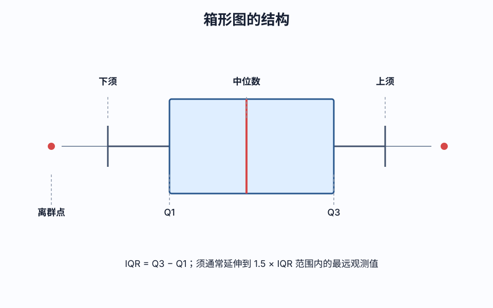
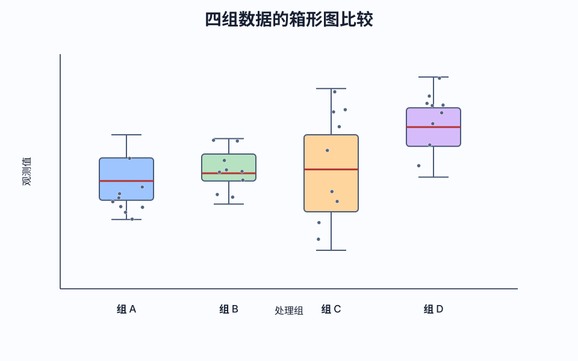
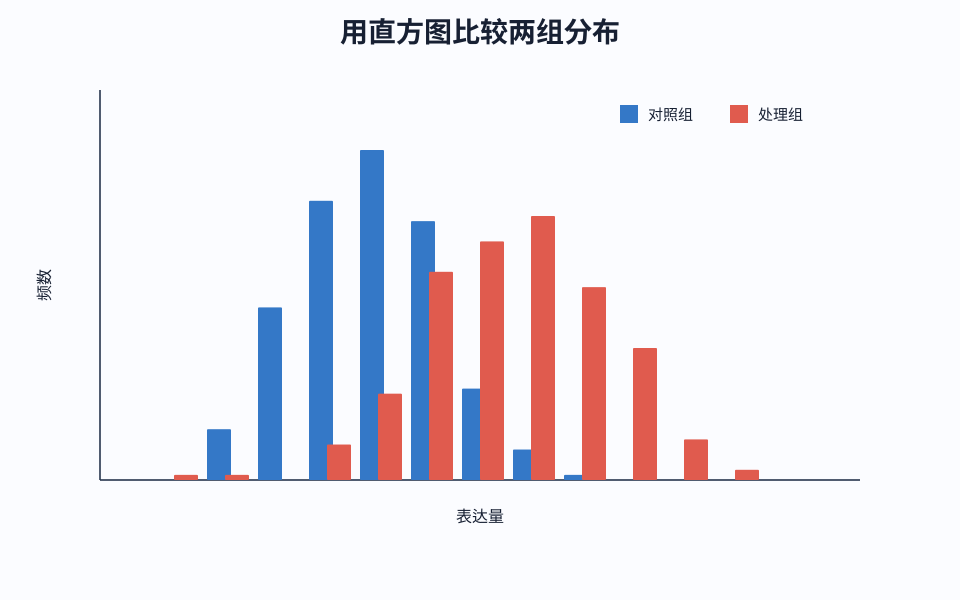
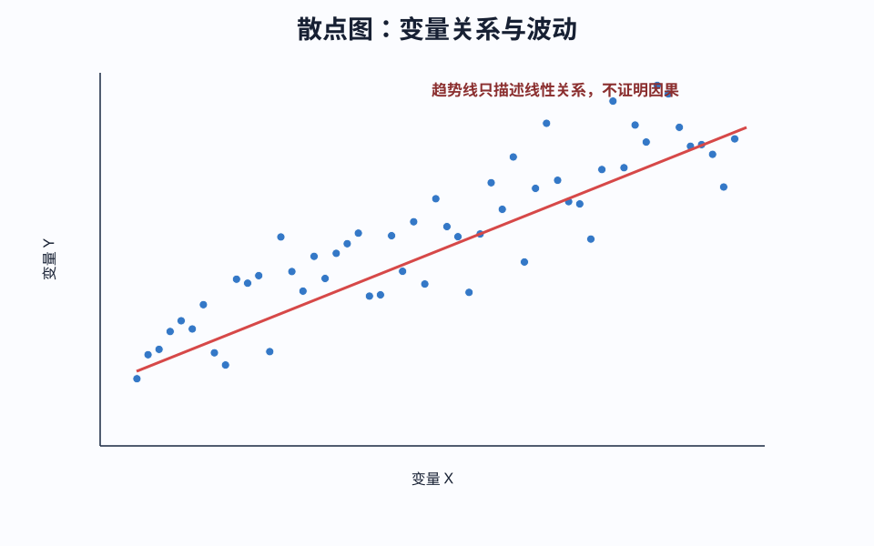
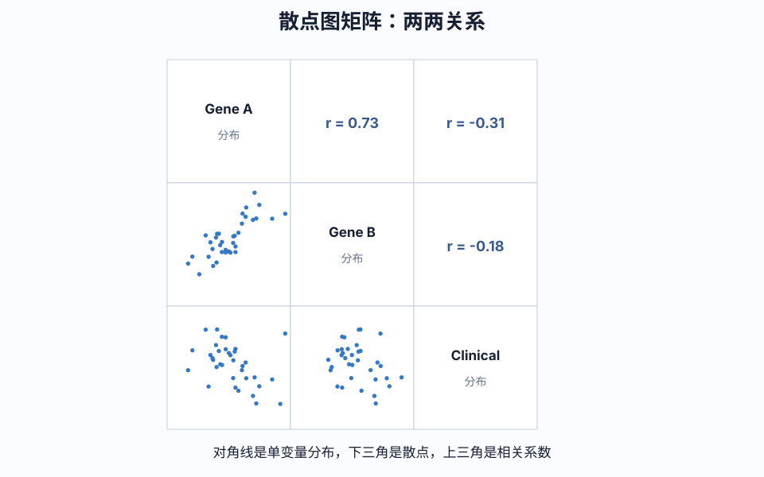

<!-- BEGIN AUTO-GENERATED NAVIGATION -->
> [!NOTE] 课程导航
> [← 上一篇：单细胞分析｜数据导入和前期整理](<BIF A-2 单细胞分析｜数据导入和前期整理.md>) · [课程目录](<COURSE_INDEX.md>) · [下一篇：单细胞分析｜数据的深入分析 →](<BIF A-4 单细胞分析｜数据的深入分析.md>)
<!-- END AUTO-GENERATED NAVIGATION -->

# 生信入门-单细胞分析 A-3：数据的初步分析
#生信 #细胞 #单细胞分析 #预处理 #文库 #测序 #数据库 #数据分析 #作图

> 配套实操：[[BIF B-2 scRNAseq 入门到 UMAP 注释]]

## 一、初级描述性统计分析  

- RNA-Seq Data 计算每种基因表达的均值中位数标准差等，看看整体上的基因表达水平分布情况  
- Clinical Data 计算各种临床变量的基本统计量  

## 二、初级可视化探索性分析

### 1. 箱形图

- 用箱型图表示一下基因的分布情况，看看有没有异常值和分布特征（比如长尾分布这种）（Boxplot）（33）  

*箱形图可以用中位数、四分位距、须和离群点来读取：*

### 2. 直方图

- 用直方图表示基因表达值的频率分布，看看总体趋势和分布形态  

### 3. 散点图

- 用散点图矩阵观察基因表达和临床变量之间的联系关系，用自带的 pairs () 函数或者 GGally 包的 ggpairs () 函数也可以  

*散点图用来描述两个变量之间的关系，可以初步观察变化趋势。*

- 散点图矩阵把多个变量的两两关系放在一起。示例右上角的数值是**皮尔逊相关系数**：1 表示完全正相关，-1 表示完全负相关，0 表示无线性相关。

> [!NOTE]
> - 使用 Pearson 相关性分析的时候要求数据正态分布（特别是小样本时），如果不满足的话可以使用 Spearman 相关性分析
> - 另外，针对多个因素两两比较的情况，除了散点图，也可以使用**热力图**的形式加以观察

> 本页图像的原始 URL、SHA-256 和许可状态见[图像来源与许可记录](../docs/image-sources.md)。
