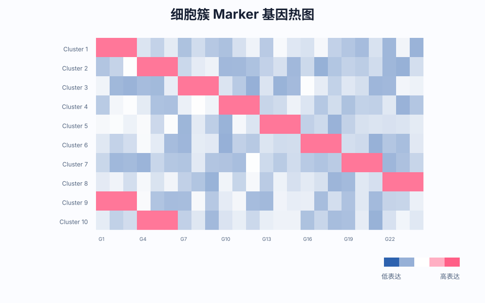
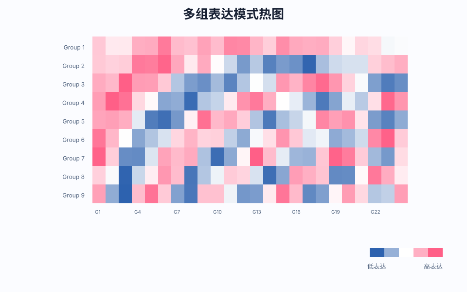
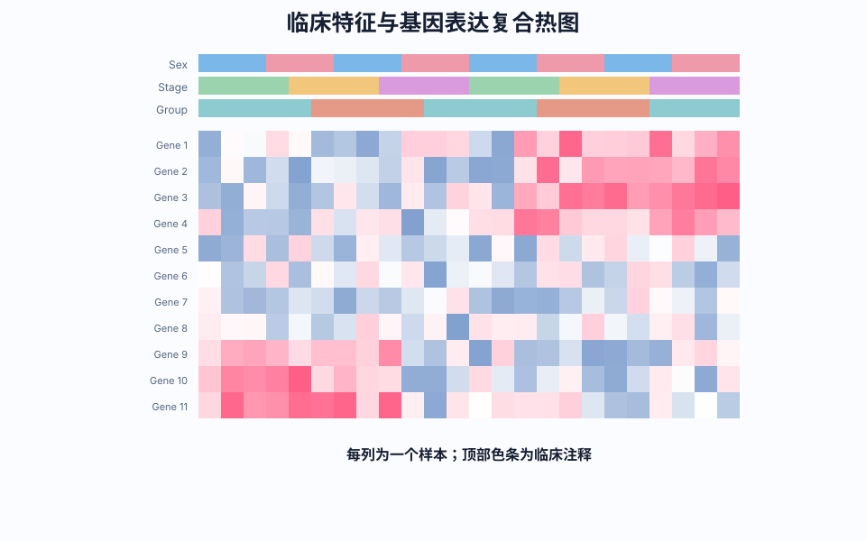
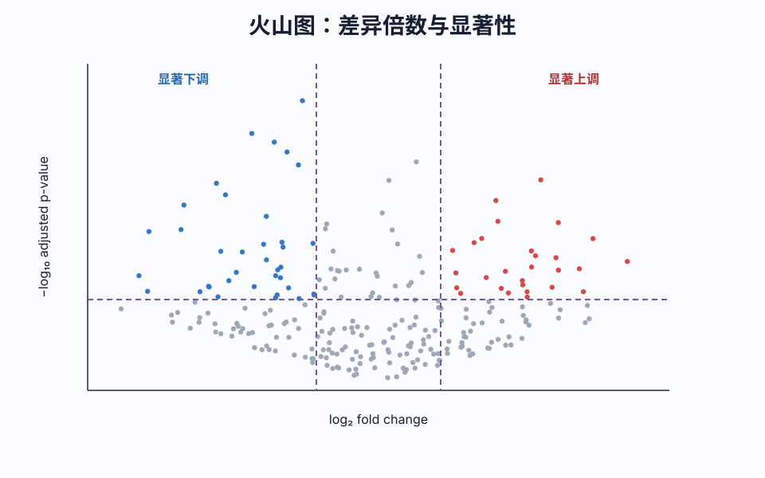

<!-- BEGIN AUTO-GENERATED NAVIGATION -->
> [!NOTE] 课程导航
> [← 上一篇：单细胞分析｜数据的深入分析](<BIF A-4 单细胞分析｜数据的深入分析.md>) · [课程目录](<COURSE_INDEX.md>) · [下一篇：单细胞分析｜参考名词索引 →](<BIF A-6 单细胞分析｜参考名词索引.md>)
<!-- END AUTO-GENERATED NAVIGATION -->

# 生信入门-单细胞分析 A-5：绘图描述
#生信 #细胞 #单细胞分析 #预处理 #文库 #测序 #数据库 #数据分析 #作图

| 图表类型               | 用途                                                                 | 工具/包          |
|------------------------|----------------------------------------------------------------------|------------------|
| **热图（Heatmap）**    | 展示基因表达差异或临床特征关联（复合热图）                          | `pheatmap`       |
| **火山图（Volcano）**  | 可视化差异基因（横轴=LFC，纵轴=-log10 (p-value)）                    | `ggplot2`        |
| **生存曲线**           | Kaplan-Meier 曲线（时间 vs 生存概率）                                | `survminer`      |
| **维恩图（Veen）**     | 展示基因列表交集                                                    | `VennDiagram`    |
| **圈图/弦图**          | 复杂关系网络可视化                                                  | `circlize`       |

## 一、热图绘制 （heatmap）（31） 

> 热图可以理解为一种添加了“颜色轴”的三维表格，颜色轴体现在色块上的颜色差异，不同情况下 XY 轴和颜色表示都可以不同  

生信分析中热图也有很多种，功能也随之不同，包括但不限于观察显示健康组织和癌症组织的差异，以及不同聚类间基因表达的差异，比较典型的是下面两种  

1. 行代表不同的细胞聚类，列代表不同的基因，这种热图可以显示不同聚类间的差异表达区域。

   

   

2. 复合热图可以同时展示患者临床特征和基因表达情况；每一列代表一个病例。

   

## 二、火山图绘制 （volcano）（67）  

横坐标 LFC (log2foldchang)，纵坐标取 p 值（-log10p-value，越大越显著），阈值也可以自己控制  

横线即为显著性水平线，越向上统计学显著性越高；两根竖线是差异倍数阈值，左侧代表下调，右侧代表上调。因此左上区域通常是显著下调且差异较大的基因，右上区域是显著上调且差异较大的基因。

> 本页图像的原始 URL、SHA-256 和许可状态见[图像来源与许可记录](../docs/image-sources.md)。

## 三、生存分析曲线 （survival）（Kaplan-Meier 曲线）（11,39）  

> 用来显示患者在不同时间点的生存概率的图表（估计时间到事件（如死亡、复发等）数据的生存概率）曲线的纵轴表示生存概率，横轴表示时间。曲线的每个阶梯下降对应一个事件的发生。  

导入生存时间和事件数据，按照探索的基因的基因表达水平将患者分组，根据这一分组进行曲线绘制  
- 生存曲线中的阶梯状曲线表达不同组的事件发生概率，每一个下降阶梯对应一个事件发生的时间点  
- 风险表（Risk Table）则描述每个时间点上的剩余研究人数  
- p 值（p-value），用于判断不同组的生存曲线是不是显著不同，一般用 Log-Rank Test  

## 四、维恩图 （20）  

## 五、弦图  

## 六、圈图  

## 七、双轴图
